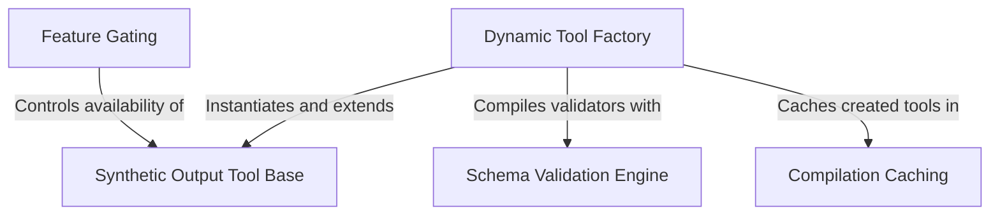

# Tutorial: SyntheticOutputTool

This project implements a **Synthetic Output Tool** that enables AI agents to generate structured data (like JSON) by strictly conforming to dynamic schemas. It utilizes a **Dynamic Tool Factory** to create specialized tool instances on the fly, powered by a *Schema Validation Engine* to ensure data integrity. To optimize performance, it employs **Compilation Caching** for validation logic, while **Feature Gating** restricts usage to specific non-interactive environments.

## Chapters

1. [Synthetic Output Tool Base](01_synthetic_output_tool_base.md)
2. [Dynamic Tool Factory](02_dynamic_tool_factory.md)
3. [Schema Validation Engine](03_schema_validation_engine.md)
4. [Feature Gating](04_feature_gating.md)
5. [Compilation Caching](05_compilation_caching.md)

---

Generated by [Code IQ](https://github.com/adityasoni99/Code-IQ)