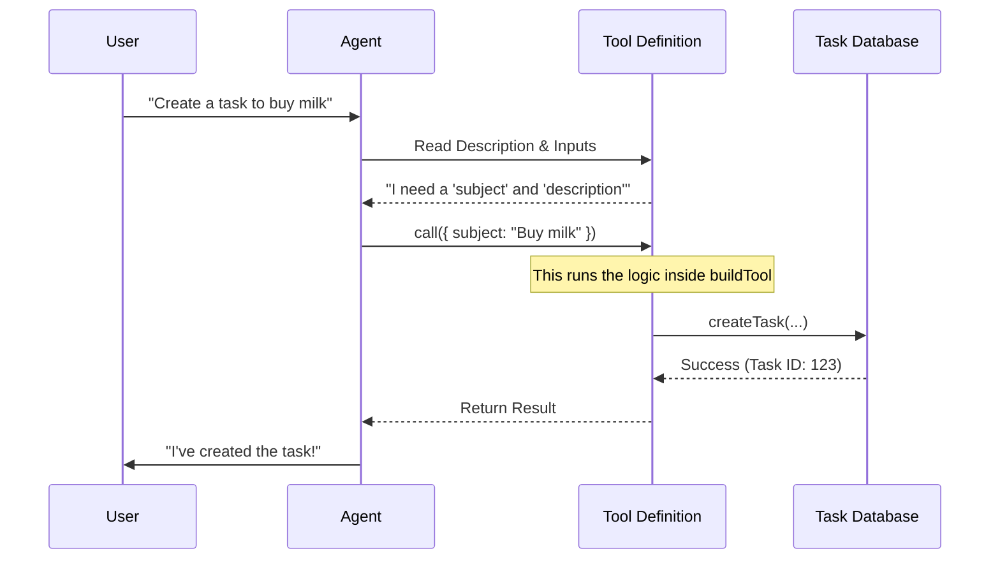

# Chapter 1: Tool Definition Architecture

Welcome to the first chapter of the **TaskCreateTool** tutorial!

In this chapter, we are going to explore the **Tool Definition Architecture**. Before we dive into complex code, let's understand the problem we are solving.

## The Motivation: The Universal Plug

Imagine you are an AI Agent. You are very smart and can converse fluently, but you live inside a text box. You cannot *actually* touch the real world. You can't click buttons, write to a database, or create a To-Do list item on your own.

To let the AI interact with your application, you need to provide it with "Tools."

Think of the **Tool Definition Architecture** as a **USB Plug**.
*   **The Computer (The Agent)** has a universal USB port. It doesn't know how a printer works internally, but it knows how to plug into a USB device.
*   **The Device (Your Code)** has specific logic (saving a task to a database).
*   **The Tool Definition** is the adapter that wraps your specific logic into that standard USB shape so the Agent can use it.

## The Solution: `buildTool`

In our project, we use a helper function called `buildTool`. This function acts as a contract. It forces us to define three specific things:
1.  **Identity:** What is this tool called?
2.  **Interface:** What inputs does it need? (e.g., a subject, a description).
3.  **Behavior:** What specific JavaScript code runs when the AI uses it?

Let's look at how we build the `TaskCreateTool`.

### Step 1: The Wrapper

First, we import the builder. This functions as our "mold" for the tool.

```typescript
import { buildTool } from '../../Tool.js'
import { TASK_CREATE_TOOL_NAME } from './constants.js'

// We start by calling buildTool with a configuration object
export const TaskCreateTool = buildTool({
  // Configuration goes here...
})
```

*Explanation:* `buildTool` ensures that our tool is compatible with the rest of the AI system. If we forget a required piece (like a name), TypeScript will yell at us.

### Step 2: Defining Identity

The AI needs to know what this tool is so it knows when to pick it up.

```typescript
export const TaskCreateTool = buildTool({
  name: TASK_CREATE_TOOL_NAME, // e.g., 'TaskCreate'
  
  // A hint for the system to find this tool quickly
  searchHint: 'create a task in the task list',

  userFacingName() {
    return 'TaskCreate'
  },
  // ... more properties
})
```

*Explanation:*
*   `name`: The internal ID used by the system.
*   `searchHint`: Helps the system find this tool when the user asks "Add a task."
*   `userFacingName`: A friendly name displayed in the UI when the tool is running.

### Step 3: Defining Behavior (The `call` method)

This is the most important part. When the AI decides to "Create a Task," this function executes.

```typescript
  // ... inside buildTool
  async call({ subject, description }, context) {
    // This is where we talk to our actual database
    const taskId = await createTask(getTaskListId(), {
      subject,
      description,
      status: 'pending',
    })

    return { data: { task: { id: taskId, subject } } }
  },
```

*Explanation:* The `call` method is the bridge. It takes arguments from the AI (`subject`, `description`) and passes them to our internal `createTask` function.

## Under the Hood: How it Works

To understand how this architecture flows, let's look at what happens when a user types: *"Remind me to buy milk."*

1.  The **Agent** looks at available tools.
2.  It sees `TaskCreateTool` and reads its description.
3.  It decides to "call" the tool with specific data.
4.  The `buildTool` wrapper executes your `call` function.



## Deep Dive: The `TaskCreateTool.ts` Implementation

Let's look at how the actual file `TaskCreateTool.ts` utilizes this architecture to handle complex requirements.

### 1. Feature Gating
We don't always want the tool to be active. The architecture allows us to add an "On/Off Switch."

```typescript
  // inside TaskCreateTool definition
  isEnabled() {
    // Only enable if TodoV2 feature flag is on
    return isTodoV2Enabled()
  },
```
*Explanation:* If `isEnabled` returns false, the AI won't even know this tool exists. We will cover this more in [Feature Gating and Availability](04_feature_gating_and_availability.md).

### 2. Contextual Prompting
We can dynamically change how the tool describes itself to the AI based on what's happening.

```typescript
  async prompt() {
    // Returns dynamic instructions for the AI
    return getPrompt() 
  },
```
*Explanation:* This allows the tool to give the AI tips like "Make sure dates are formatted as YYYY-MM-DD." We will cover this in [Dynamic Contextual Prompting](03_dynamic_contextual_prompting.md).

### 3. Execution Safety
The architecture allows us to define if multiple tasks can be created at once.

```typescript
  isConcurrencySafe() {
    return true
  },
```
*Explanation:* This tells the Agent system, "It's safe to run this tool multiple times in parallel" (e.g., creating 5 tasks at once).

### 4. Input and Output Contracts
While the logic is in `call`, the *rules* for the data are defined in schemas.

```typescript
  get inputSchema(): InputSchema {
    return inputSchema()
  },
  get outputSchema(): OutputSchema {
    return outputSchema()
  },
```
*Explanation:* This defines strictly that `subject` must be a string and `metadata` is an optional record. If the AI tries to send a number as the subject, the tool architecture rejects it automatically.

## Conclusion

In this chapter, we learned that **Tool Definition Architecture** is about wrapping specific code (like creating a database row) into a standardized object using `buildTool`. This allows the AI agent to understand **who** the tool is, **when** to use it, and **how** to execute it.

However, simply defining the tool isn't enough. We need to be very strict about exactly what data the AI is allowed to send us. If we aren't careful, the AI might send messy data that breaks our database.

In the next chapter, we will learn how to enforce these rules using **Zod**.

[Next Chapter: Schema-Based Data Contracts](02_schema_based_data_contracts.md)

---

Generated by [Code IQ](https://github.com/adityasoni99/Code-IQ)