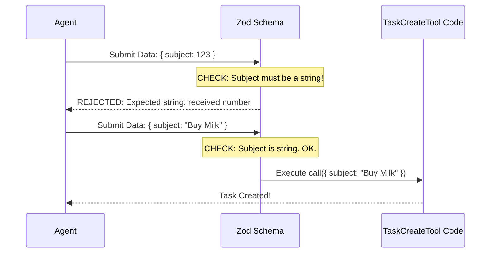

# Chapter 2: Schema-Based Data Contracts

Welcome to Chapter 2!

In the previous chapter, [Tool Definition Architecture](01_tool_definition_architecture.md), we learned how to build the "USB plug" (the Tool) that connects our code to the AI Agent. We created the container for `TaskCreateTool`.

But having a connection isn't enough. We need to make sure the data passing through that connection is safe, correct, and understood by both parties.

## The Motivation: The "Building Permit" Office

Imagine you run a construction company (this is your internal code). You cannot simply let anyone walk in and start building.

Before a shovel hits the ground, the applicant must fill out a **Building Permit**.
*   **The Applicant:** The AI Agent.
*   **The Permit:** The **Schema** (Data Contract).
*   **The Clerk:** The `zod` library.

If the AI hands in a permit where the "Building Height" is written as "Very tall" (a string) instead of "100" (a number), or if the "Address" is missing entirely, the Clerk rejects it immediately.

**Why is this vital?**
If we didn't have this check, your construction crew (the `call` function) would arrive at the site, realize there is no address, and the whole system would crash.

**Schema-Based Data Contracts** ensure that your tool's logic *never* executes unless the input is perfect.

## The Solution: Zod and Schemas

To implement this "Permit Clerk," we use a library called **Zod**. Zod allows us to define the "shape" of data we expect.

### Concept 1: The Input Schema

The **Input Schema** defines what the AI must send us. For `TaskCreateTool`, we need a `subject` (title) and a `description`.

Here is how we define the rules:

```typescript
import { z } from 'zod/v4'
import { lazySchema } from '../../utils/lazySchema.js'

// We define a strict object. 
// "Strict" means: "Don't send fields I didn't ask for!"
const inputSchema = lazySchema(() =>
  z.strictObject({
    subject: z.string().describe('A brief title for the task'),
    // ... more fields
  })
)
```

**Explanation:**
*   `z.string()`: We tell the system "This value MUST be text."
*   `.describe(...)`: This is crucial! The AI reads this text to understand *what* to write in that field.
*   `lazySchema`: This is a performance helper. It effectively means "Don't load this rulebook until someone actually asks to use the tool."

### Concept 2: Handling Optional Fields

Sometimes, information is nice to have but not required. For example, `activeForm` is a piece of UI state that acts like a loading spinner text (e.g., "Scanning files...").

```typescript
    // Inside the z.strictObject...
    activeForm: z
      .string()
      .optional()
      .describe('Present continuous form shown in spinner'),
      
    metadata: z
      .record(z.string(), z.unknown())
      .optional()
      .describe('Arbitrary metadata to attach to the task'),
```

**Explanation:**
*   `.optional()`: This tells Zod, "It's okay if this field is missing."
*   If the AI provides it, it *must* be a string. If not, our code will receive `undefined`, which is safe to handle.

### Concept 3: The Output Schema

Data contracts work both ways. We also need to promise the AI what we will give *back*.

```typescript
const outputSchema = lazySchema(() =>
  z.object({
    task: z.object({
      id: z.string(),
      subject: z.string(),
    }),
  }),
)
```

**Explanation:**
When the tool finishes, it guarantees it will return an object containing a `task`, which has an `id` and `subject`. This helps the AI understand the result of its action.

## Connecting the Schema to the Tool

Now that we have written the "Permit Application" (the schema), we need to place it on the counter. We do this inside our tool definition.

```typescript
export const TaskCreateTool = buildTool({
  name: TASK_CREATE_TOOL_NAME,
  
  // We attach the rules here:
  get inputSchema(): InputSchema {
    return inputSchema()
  },
  
  get outputSchema(): OutputSchema {
    return outputSchema()
  },
  // ... rest of tool
})
```

**Explanation:**
By adding these getters, the `TaskCreateTool` now enforces these rules automatically.

## Under the Hood: The Validation Flow

What actually happens when the AI tries to create a task?

1.  **AI Request:** The Agent decides to call `TaskCreateTool`. It generates a JSON object based on the `.describe()` text we wrote.
2.  **The Interceptor:** Before running your code, the system intercepts the JSON.
3.  **Zod Parse:** It runs `inputSchema.parse(json)`.
4.  **Decision:**
    *   **Pass:** The data is clean. The `call()` function runs.
    *   **Fail:** Zod throws an error (e.g., "Expected string, received number"). The system catches this and tells the AI, "You filled out the form wrong, try again."



## Deep Dive: Type Safety in Code

One of the biggest benefits of using Zod is that it gives us **TypeScript Types** for free. We don't have to manually define interfaces for our inputs.

### Inferring Types

We can extract the TypeScript type directly from the Zod variable.

```typescript
// Create a TS type based on the Zod variable
type InputSchema = ReturnType<typeof inputSchema>
type OutputSchema = ReturnType<typeof outputSchema>

// We can now use this type for our output
export type Output = z.infer<OutputSchema>
```

### Using Types in Execution

Because of these contracts, when we write the `call` function, our code editor knows exactly what fields exist.

```typescript
  // inside TaskCreateTool ...
  async call({ subject, description, activeForm, metadata }, context) {
    
    // TypeScript knows 'subject' is a string automatically!
    // It also knows 'metadata' is optional.
    
    const taskId = await createTask(getTaskListId(), {
      subject,
      description,
      metadata, // passing the valid data
      status: 'pending',
    })

    return { data: { task: { id: taskId, subject } } }
  },
```

**Explanation:**
Notice we don't check `if (typeof subject === 'string')`. We don't have to! The Schema Contract guarantees that if this line of code is running, `subject` IS a string.

## Conclusion

In this chapter, we established **Schema-Based Data Contracts**.

We learned that using `zod` acts like a strict immigration officer. It protects our internal code from bad data and helps the AI understand exactly what information we require via `.describe()` fields.

However, sometimes a static description isn't enough. Sometimes the "Permit Form" needs to change based on the situation (e.g., "It's a weekend, so you need to fill out the Weekend Annex").

In the next chapter, we will learn how to make our instructions dynamic.

[Next Chapter: Dynamic Contextual Prompting](03_dynamic_contextual_prompting.md)

---

Generated by [Code IQ](https://github.com/adityasoni99/Code-IQ)