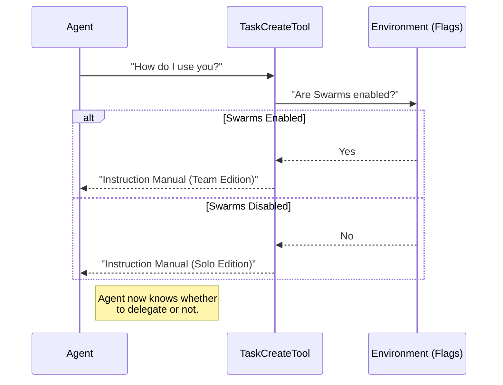

# Chapter 3: Dynamic Contextual Prompting

Welcome to Chapter 3!

In the previous chapter, [Schema-Based Data Contracts](02_schema_based_data_contracts.md), we acted as "Security Guards," using strict schemas to ensure the AI only sends us valid data.

Now that the data is safe, we need to act as "Teachers." We need to teach the AI **when** to use the tool and **how** to write good content for it. But here is the challenge: the rules might change depending on the situation.

This brings us to **Dynamic Contextual Prompting**.

## The Motivation: The "Briefing Officer"

Imagine you are a Commander sending a soldier (the AI) on a mission.
*   **Scenario A (Solo Mission):** You tell the soldier, "Go fix the radio. Just get it done."
*   **Scenario B (Team Mission):** You tell the soldier, "Go fix the radio. **Write down exactly what you did so your teammates can read it later.**"

If you gave the soldier the "Solo" instructions during a "Team" mission, communication would break down.

**The Problem:**
Most tools have static descriptions (e.g., "This tool creates a task"). This is often too vague.

**The Solution:**
**Dynamic Contextual Prompting** acts like a smart Briefing Officer. Before the AI acts, this logic checks the environment (Are we alone? Are we in a Swarm?) and generates a custom manual specifically for that moment.

## Concept 1: The `prompt()` Method

In our `TaskCreateTool`, strictly defining the input fields isn't enough. We need to give the AI "Soft Skills" advice.

Instead of a static string, our architecture allows us to define a `prompt()` function.

```typescript
// Inside TaskCreateTool.ts
export const TaskCreateTool = buildTool({
  // ... name and schemas
  
  async prompt() {
    // We run logic here to decide what to say!
    return getPrompt()
  },
})
```
*Explanation:* Every time the Agent considers using this tool, it runs this function to get the latest instructions.

## Concept 2: Environment-Aware Instructions

The most powerful feature of this system is adapting to **Agent Swarms**.

"Agent Swarms" is a mode where multiple AI agents work together. If this mode is on, our tool needs to tell the AI: *"Hey, you have teammates! Write clearer descriptions so they understand you."*

Let's look at how we build this logic in `prompt.ts`.

### Step 1: Checking the Environment

First, we check if the "Swarms" feature is active.

```typescript
// prompt.ts
import { isAgentSwarmsEnabled } from '../../utils/agentSwarmsEnabled.js'

export function getPrompt(): string {
  // Check if we are in a team environment
  const isTeamMode = isAgentSwarmsEnabled()
  
  // ... continue logic
}
```

### Step 2: Conditional Text

We create variables that contain text *only* if the condition is met.

```typescript
  // ... inside getPrompt
  
  const teammateTips = isTeamMode
    ? `- Include enough detail for another agent to understand
- New tasks have no owner - use TaskUpdate to assign them`
    : '' // If working alone, say nothing here.
```

*Explanation:* If `isTeamMode` is true, we prepare specific advice about delegation. If false, we leave it blank to keep the prompt simple.

### Step 3: The Template Literal

Finally, we inject these variables into the main instruction text.

```typescript
  return `Use this tool to create a task list.

## When to Use This Tool
- Complex multi-step tasks
- Plan mode

## Tips
- Create tasks with clear subjects
${teammateTips} 
`
```

*Explanation:*
*   We use standard Markdown for the instructions.
*   We insert `${teammateTips}` dynamically.
*   The AI reads this final generated string.

## Under the Hood: The Briefing Flow

Let's visualize what happens when the Agent starts a session.

1.  **Agent Initialization:** The Agent wakes up.
2.  **Tool Inspection:** The Agent asks, "What tools do I have?"
3.  **Context Check:** The `TaskCreateTool` runs `prompt()`.
4.  **Logic Execution:** The code checks `isAgentSwarmsEnabled()`.
5.  **Manual Delivery:** The tool hands the Agent the specific instructions for *this* session.



## Deep Dive: The Implementation

Let's look at the actual code in `prompt.ts` to see how specific the instructions are.

### Defining "When to Use"
We don't just tell the AI *how* to use the tool, but *when*.

```typescript
// prompt.ts
return `
## When to Use This Tool

Use this tool proactively in these scenarios:
- Complex multi-step tasks (3+ steps)
- User explicitly requests todo list
- After receiving new instructions
`
```
*Explanation:* We explicitly tell the AI to use this tool for "Complex" tasks. This prevents the AI from creating a database task for something trivial like "Say hello."

### Defining "When NOT to Use"
Equally important is telling the AI when to stop.

```typescript
// prompt.ts
`
## When NOT to Use This Tool

Skip using this tool when:
- There is only a single, straightforward task
- The task is purely conversational
`
```
*Explanation:* This saves system resources. We don't want to create a database entry just to answer "What is 2+2?".

### Connecting it to the Definition
Finally, we hook this logic into our main definition file, `TaskCreateTool.ts`.

```typescript
// TaskCreateTool.ts
import { getPrompt } from './prompt.js'

export const TaskCreateTool = buildTool({
  name: TASK_CREATE_TOOL_NAME,
  
  // The Prompt Hook
  async prompt() {
    return getPrompt()
  },
  
  // ... rest of definition
})
```

## Conclusion

In this chapter, we learned about **Dynamic Contextual Prompting**.

We moved beyond static descriptions and created a tool that is **self-aware**. It knows if it is operating in a team (Swarms) or alone, and it changes its instructions to the AI accordingly. This ensures the AI behaves correctly without the user having to manually explain the rules every time.

We have defined the tool, secured the data, and taught the AI how to use it. But what if we don't want the user to see this tool at all?

In the next chapter, we will learn how to hide or show tools entirely based on system flags.

[Next Chapter: Feature Gating and Availability](04_feature_gating_and_availability.md)

---

Generated by [Code IQ](https://github.com/adityasoni99/Code-IQ)