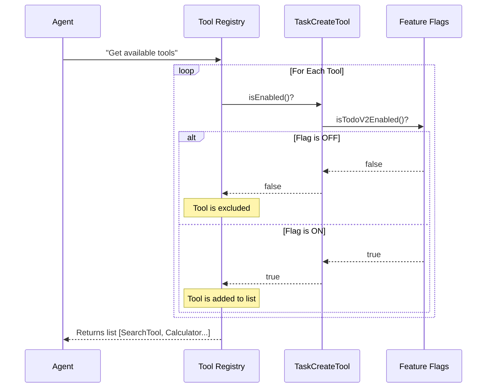

# Chapter 4: Feature Gating and Availability

Welcome to Chapter 4!

In the previous chapter, [Dynamic Contextual Prompting](03_dynamic_contextual_prompting.md), we taught the AI **how** to use our tool properly by giving it dynamic instructions.

Now, we face a different question: **Should the AI be allowed to use the tool at all?**

Just because we wrote the code for `TaskCreateTool` doesn't mean every user should see it. Maybe the feature is still in "Beta" testing. Maybe it's only for "Pro" users.

This chapter is about **Feature Gating**—acting as a "Master Switch" to turn the tool on or off without changing the code.

## The Motivation: The "Secret Menu"

Imagine you run a restaurant. You have a new "Super Burger" (your new tool), but the kitchen is still experimenting with the recipe.

If you put the Super Burger on the main menu, everyone will order it, and chaos will ensue. You want the recipe to exist in the kitchen, but you only want it to appear on the menu for specific VIPs or when the Head Chef gives the "Thumbs Up."

**The Problem:**
By default, if you define a tool and register it, the AI Agent sees it immediately.

**The Solution:**
We need an **Availability Check**. Before the Agent is even told that `TaskCreateTool` exists, the system runs a quick check: "Is this feature turned on?"

If the answer is **No**, the tool effectively puts on an "Invisibility Cloak." The Agent doesn't know it exists and won't try to use it.

## The Solution: `isEnabled()`

The `buildTool` architecture provides a specific method for this called `isEnabled()`.

This method returns a simple `true` or `false`.
*   **True:** The tool is added to the Agent's toolbox.
*   **False:** The tool is hidden completely.

Let's look at how we implement this in our tool definition.

### Step 1: Importing the Logic

We rarely hard-code `true` or `false` inside the tool. Instead, we usually import a "Feature Flag" function from our system settings.

```typescript
// TaskCreateTool.ts
import { buildTool } from '../../Tool.js'

// We import a helper that checks our system configuration
import { isTodoV2Enabled } from '../../utils/tasks.js'
```

*Explanation:* `isTodoV2Enabled` is our "Master Switch." It might check a database, an environment variable, or a user setting.

### Step 2: The Guard Clause

Inside our `buildTool` configuration, we add the `isEnabled` property.

```typescript
export const TaskCreateTool = buildTool({
  name: 'TaskCreate',
  
  // The Gatekeeper
  isEnabled() {
    // Check the flag. If this returns false, the tool is invisible.
    return isTodoV2Enabled()
  },
  
  // ... other properties (schemas, call, etc.)
})
```

*Explanation:* When the application starts, or when a user session begins, the system calls this function.

## Why use Feature Gating?

You might ask, "Why not just delete the file if I don't want to use it?"

Here are the three main benefits:

1.  **Safer Deployments:** You can deploy your code to production while the switch is `OFF`. Once you are sure the system is stable, you flip the switch `ON` without redeploying code.
2.  **A/B Testing:** You can enable the tool for 50% of users to see if they like the new Task feature, while keeping it off for the others.
3.  **Maintenance Mode:** If a bug is discovered in `TaskCreateTool`, you can flip the switch off instantly to stop the errors while you fix the bug.

## Under the Hood: The Discovery Process

How does the Agent actually "miss" the tool? It happens during the **Tool Discovery** phase.

Imagine the Agent acts like a customer asking for a menu. The System (the waiter) checks which items are available before printing the menu.

1.  **Agent:** "I need to solve a problem. What tools do I have?"
2.  **System:** "Let me check the registry."
3.  **System:** Looks at `TaskCreateTool`. Runs `isEnabled()`.
4.  **Result:** Returns `false`.
5.  **System:** "Okay, skip that one."
6.  **Agent:** Receives a list of tools. `TaskCreateTool` is **not** on the list.



## Deep Dive: The Implementation

Let's look at the specific implementation in `TaskCreateTool.ts`.

It is surprisingly simple because the complexity is abstracted away into the `isTodoV2Enabled` function.

```typescript
// TaskCreateTool.ts excerpt

  // ... schemas defined above

  isEnabled() {
    // This allows us to gate the new Todo logic behind a flag
    // so we don't break existing users who are on V1.
    return isTodoV2Enabled()
  },

  isConcurrencySafe() {
    return true
  },

  // ... call function below
```

### Context-Aware Gating

While our example uses a global flag (`isTodoV2Enabled`), `isEnabled()` can also access the current **Context**.

This allows for very specific rules, such as:
*   "Only enable this tool if the user is an Admin."
*   "Only enable this tool if the user is on a Mobile device."

*(Note: In our current simple example, we rely on the global flag, but the architecture supports passing context if needed.)*

## Conclusion

In this chapter, we learned about **Feature Gating and Availability**.

We discovered that defining a tool isn't enough; we must also control its visibility. By using `isEnabled()`, we act as a "Circuit Breaker," ensuring the AI only interacts with features that are fully ready and authorized for the current situation.

We have now built the complete definition:
1.  **Architecture:** The tool exists.
2.  **Data:** The inputs are validated.
3.  **Prompts:** The AI knows how to use it.
4.  **Availability:** The system knows when to show it.

Now, there is only one step left. What happens when the AI actually pulls the lever? How do we handle the database, errors, and success messages?

In the final chapter, we will cover the engine room.

[Next Chapter: Task Execution & Lifecycle Management](05_task_execution___lifecycle_management.md)

---

Generated by [Code IQ](https://github.com/adityasoni99/Code-IQ)