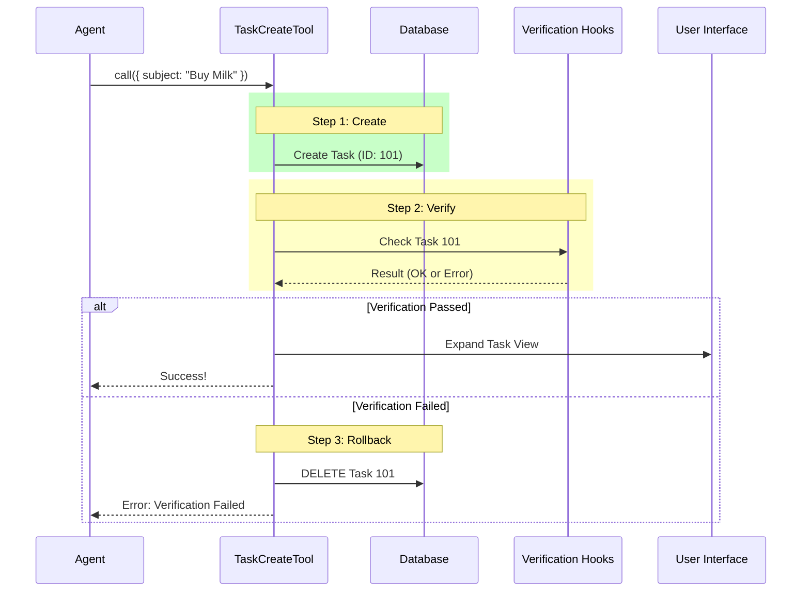

# Chapter 5: Task Execution & Lifecycle Management

Welcome to Chapter 5, the final chapter of our **TaskCreateTool** tutorial series!

In the previous chapter, [Feature Gating and Availability](04_feature_gating_and_availability.md), we learned how to act as a "Bouncer," allowing or denying access to the tool based on system flags.

Now, we have finally arrived at the moment of truth. The Agent has been authorized, the data has been validated, and the "Start" button has been pressed. It is time to execute the logic.

In this chapter, we will explore **Task Execution & Lifecycle Management**.

## The Motivation: The Bank Transaction Manager

It is tempting to think that "Creating a Task" is just one line of code: `database.save(task)`.

But in a robust system, it is never that simple. Think of a **Bank Transaction**:
1.  **Move Money:** You transfer $100 to a friend.
2.  **Verify:** The bank checks for fraud.
3.  **Notify:** The bank sends an email receipt.
4.  **UI Update:** Your app updates your balance immediately.

**The Catch:** What if the fraud check fails *after* the money has moved?
The bank cannot just shrug. It must **Rollback** (undo) the transfer.

Our `TaskCreateTool` works the same way. It manages a **Lifecycle**:
1.  **Create** the task.
2.  **Run Hooks** (Side effects/Checks).
3.  **Rollback** if checks fail.
4.  **Update UI** if successful.

## Concept 1: The `call` Method

All the work happens inside the `call` method. This is the engine room.

It receives the validated arguments (like `subject` and `description`) and the `context` (which allows us to talk to the front-end UI).

```typescript
// TaskCreateTool.ts
async call({ subject, description }, context) {
  // 1. The Core Action
  // 2. The Verification
  // 3. The Cleanup
  // 4. The Result
}
```

Let's break down the lifecycle steps inside this function.

## Concept 2: The Core Action (Creation)

First, we perform the primary job: writing to the database.

```typescript
// inside call() ...

const taskId = await createTask(getTaskListId(), {
  subject,
  description,
  status: 'pending',
  // ... other fields
})
```

**Explanation:**
*   We call `createTask`, which talks to our storage.
*   We get back a `taskId`. At this specific millisecond, the task **exists** in the database.

## Concept 3: Hooks and Verification

Now that the task exists, we run "Hooks." These are background processes that might analyze the task, tag it, or validate it against complex rules.

```typescript
const blockingErrors: string[] = []

// Run a generator that executes checks one by one
const generator = executeTaskCreatedHooks(taskId, subject, ...)

for await (const result of generator) {
  if (result.blockingError) {
    // Oh no! A check failed.
    blockingErrors.push(result.blockingError)
  }
}
```

**Explanation:**
*   We use a loop to process checks.
*   If a hook says, "Wait, this task violates policy!", we add it to `blockingErrors`.

## Concept 4: The Rollback (Safety Net)

This is the critical "Transaction Manager" part. If we found errors in the previous step, we must undo what we did in Step 1.

```typescript
if (blockingErrors.length > 0) {
  // 1. Undo the database write
  await deleteTask(getTaskListId(), taskId)
  
  // 2. Stop everything and yell at the Agent
  throw new Error(blockingErrors.join('\n'))
}
```

**Explanation:**
*   **Atomic Consistency:** We ensure that we don't leave "bad" tasks in the database.
*   If the hooks fail, we delete the task we just created. It's as if it never happened.

## Concept 5: UI State Management

If we passed the checks, we want the user to *see* the result immediately. We don't want them to have to refresh the page.

We use the `context` object to manipulate the User Interface.

```typescript
// Auto-expand task list so the user sees the new item
context.setAppState(prev => {
  // If already open, do nothing
  if (prev.expandedView === 'tasks') return prev
  
  // Otherwise, switch the view to 'tasks'
  return { ...prev, expandedView: 'tasks' }
})
```

**Explanation:**
*   `context.setAppState` allows the backend tool to control the frontend React state.
*   We force the UI to expand the "Tasks" panel so the user feels immediate feedback.

## Under the Hood: The Execution Flow

Let's visualize the entire lifecycle in a diagram.

1.  **Agent** calls the tool.
2.  **Tool** writes to **Database**.
3.  **Tool** runs **Hooks** (Verification).
4.  **Scenario A (Success):** Tool updates **UI** and returns success.
5.  **Scenario B (Failure):** Tool deletes from **Database** and throws error.



## Deep Dive: Returning the Result

Finally, if everything goes well, we need to tell the Agent that we succeeded.

We return a structured object that matches the `outputSchema` we defined in [Schema-Based Data Contracts](02_schema_based_data_contracts.md).

```typescript
return {
  data: {
    task: {
      id: taskId,
      subject,
    },
  },
}
```

### The Human-Readable Output

In addition to the raw data, the system needs to generate a text message for the chat history. We define this using `mapToolResultToToolResultBlockParam`.

```typescript
// TaskCreateTool.ts
mapToolResultToToolResultBlockParam(content, toolUseID) {
  const { task } = content
  
  // This is what appears in the chat log
  return {
    type: 'tool_result',
    content: `Task #${task.id} created successfully: ${task.subject}`,
  }
}
```

**Explanation:**
This ensures that the LLM (Large Language Model) reads a clear confirmation message like *"Task #123 created successfully: Buy Milk"*, reinforcing that its action worked.

## Conclusion

Congratulations! You have completed the **TaskCreateTool** tutorial series.

We have built a sophisticated AI tool from scratch, covering every layer of the architecture:

1.  **[Tool Definition Architecture](01_tool_definition_architecture.md):** We created the "USB Plug" to connect our code to the Agent.
2.  **[Schema-Based Data Contracts](02_schema_based_data_contracts.md):** We acted as "Security Guards," strictly enforcing valid inputs with Zod.
3.  **[Dynamic Contextual Prompting](03_dynamic_contextual_prompting.md):** We acted as "Teachers," giving the AI instructions that adapt to the environment.
4.  **[Feature Gating and Availability](04_feature_gating_and_availability.md):** We acted as "Gatekeepers," controlling who can see the tool.
5.  **Task Execution & Lifecycle Management:** We acted as "Transaction Managers," ensuring data integrity, safety rollbacks, and UI feedback.

You now possess the blueprint to build any tool for this system. Whether you are creating calendar events, sending emails, or managing files, the pattern remains the same.

Go forth and build!

---

Generated by [Code IQ](https://github.com/adityasoni99/Code-IQ)