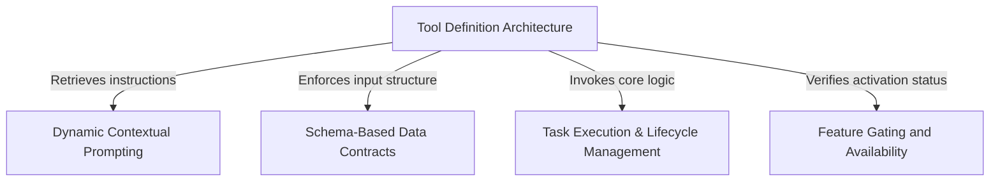

# Tutorial: TaskCreateTool

This project defines a specialized **TaskCreate** tool that allows an AI agent to *programmatically* add new items to a structured task list. It acts as a bridge between the agent's intent and the system's database, ensuring that every task has a clear **subject** and **description** while strictly validating data and checking feature flags before execution.

## Chapters

1. [Tool Definition Architecture](01_tool_definition_architecture.md)
2. [Schema-Based Data Contracts](02_schema_based_data_contracts.md)
3. [Dynamic Contextual Prompting](03_dynamic_contextual_prompting.md)
4. [Feature Gating and Availability](04_feature_gating_and_availability.md)
5. [Task Execution & Lifecycle Management](05_task_execution___lifecycle_management.md)

---

Generated by [Code IQ](https://github.com/adityasoni99/Code-IQ)