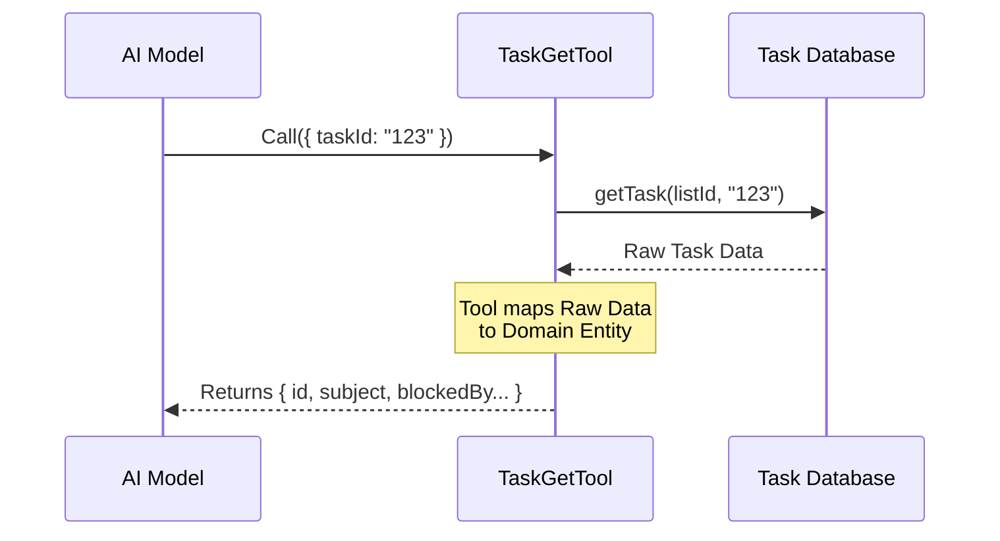

# Chapter 1: Task Domain Entity

Welcome to the **TaskGetTool** project! 

In this first chapter, we are going to talk about the foundation of our tool. Before we can ask an AI to "get a task" or "complete a task," we need to define exactly **what a task is**.

## The Motivation: From Text to Structured Data

Imagine you are working with a colleague, and you hand them a sticky note that says: *"Fix the bug."*

Your colleague will have questions:
- *Which* bug?
- Is it important?
- Can I start now, or do I need to wait for someone else?

In software, passing plain text around creates confusion. To solve this, we create a **Task Domain Entity**. This is the "Noun" of our system. It turns a vague idea into a structured object that both humans and AI models can understand perfectly.

**The Central Use Case:**
We want an AI agent to look at a task (e.g., "Deploy Database") and automatically realize: *"Wait, I cannot do this yet because it is blocked by 'Write Migration Script'."*

## Key Concepts

To allow the AI to reason about order of operations, our Entity needs three main parts:

### 1. Identity & Content
Every task needs a unique fingerprint and human-readable details.
*   **ID:** A specific code (like `T-123`) to find it.
*   **Subject:** A short title.
*   **Description:** The full details of what needs to be done.

### 2. Status
We need to know the lifecycle of the work.
*   **Status:** Is it `pending`, `in_progress`, or `completed`?

### 3. The Dependency Graph (The "Secret Sauce")
This is what makes our entity smart. Instead of just a list, tasks are nodes in a web (a graph).
*   **BlockedBy:** A list of other task IDs that must finish first.
*   **Blocks:** A list of future tasks waiting on this one.

## How It Looks in Code

In our project, the `TaskGetTool` returns this entity. Let's look at how we define this structure using a schema (a blueprint for data).

We use a library called `zod` to define this shape. Don't worry about the syntax yet (we cover that in [Chapter 2: Data Contract Schemas](02_data_contract_schemas.md)), just look at the fields:

```typescript
// From TaskGetTool.ts
z.object({
  id: z.string(),              // The unique fingerprint
  subject: z.string(),         // The title
  description: z.string(),     // The details
  status: TaskStatusSchema(),  // e.g., 'pending'
  blocks: z.array(z.string()),    // Tasks waiting on this
  blockedBy: z.array(z.string()), // Dependencies
})
```

**Explanation:**
This code tells the AI: "When you ask for a task, you will receive an object with exactly these six pieces of information." This guarantees the AI never has to guess if a task has dependencies—the field is always there.

## Under the Hood: The Internal Implementation

How does the tool actually produce this entity? Let's walk through the flow when an AI asks for a task.

### The Flow
1.  **Request:** The AI asks for Task ID `123`.
2.  **Retrieval:** The tool asks the database for the raw data.
3.  **Mapping:** The tool takes the raw data and shapes it into our **Task Domain Entity**.
4.  **Response:** The structured entity is sent back to the AI.



### The Implementation Logic

Inside the `TaskGetTool.ts` file, there is a `call` function. This is where the magic happens. We fetch the data and strictly map it to our entity definition.

```typescript
// Inside TaskGetTool.ts -> call() method
const task = await getTask(taskListId, taskId)

// If found, return the structured Entity
return {
  data: {
    task: {
      id: task.id,
      subject: task.subject,
      status: task.status,
      // The AI uses these to decide order of work:
      blocks: task.blocks,     
      blockedBy: task.blockedBy, 
    },
  },
}
```

**Explanation:**
This code explicitly copies fields from our internal database object (`task`) into the public response. By including `blocks` and `blockedBy`, we are giving the AI the ability to see the future (what comes next) and the past (what must be done first).

## Analogy: The Recipe Card

Think of the **Task Domain Entity** like a professional Recipe Card in a kitchen.

*   **Subject:** "Bake Cake"
*   **Status:** "In Oven"
*   **BlockedBy:** ["Buy Eggs", "Preheat Oven"]

If you just wrote "Cake" on a napkin, the chef (the AI) might try to bake it before buying eggs. By using the Recipe Card structure, the chef knows exactly what prerequisites exist.

## Conclusion

In this chapter, we defined the **Task Domain Entity**. We learned that a task is more than just text; it is a structured object with an ID, status, and crucial dependency information (`blocks`/`blockedBy`). This structure allows the AI to understand the workflow logic of a project.

Now that we know *what* our data looks like, how do we ensure the code never breaks this structure?

[Next Chapter: Data Contract Schemas](02_data_contract_schemas.md)

---

Generated by [Code IQ](https://github.com/adityasoni99/Code-IQ)