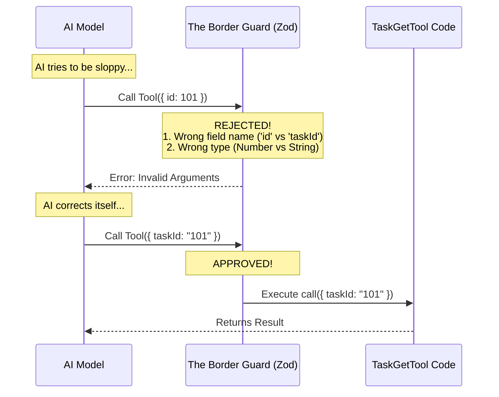

# Chapter 2: Data Contract Schemas

Welcome to the second chapter of the **TaskGetTool** tutorial!

In the previous [Chapter 1: Task Domain Entity](01_task_domain_entity.md), we defined the shape of our data (the "Noun"). We decided that a Task must have an ID, a subject, and dependency lists.

Now, we face a practical problem. AI models are creative storytellers—they generate text. But our code is strict logical machinery—it crashes if data is formatted incorrectly.

In this chapter, we build the "Border Guard" that stands between the AI and our Code.

## The Motivation: Chaos vs. Order

Imagine you operate a secure vault (the Code). The AI is a customer trying to get in.
Sometimes the customer follows the rules: *"I would like to open box 123."*
Sometimes the customer is sloppy: *"Open the box with the number one-hundred-twenty-three."*

If you feed "one-hundred-twenty-three" into a function expecting a numeric ID or a strict string ID, your program crashes.

**The Solution:**
We create **Data Contract Schemas**. These are strict rules (contracts) that validate everything coming IN and everything going OUT.

## Key Concepts

We use a library called **Zod** (`z`) to define these rules. Think of Zod as a scanner at the airport security checkpoint.

### 1. The Input Schema (The Entry Visa)
This defines exactly what arguments the AI *must* provide to call our tool. If the AI tries to call our tool with missing data or the wrong data type, the Schema blocks it before it ever reaches our code.

### 2. The Output Schema (The Exit Package)
This defines exactly what our tool guarantees to return to the AI. This ensures the AI receives a consistent structure it can rely on for its reasoning.

## How to Use It

Let's look at how we define these schemas in `TaskGetTool.ts`.

### Defining the Input Schema

The AI needs to know: "What inputs do you need to find a task?"
We need just one thing: the `taskId`.

```typescript
// Inside TaskGetTool.ts
const inputSchema = lazySchema(() =>
  z.strictObject({
    // We strictly require a string called 'taskId'
    taskId: z.string().describe('The ID of the task to retrieve'),
  }),
)
```

**Beginner Explanation:**
*   `z.strictObject`: This tells the AI, "Don't send me extra random fields. I only want what is on this list."
*   `taskId: z.string()`: The value must be text (e.g., "123"), not a raw number (123).
*   `.describe(...)`: This is a hint for the AI. It reads this text to understand what the field is for.

### Defining the Output Schema

Once the tool finds the task, we need to package it safely. This matches the **Task Domain Entity** we designed in Chapter 1.

```typescript
// Inside TaskGetTool.ts
const outputSchema = lazySchema(() =>
  z.object({
    task: z
      .object({
        id: z.string(),
        subject: z.string(),
        status: TaskStatusSchema(), // e.g. 'pending'
        blocks: z.array(z.string()),
        blockedBy: z.array(z.string()),
      })
      .nullable(), // Allows returning null if not found
  }),
)
```

**Beginner Explanation:**
*   We wrap the result in a parent object `{ task: ... }`.
*   `z.array(z.string())`: This defines our dependency lists. It guarantees the AI will receive a list (array) of strings, even if that list is empty.
*   `.nullable()`: This is crucial. Sometimes a task ID doesn't exist. This contract tells the AI: "Be prepared, sometimes I might return `null`."

## Under the Hood: The Validation Flow

What actually happens when the AI tries to use the tool? The Schema acts as a gatekeeper.

Let's visualize the process using a Sequence Diagram.



### Implementing the Connection

Defining the schemas is step one. Step two is attaching them to the tool definition so the system knows about them.

In `TaskGetTool.ts`, we use the `buildTool` function to wire everything together.

```typescript
// Inside TaskGetTool.ts
export const TaskGetTool = buildTool({
  name: TASK_GET_TOOL_NAME,
  
  // We attach our "Border Guard" here
  get inputSchema(): InputSchema {
    return inputSchema()
  },
  
  // We attach our "Exit Package" here
  get outputSchema(): OutputSchema {
    return outputSchema()
  },

  // ... rest of the tool definition
})
```

**Beginner Explanation:**
When the AI connects to our application, it reads this definition. It looks at `inputSchema` to learn *how* to talk to us. It looks at `outputSchema` to learn *what* it will get back.

This prevents the "garbage in, garbage out" problem. By the time the data reaches your `call()` function (which we will discuss later), you can be 100% confident that `taskId` exists and is a string. You don't need to write code to check if it's a number or if it's undefined—the Schema already did that work for you.

## Conclusion

In this chapter, we established the **Data Contract Schemas**. 

We learned that:
1.  **Zod Schemas** act as a strict border guard.
2.  **Input Schemas** protect our code from malformed AI requests.
3.  **Output Schemas** guarantee the AI receives the structural logic (like dependencies) we designed in the previous chapter.

Now the AI knows *what* the data looks like and *how* to format the request. But how does the AI know *what the tool actually does* or *when* it should be used?

We solve that by teaching the AI with language.

[Next Chapter: Prompt Configuration](03_prompt_configuration.md)

---

Generated by [Code IQ](https://github.com/adityasoni99/Code-IQ)