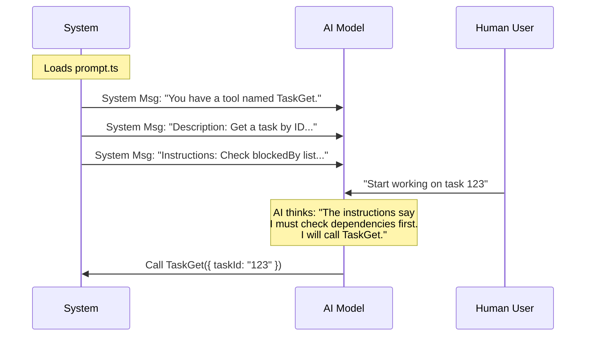

# Chapter 3: Prompt Configuration

Welcome to Chapter 3 of the **TaskGetTool** tutorial!

In the previous [Chapter 2: Data Contract Schemas](02_data_contract_schemas.md), we built strict "Border Guards" (Schemas) to ensure the AI speaks to our code correctly (using the right data types).

Now, we face a different challenge. The AI knows *how* to call the tool (syntax), but it doesn't necessarily know *why* or *when* to call it (semantics).

In this chapter, we will write the **Prompt Configuration**. This is effectively the "User Manual" that we hand to the AI.

## The Motivation: Context is King

Imagine you hand a new employee a specialized wrench.
*   **The Schema (Chapter 2)** ensures the employee holds the wrench by the handle, not the jagged end.
*   **The Prompt (This Chapter)** tells the employee: *"Only use this wrench on pipes that are leaking, and never use it on electrical wires."*

Without this manual, the AI is just guessing. It might try to "Get a Task" when it should be "Creating a Task." Or worse, it might start working on a task without checking if it is blocked by another task first.

**The Central Use Case:**
We want the AI to read our documentation and autonomously think: *"I see that I should check the 'blockedBy' field before I tell the user I'm starting work."*

## Key Concepts

We define these instructions in a file called `prompt.ts`. There are two distinct parts to this configuration:

### 1. The Description (The "Elevator Pitch")
This is a short, one-sentence summary. When the AI has 50 different tools available, it scans these descriptions to quickly decide which tool is relevant to the user's request.

### 2. The Prompt Strategy (The "User Manual")
This is a detailed block of text (often written in Markdown). It provides:
*   **Usage Rules:** When to use this vs. other tools.
*   **Output Expectations:** What data the AI will see.
*   **Tips/Strategy:** "Best practices" for the AI to follow.

## How to Use It

Let's look at the `prompt.ts` file in our project.

### 1. Defining the Description

We keep this simple. It helps the AI's "router" pick the right tool.

```typescript
// Inside prompt.ts
export const DESCRIPTION = 'Get a task by ID from the task list'
```

**Explanation:**
If a user says "Find task 123," the AI matches that intent against this string.

### 2. Defining the Prompt Strategy

This is where we add intelligence. We aren't writing code here; we are writing English instructions that the AI will "read."

```typescript
// Inside prompt.ts
export const PROMPT = `Use this tool to retrieve a task by its ID.

## When to Use This Tool
- To understand task dependencies (what blocks it)
- After being assigned a task, to get complete requirements

## Tips
- After fetching, verify its 'blockedBy' list is empty.
`
```

**Explanation:**
*   **Markdown Format:** We use headers (`##`) and bullet points because AI models are trained on internet text and understand this structure very well.
*   **Dependency Logic:** Notice the specific tip: *"verify its blockedBy list is empty."* We are explicitly teaching the AI how to behave safely without writing complex validation code.

## Under the Hood: The Internal Implementation

How does the AI actually see this? It's not magic. When the application starts, our system bundles these strings and sends them to the AI in a "System Message."

### The Flow of Knowledge

1.  **System Startup:** The tool loads `DESCRIPTION` and `PROMPT`.
2.  **Context Injection:** The system sends a hidden message to the AI: *"Here are the tools you can use..."*
3.  **AI Reasoning:** The AI reads the Prompt Strategy to plan its actions.



### Wiring it to the Tool

We need to attach these strings to our main Tool Definition so the system can find them. We do this in `TaskGetTool.ts`.

```typescript
// Inside TaskGetTool.ts
import { DESCRIPTION, PROMPT } from './prompt.js'

export const TaskGetTool = buildTool({
  name: TASK_GET_TOOL_NAME,
  
  // 1. Attach the short description
  async description() {
    return DESCRIPTION
  },

  // 2. Attach the detailed manual
  async prompt() {
    return PROMPT
  },
  
  // ... rest of the tool definition (schemas, call function)
})
```

**Beginner Explanation:**
*   We import the strings from `prompt.ts`.
*   We assign them to `description()` and `prompt()` functions in the tool builder.
*   Now, whenever the generic `buildTool` framework runs, it knows exactly what documentation to send to the AI.

## Why Separate the Prompt?

You might wonder, *"Why put text in a separate file (`prompt.ts`) instead of right inside the code?"*

1.  **Iterating is easier:** You can tweak the wording of the instructions to make the AI smarter without touching the "hard" code logic. This is called **Prompt Engineering**.
2.  **Readability:** It keeps our TypeScript logic clean and our English instructions separate.

## Conclusion

In this chapter, we created the **Prompt Configuration**.

We learned that:
1.  **Descriptions** help the AI find the tool.
2.  **Prompt Strategies** teach the AI how to use the tool correctly (e.g., checking dependencies).
3.  This is effectively "documentation for the machine."

At this point, the AI knows *how* to call the tool (Chapter 2) and *why* to call it (Chapter 3). When it finally calls the tool, our code runs and gets a result from the database.

However, the database gives us raw data. If we just dump a giant JSON object back to the AI, it might get confused or waste "tokens" (processing power). We need to present the result nicely.

[Next Chapter: Result Formatting Strategy](04_result_formatting_strategy.md)

---

Generated by [Code IQ](https://github.com/adityasoni99/Code-IQ)