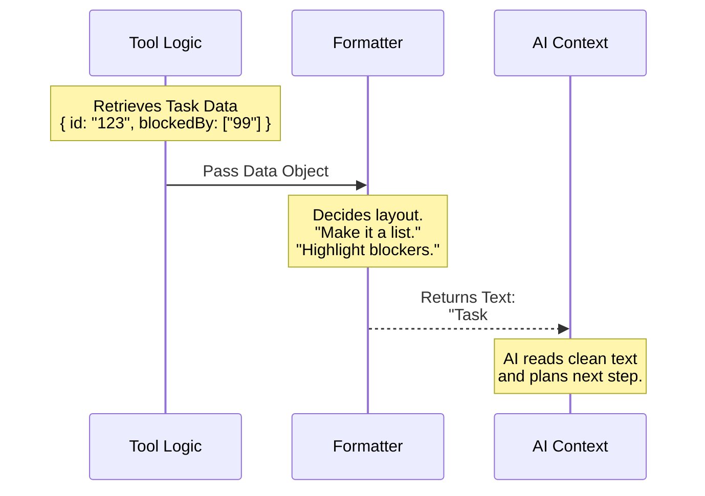

# Chapter 4: Result Formatting Strategy

Welcome to Chapter 4 of the **TaskGetTool** tutorial!

In the previous [Chapter 3: Prompt Configuration](03_prompt_configuration.md), we taught the AI *when* and *why* to use our tool. We gave it a "User Manual."

Now, imagine the AI follows your instructions and successfully retrieves a task. The database sends back a raw data object. 

**The Question:** How do we present this data to the AI so it immediately understands what matters?

In this chapter, we explore the **Result Formatting Strategy**. This is the "View" layer of our tool. It translates computer-friendly code into "human-readable" text that the AI can process easily.

## The Motivation: Raw Data vs. Clear Insights

Computers love JSON (JavaScript Object Notation). It looks like this:

```json
{ "id": "123", "subject": "Fix Bug", "blockedBy": ["456"], "blocks": [] }
```

While the AI *can* read this, it is dense and cluttered with brackets and quotes. If we just dump raw JSON into the AI's conversation history, two bad things happen:
1.  **Wasted Space:** All those brackets `{ } " "` take up space in the AI's limited memory (Context Window).
2.  **Missed Details:** Essential information (like being "Blocked") might get lost in the noise.

**The Central Use Case:**
We want the AI to see a clean summary like this:

> Task #123: Fix Bug
> Status: pending
> **Blocked by: #456**

By formatting the result, we force the AI to notice the dependency (`#456`). This ensures the AI stops and says: *"Ah, I see this is blocked. I must fix Task 456 first."*

## Key Concepts

We implement this strategy using a specific function called `mapToolResultToToolResultBlockParam`. Don't let the long name scare you! It simply means: **Map (Convert) the Result into a Text Block.**

### 1. The Input (Structured Data)
This is the object we defined in [Chapter 1: Task Domain Entity](01_task_domain_entity.md). It is perfect for code, but dry for reading.

### 2. The Formatter (The Translator)
This is our logic. It decides what is important. It acts like a highlighter, picking specific fields (like `blockedBy`) and adding labels to them.

### 3. The Output (The Text Block)
This is the final string the AI reads. It mimics how a human project manager would type a status update in a chat.

## Under the Hood: The Flow

Before we look at the code, let's visualize what happens when the tool finishes its job.



## How to Implement It

We write this logic inside the `TaskGetTool.ts` file. Let's break down the `mapToolResultToToolResultBlockParam` function into three simple steps.

### Step 1: Handling "Not Found"

Sometimes, the AI asks for a task ID that doesn't exist. Our [Chapter 2: Data Contract Schemas](02_data_contract_schemas.md) allows us to return `null`. We need to tell the AI clearly that nothing was found.

```typescript
// Inside mapToolResultToToolResultBlockParam
const { task } = content as Output

// If the database returned nothing...
if (!task) {
  return {
    tool_use_id: toolUseID,
    type: 'tool_result',
    content: 'Task not found', // Simple, clear feedback
  }
}
```

**Explanation:**
If `task` is missing, we don't throw an error. We just return the string `'Task not found'`. This allows the AI to apologize to the user: *"I couldn't find that task. Did you mean a different ID?"*

### Step 2: Building the Basic Info

If the task exists, we want to create a clean list of details. We use an array of strings (lines) that we will later join together.

```typescript
// Create a list of lines for the AI to read
const lines = [
  `Task #${task.id}: ${task.subject}`,
  `Status: ${task.status}`,
  `Description: ${task.description}`,
]
```

**Explanation:**
We use Template Literals (backticks \`\`) to mix text and variables.
*   **Input:** `{ id: "123", subject: "Buy Milk" }`
*   **Result:** `"Task #123: Buy Milk"`

### Step 3: Highlighting Logic (The "View" Logic)

This is the most important part. We only want to show dependency lines **if they exist**. If a task isn't blocked, saying `Blocked by: (empty)` is just noise.

```typescript
// Only add this line if the list is not empty
if (task.blockedBy.length > 0) {
  // Convert list ["1", "2"] -> "#1, #2"
  const ids = task.blockedBy.map(id => `#${id}`).join(', ')
  lines.push(`Blocked by: ${ids}`)
}

if (task.blocks.length > 0) {
  lines.push(`Blocks: ${task.blocks.map(id => `#${id}`).join(', ')}`)
}
```

**Explanation:**
We check `.length > 0`. This is our "View Logic." We are curating the experience for the AI. By adding `Blocked by:` explicitly, we draw the AI's attention to the blockers.

### Step 4: Final Assembly

Finally, we join all our lines with a "newline" character (`\n`) and wrap it in the required object structure.

```typescript
return {
  tool_use_id: toolUseID,
  type: 'tool_result',
  // Join lines: "Line 1\nLine 2\nLine 3"
  content: lines.join('\n'), 
}
```

## Analogy: The Restaurant Menu

Think of the raw data from the database as a **Spreadsheet of Ingredients**:
*   *Flour: 500g, Eggs: 3, Sugar: 200g, DishID: 55*

If you gave that to a customer, they would be confused.

The **Result Formatting Strategy** is the **Printed Menu**:
*   *Pancakes (Dish #55)*
*   *Contains: Eggs, Gluten.*

By formatting it, you make it usable. Specifically, by highlighting "Contains: Eggs," you warn people with allergies. Similarly, by highlighting "Blocked by," we warn the AI about dependencies.

## Conclusion

In this chapter, we built the **Result Formatting Strategy**.

We learned that:
1.  **Raw JSON is for code, Text is for AI.**
2.  We use formatting logic to **highlight critical details** (like blockers) and hide empty fields.
3.  This layer acts as a translator, ensuring the AI receives clear, concise feedback.

We have now covered the Data (Chapter 1), the Rules (Chapter 2), the Instructions (Chapter 3), and the Display (Chapter 4).

There is only one step left. We need to assemble all these pieces into the final Tool Object that the system can actually run.

[Next Chapter: Tool Definition](05_tool_definition.md)

---

Generated by [Code IQ](https://github.com/adityasoni99/Code-IQ)