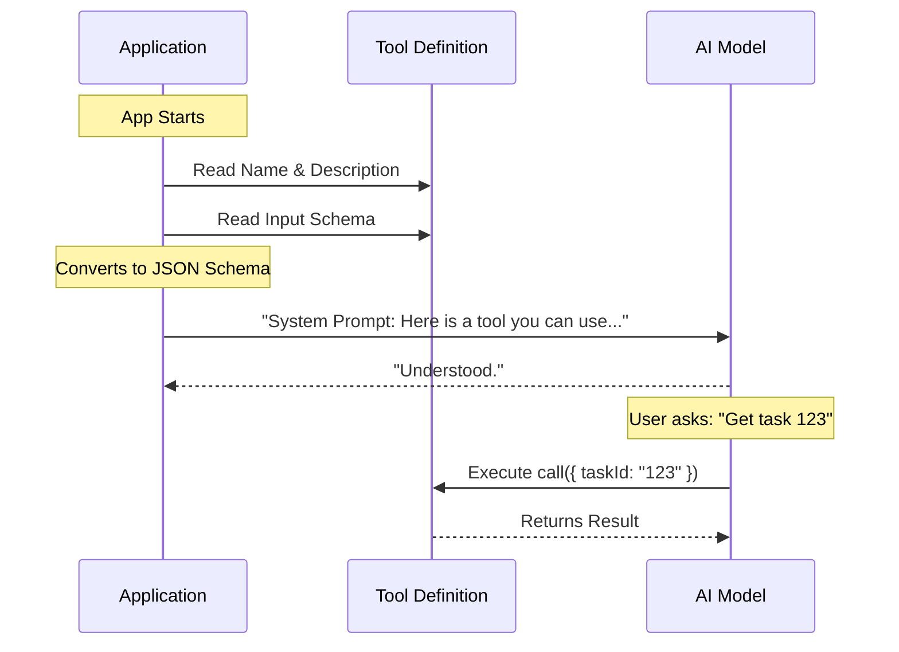

# Chapter 5: Tool Definition

Welcome to the final chapter of the **TaskGetTool** tutorial!

In the previous chapters, we built all the individual components of our tool:
1.  We defined the data structure in [Chapter 1: Task Domain Entity](01_task_domain_entity.md).
2.  We created validation rules in [Chapter 2: Data Contract Schemas](02_data_contract_schemas.md).
3.  We wrote the user manual in [Chapter 3: Prompt Configuration](03_prompt_configuration.md).
4.  We designed the output look-and-feel in [Chapter 4: Result Formatting Strategy](04_result_formatting_strategy.md).

Right now, these are just loose parts scattered on a workbench. In this chapter, we will assemble them into a single, functioning unit called the **Tool Definition**.

## The Motivation: The "Robot Hand"

Imagine you are building a robot. You have the fingers, the motors, and the wires, but you need to attach them all to a single arm so the robot knows how to use them.

The **Tool Definition** is that arm. It is the bridge that connects your code to the AI Agent.

**The Central Use Case:**
The AI system needs to interact with your code, but it cannot read your raw TypeScript files. It needs a standardized "ID Card" that tells it:
*   "My name is TaskGet."
*   "I am safe to run (Read Only)."
*   "Here are my inputs."
*   "Here is the function to run."

Without this definition, the AI doesn't know your tool exists.

## Key Concepts

We use a helper function called `buildTool`. This creates a unified object containing everything the AI needs to know.

### 1. Identity & Metadata
Just like a person has a name and a job title, a tool needs a unique **Name** (for the system) and a **Description** (for the AI to understand its purpose).

### 2. The Interface (Schemas)
We plug in the Input and Output schemas we built in Chapter 2. This tells the system how to validate data entering and leaving the tool.

### 3. The Behavior (Logic)
We attach the actual executable code (the `call` function). This is the engine that runs when the AI decides to use the tool.

### 4. Safety Flags
We set rules like `isReadOnly`. This tells the AI: "This tool is safe; it won't delete data or crash the server."

## How to Build It

Let's look at `TaskGetTool.ts` and see how we use `buildTool` to wire everything together. We will break this large object into small, understandable pieces.

### Step 1: The Container
We start by calling `buildTool`. This function ensures we don't forget any required fields.

```typescript
// Inside TaskGetTool.ts
export const TaskGetTool = buildTool({
  name: TASK_GET_TOOL_NAME, // e.g. 'TaskGet'
  userFacingName() {
    return 'TaskGet'        // Friendly name for UI logs
  },
  
  // ... other properties go here
})
```

**Explanation:**
*   `export const`: We export this so the main application can load it.
*   `name`: A unique machine-readable ID.

### Step 2: Attaching the "User Manual"
Next, we attach the instructions we wrote in [Chapter 3: Prompt Configuration](03_prompt_configuration.md).

```typescript
// Inside buildTool({ ... })
  async description() {
    return DESCRIPTION // "Get a task by ID..."
  },
  async prompt() {
    return PROMPT      // The detailed usage guide
  },
```

**Explanation:**
When the AI starts up, it calls these functions to "read" the manual. It learns what the tool does before it ever tries to use it.

### Step 3: Attaching the "Border Guards"
We connect the Zod schemas from [Chapter 2: Data Contract Schemas](02_data_contract_schemas.md).

```typescript
// Inside buildTool({ ... })
  get inputSchema(): InputSchema {
    return inputSchema() // Validates arguments (taskId)
  },
  get outputSchema(): OutputSchema {
    return outputSchema() // Validates return data
  },
```

**Explanation:**
By adding these getters, we ensure that every request is automatically checked. If the AI sends bad data, `buildTool` rejects it before it reaches our logic.

### Step 4: The Execution Logic
This is the heart of the tool. The `call` function performs the actual work.

```typescript
// Inside buildTool({ ... })
  async call({ taskId }) {
    // 1. Get the data
    const task = await getTask(getTaskListId(), taskId)

    // 2. Return the structured object
    // (We return the Task Domain Entity from Chapter 1)
    if (!task) return { data: { task: null } }
    
    return { 
      data: { task: { /* ... mapped fields ... */ } } 
    }
  },
```

**Explanation:**
This is where the code meets the database. Notice how simple it is? Because we handled validation in the Schema and formatting in the View layer, this function only needs to fetch and return data.

### Step 5: Configuration & Safety
Finally, we add flags to help the system manage the tool.

```typescript
// Inside buildTool({ ... })
  shouldDefer: true,       // Run in background if slow
  isEnabled() {
    return isTodoV2Enabled() // Feature flag check
  },
  isReadOnly() {
    return true            // Safe! No side effects.
  },
```

**Explanation:**
*   `isReadOnly()`: Crucial for trust. The AI knows it can call this tool freely without breaking anything.
*   `isEnabled()`: Allows us to turn the tool on or off based on system settings (feature flags).

## Under the Hood: The Tool Lifecycle

What happens when you run the application? How does this object turn into AI magic?

### The Registration Flow

1.  **Startup:** The application starts and imports `TaskGetTool`.
2.  **Registration:** The system reads the `name`, `description`, and `inputSchema`.
3.  **Conversion:** The system converts our Zod schema into a format called "JSON Schema" that OpenAI/Anthropic models understand.
4.  **Handshake:** The system sends this definition to the AI Model: *"I have a tool named TaskGet that takes a `taskId` string."*



## Analogy: The Smartphone App

Think of the **Tool Definition** like publishing an App to the App Store.

*   **Name/Description:** The listing on the store.
*   **Input Schema:** The permissions the app asks for (e.g., "Access Camera").
*   **Call Function:** The code that runs when you tap the icon.
*   **Safety Flags:** The "Age Rating" or "Privacy Policy."

If you don't fill out the App Store form (the `buildTool` object) correctly, the store (the AI) won't let users download or use your app.

## Conclusion

Congratulations! You have completed the **TaskGetTool** tutorial.

In this final chapter, we learned that a **Tool Definition** is a configuration object that:
1.  **Identifies** the tool to the AI.
2.  **Validates** data using Schemas.
3.  **Executes** logic using a `call` function.
4.  **Configures** safety settings.

By wrapping our logic in `buildTool`, we created a safe, well-documented, and structured capability that an AI agent can use to help users get their work done.

You now have a fully functional tool that retrieves tasks, understands dependencies, and communicates clearly with an AI!

---

Generated by [Code IQ](https://github.com/adityasoni99/Code-IQ)