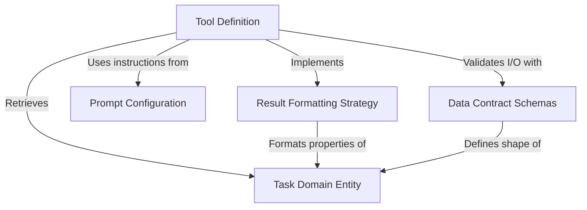

# Tutorial: TaskGetTool

This project implements the **TaskGetTool**, a specialized interface that enables an *AI agent* to retrieve detailed information about a specific task by its ID. It combines strict **Data Contract Schemas** for safety, detailed *Prompt Configurations* for context, and a formatting strategy to present the retrieved **Task Domain Entity** (including dependencies like blocks) in a clear, human-readable format.

## Chapters

1. [Task Domain Entity](01_task_domain_entity.md)
2. [Data Contract Schemas](02_data_contract_schemas.md)
3. [Prompt Configuration](03_prompt_configuration.md)
4. [Result Formatting Strategy](04_result_formatting_strategy.md)
5. [Tool Definition](05_tool_definition.md)

---

Generated by [Code IQ](https://github.com/adityasoni99/Code-IQ)