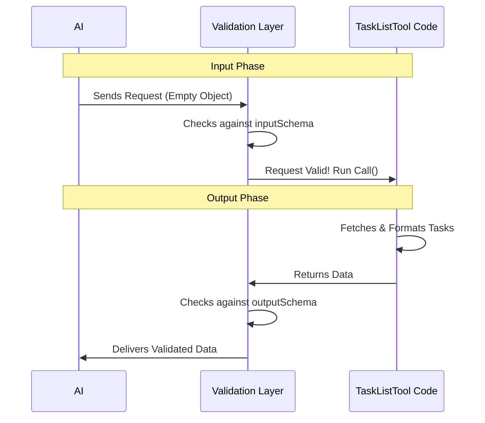

# Chapter 1: Data Schema & Validation

Welcome to the **TaskListTool** project! In this first chapter, we are going to lay the foundation for our AI tool. Before we write any logic or fancy prompts, we need to agree on a language.

## The Problem: The Chaos of Conversation

Imagine you are running a busy professional kitchen. A waiter runs in and shouts, "Someone wants food!"

You would be confused. *What* food? A burger? A salad? Do they have allergies?

If the AI (the waiter) just sends random text to our code (the kitchen), our program will crash. Similarly, if our code sends a messy pile of data back to the AI, the AI won't know how to read it.

## The Solution: The "Order Ticket" (Schema)

To solve this, we create a **Schema**. Think of a Schema as a standardized **Kitchen Order Ticket**.

*   **Input Schema:** The waiter *must* write the order on this ticket. If they don't check the right boxes, the kitchen rejects it.
*   **Output Schema:** The kitchen puts the food on a standard plate so the waiter knows exactly what they are carrying.

In our code, we use a library called **Zod** to create these tickets. Zod acts as a strict gatekeeper: it ensures type safety and predictable data formats.

### Use Case: Listing Tasks

Let's look at our specific goal: We want the AI to **List all tasks**.

1.  **Input:** The AI doesn't need to give us any specific details to "list everything." So, our input ticket is blank (but it still must be a ticket!).
2.  **Output:** We need to return a list where every task has specific fields: `id`, `subject`, `status`, `owner`, and `blockedBy`.

## Defining the Schemas

Let's look at how we define these rules in `TaskListTool.ts`.

### 1. The Input Schema

Since we are just asking for a list of all tasks, we don't need to provide any arguments (like a search term or a specific ID).

```typescript
import { z } from 'zod/v4'
import { lazySchema } from '../../utils/lazySchema.js'

// Defines what the AI sends TO us
const inputSchema = lazySchema(() => z.strictObject({}))

type InputSchema = ReturnType<typeof inputSchema>
```

**Explanation:**
*   `z.strictObject({})`: This creates a Zod object that is empty (`{}`).
*   `strict`: This means "Don't add anything extra!" If the AI tries to send `{ filter: "urgent" }`, this schema will reject it because we didn't ask for a filter.
*   It's like a form with no fields to fill out—you just submit it to trigger the action.

### 2. The Output Schema

This is where the magic happens. We need to tell the system exactly what a "Task" looks like so the AI understands the data we give back.

```typescript
const outputSchema = lazySchema(() =>
  z.object({
    tasks: z.array(
      z.object({
        id: z.string(),
        subject: z.string(),
        // ... continued below
      }),
    ),
  }),
)
```

**Explanation:**
*   `z.object(...)`: The result is an object containing data.
*   `tasks: z.array(...)`: We are returning a list (array) of items.
*   `id: z.string()`: Every task *must* have an ID, and it *must* be text (string).

### 3. Adding Details to the Output

A task is more than just an ID. We need to define the status and relationships.

```typescript
// ... inside the object defined above
        status: TaskStatusSchema(),
        owner: z.string().optional(),
        blockedBy: z.array(z.string()),
```

**Explanation:**
*   `status`: Uses a helper `TaskStatusSchema()` (likely defines specific words like 'todo', 'done').
*   `owner`: This is `optional()`. A task might not have an owner, and that's okay. Zod won't complain if it's missing.
*   `blockedBy`: An array of strings (IDs of other tasks blocking this one).

## Under the Hood: How Validation Works

When the AI tries to use our tool, a process runs to ensure everything matches our schemas.



1.  **Input Check:** The system looks at `inputSchema`. Since we defined an empty object, it ensures the AI didn't pass random arguments.
2.  **Execution:** The tool logic runs (we'll cover this in later chapters).
3.  **Output Check:** Before the data is sent back to the AI, Zod checks strictly. If our code tries to return a number for the `id` instead of a string, Zod throws an error. This protects the AI from confusing data.

## Mapping Data to Schema

In our actual code implementation, we have to make sure the data we fetch from our database matches that `outputSchema` we defined.

Here is how we map the raw data to match our Zod definition:

```typescript
    // Inside the call() function
    const tasks = allTasks.map(task => ({
      id: task.id,
      subject: task.subject,
      status: task.status,
      owner: task.owner,
      // Filter out blockers that are already finished
      blockedBy: task.blockedBy.filter(id => !resolvedTaskIds.has(id)),
    }))
```

**Explanation:**
*   We loop through `allTasks`.
*   We create a new object for each task that matches our Zod schema exactly.
*   Notice `blockedBy`: We do a little logic here to clean up the data before putting it into the schema format.

Finally, we return the data wrapped in the structure our `outputSchema` expects:

```typescript
    return {
      data: {
        tasks, // This matches z.array inside our outputSchema
      },
    }
```

## Conclusion

We have successfully defined the "contract" for our tool.
1.  We created an **Input Schema** (an empty form).
2.  We created an **Output Schema** (a strict definition of a Task).
3.  We ensured that any data entering or leaving our tool is predictable and safe.

Now that the shape of our data is defined, we need to tell the AI generally what this tool is and how it behaves.

[Next Chapter: Tool Definition & Configuration](02_tool_definition___configuration.md)

---

Generated by [Code IQ](https://github.com/adityasoni99/Code-IQ)