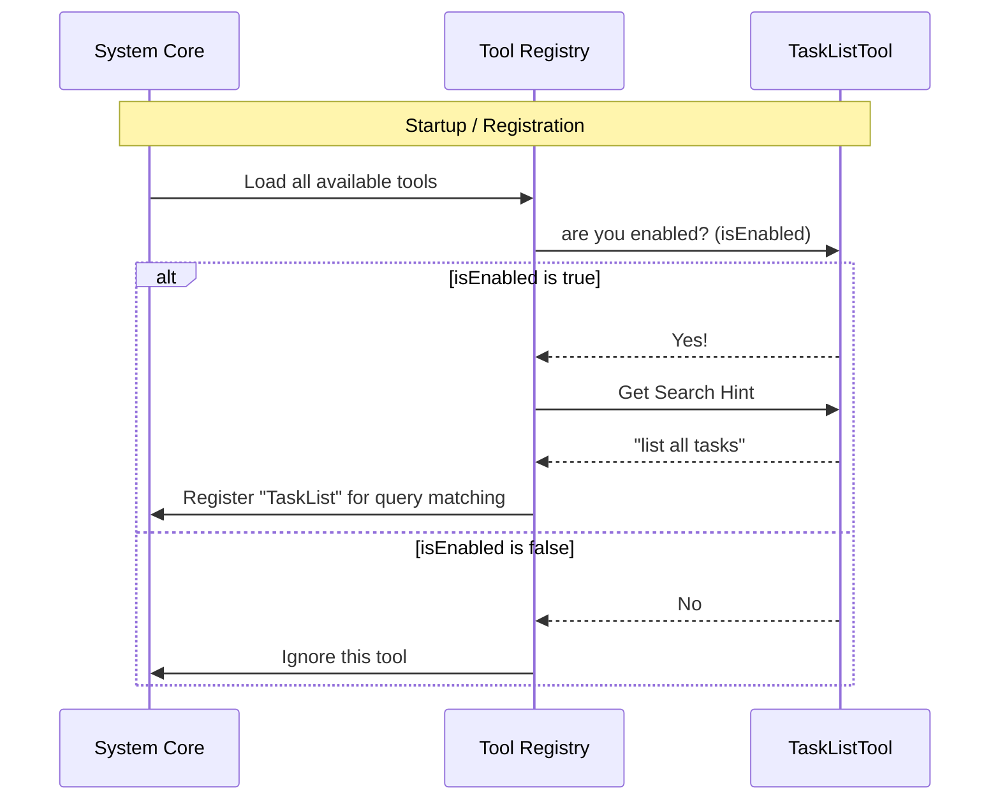

# Chapter 2: Tool Definition & Configuration

In the previous chapter, [Data Schema & Validation](01_data_schema___validation.md), we defined the "language" (Input and Output schemas) that our tool uses to communicate.

Now that we have the forms for the data, we need to officially hire the employee who will handle them. In this chapter, we will focus on **Tool Definition & Configuration**.

## The Problem: The Unknown Employee

Imagine you have written a brilliant piece of code that can list every task in your database. It's fast, it's accurate, and it uses the schemas we built in Chapter 1.

However, the AI Agent acts like a busy project manager. It doesn't know your code exists. It doesn't know:
1.  **What** the tool is named.
2.  **When** to use it (keywords).
3.  **If** it is safe to run alongside other tasks.

Without a formal definition, your code is just a ghost—invisible to the system.

## The Solution: The "ID Badge" (`buildTool`)

To solve this, we use a utility called `buildTool`. Think of this as filling out a detailed **Employee Registration Form** or creating an **ID Badge**.

When we fill out this configuration, we tell the system:
*   "My name is TaskList."
*   "I am helpful when you want to 'list all tasks'."
*   "I am read-only (I don't delete things)."

## Key Configuration Concepts

Let's break down the registration form into small, manageable pieces. All of this happens inside the `TaskListTool.ts` file.

### 1. Identity & Searchability

First, we need to give the tool a name and tell the AI how to find it.

```typescript
import { buildTool } from '../../Tool.js'
import { TASK_LIST_TOOL_NAME } from './constants.js'

export const TaskListTool = buildTool({
  name: TASK_LIST_TOOL_NAME, // Unique internal ID
  userFacingName: () => 'TaskList', // What the user sees in the UI
  // The 'Hint' helps the AI find this tool via semantic search
  searchHint: 'list all tasks', 
  // ... configuration continues
})
```

**Explanation:**
*   `name`: A unique string ID (e.g., `'TaskList'`).
*   `searchHint`: This is crucial. When the user types "Show me everything on my plate," the system compares that phrase to `'list all tasks'`. If they are similar, the AI picks this tool.

### 2. Linking the Schemas

Remember the "Order Tickets" we made in [Data Schema & Validation](01_data_schema___validation.md)? We need to attach them here.

```typescript
  // ... inside buildTool
  get inputSchema() {
    return inputSchema() // Defined in Chapter 1
  },
  get outputSchema() {
    return outputSchema() // Defined in Chapter 1
  },
  // ... configuration continues
```

**Explanation:**
*   We use "getters" (`get`) to attach the schemas.
*   This connects the "ID Badge" (Definition) to the "Job Responsibilities" (Schema). The AI now knows strictly what data to send and receive.

### 3. Safety & Permissions

The AI needs to know if this tool is dangerous or heavy.

```typescript
  // ... inside buildTool
  isConcurrencySafe() {
    return true
  },
  isReadOnly() {
    return true
  },
  shouldDefer: true,
```

**Explanation:**
*   `isConcurrencySafe`: Returns `true`. This means if the user asks for 5 different things at once, this tool can run in parallel without breaking anything.
*   `isReadOnly`: Returns `true`. This tool only *looks* at data; it doesn't change it. This makes the AI more confident in using it freely.
*   `shouldDefer`: If `true`, the tool runs in the background for a smoother user experience.

### 4. Feature Flagging

Sometimes, we want to hide a tool without deleting the code (e.g., if a feature isn't ready for the public yet).

```typescript
import { isTodoV2Enabled } from '../../utils/tasks.js'

  // ... inside buildTool
  isEnabled() {
    return isTodoV2Enabled()
  },
```

**Explanation:**
*   Before showing the tool to the AI, the system runs this function.
*   If `isTodoV2Enabled()` returns `false`, the AI will pretend this tool doesn't exist.

## Under the Hood: The Registration Process

How does the system actually use this configuration object? Let's look at the "hiring" process.



1.  **Check:** The system checks `isEnabled()`.
2.  **Index:** If enabled, the system reads the `searchHint`. It adds this hint to a "semantic search" index.
3.  **Match:** Later, when a user types a query, the system looks at that index to decide which tool to pull off the shelf.

## The Full Picture

Here is how it looks when we put these pieces together in the code. We wrap it all in `buildTool` and ensure it satisfies our `ToolDef` type for safety.

```typescript
export const TaskListTool = buildTool({
  name: TASK_LIST_TOOL_NAME,
  searchHint: 'list all tasks',
  
  // Linking our Schemas
  get inputSchema(): InputSchema { return inputSchema() },
  get outputSchema(): OutputSchema { return outputSchema() },

  // Safety & Config
  isEnabled() { return isTodoV2Enabled() },
  isConcurrencySafe() { return true },
  isReadOnly() { return true },

  // ... (Logic and Prompts come later)
} satisfies ToolDef<InputSchema, Output>)
```

**Explanation:**
*   `satisfies ToolDef<...>`: This is a TypeScript trick. It ensures we didn't forget any required fields in our ID Badge. If we forget `name`, TypeScript will yell at us.

## Conclusion

We have successfully created the **ID Card** for our `TaskListTool`.
1.  We gave it a **Name** and **Search Hint** so the AI can find it.
2.  We attached the **Schemas** so the AI knows how to talk to it.
3.  We defined **Permissions** (Read-only, Concurrency safe) so the AI knows how to handle it safely.

However, simply having an ID badge isn't enough. The AI might know *what* the tool is, but it doesn't intuitively understand the nuances of *how* to use it to get the best results. For that, we need to teach the AI with dynamic instructions.

[Next Chapter: Dynamic Prompt Engineering](03_dynamic_prompt_engineering.md)

---

Generated by [Code IQ](https://github.com/adityasoni99/Code-IQ)