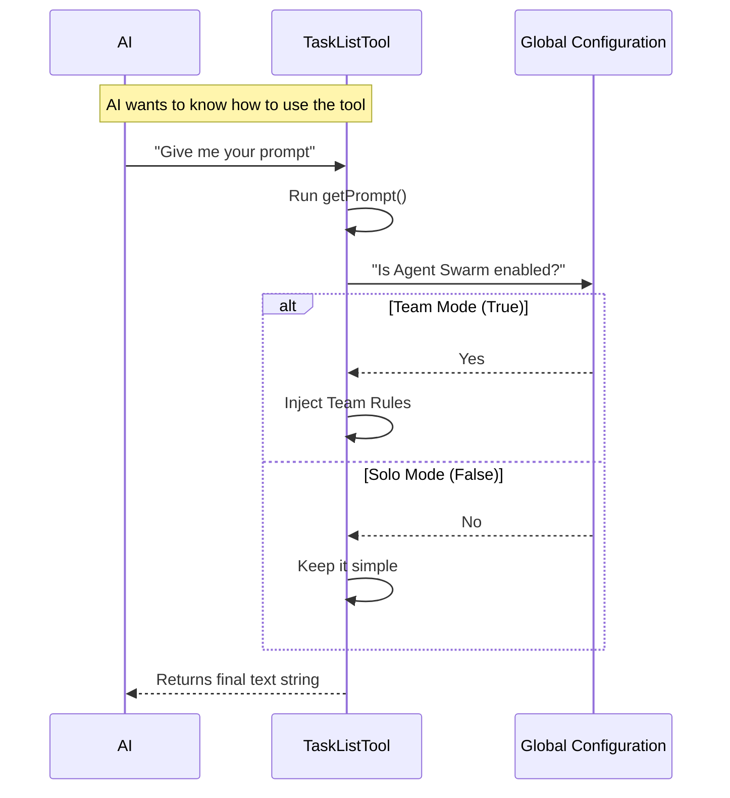

# Chapter 3: Dynamic Prompt Engineering

In the previous chapter, [Tool Definition & Configuration](02_tool_definition___configuration.md), we gave our tool a name and an "ID Badge" so the system knows it exists.

But hiring an employee isn't enough; you have to train them. In this chapter, we explore **Dynamic Prompt Engineering**. This is how we give the AI a "Briefing Document" on how to use the tool effectively.

## The Problem: One Size Doesn't Fit All

Imagine you are hiring a cleaner.
1.  **Scenario A (Empty House):** You say, "Clean everything."
2.  **Scenario B (Busy Office):** You say, "Clean everything, *but* don't disturb the workers, and ask the manager before throwing away papers."

If you gave the instructions for Scenario A to the cleaner in Scenario B, chaos would ensue.

In our **TaskListTool**, we have a similar situation. Sometimes the AI works alone (Solo Mode), and sometimes it works as part of a "Swarm" of agents (Team Mode).
*   **Solo Mode:** "Just list the tasks and finish them."
*   **Team Mode:** "List the tasks, claim one by putting your name on it, and don't touch tasks that belong to others."

We need a way to change the instructions based on the situation.

## The Solution: Dynamic Prompting

We don't write a static text file. Instead, we write a **function** that *generates* the text. This function acts like a smart manager who checks the current situation before giving a briefing.

We call this logic inside a file usually named `prompt.ts`.

### Key Concept: The "Switch"

We use a "feature flag" (a simple true/false switch) to check if we are in Team Mode.

```typescript
import { isAgentSwarmsEnabled } from '../../utils/agentSwarmsEnabled.js'

// This function builds the text dynamically
export function getPrompt(): string {
  // Check the switch
  const isTeamMode = isAgentSwarmsEnabled()
  
  // ... logic continues below
}
```

**Explanation:**
*   `isAgentSwarmsEnabled()`: This function looks at the system configuration. It returns `true` if we are in Team Mode, and `false` if we are Solo.

## Building the Briefing

Let's look at how we build the text piece by piece. We use standard text for everyone, and inject special text for teams.

### 1. The Teammate Workflow

If we are in a team, we need to tell the AI to be polite and coordinated.

```typescript
  const teammateWorkflow = isAgentSwarmsEnabled()
    ? `
## Teammate Workflow
1. Call TaskList to find available work
2. Look for tasks with no owner
3. Claim a task by setting 'owner' to your name
`
    : '' // If not in a team, add nothing (empty string)
```

**Explanation:**
*   This is a **Ternary Operator** (`condition ? value_if_true : value_if_false`).
*   If `isAgentSwarmsEnabled()` is true, the variable `teammateWorkflow` gets a paragraph of strict rules about coordination.
*   If it is false, the variable is empty.

### 2. The Context Injection

We also want to give specific advice on *when* to use the tool.

```typescript
  const teammateUseCase = isAgentSwarmsEnabled()
    ? `- Before assigning tasks to teammates, to see what's available`
    : ''
```

**Explanation:**
*   Here we add a bullet point specifically for team leaders looking to delegate work.

### 3. Assembling the Final Prompt

Finally, we glue all the pieces together into one long string using a template literal (the backticks \` \`).

```typescript
  return `Use this tool to list all tasks in the task list.

## When to Use This Tool
- To see what tasks are available
- To check overall progress
${teammateUseCase}

## Output
Returns a summary of each task.
${teammateWorkflow}`
```

**Explanation:**
*   `${teammateUseCase}`: This inserts the text we defined earlier. If we are in Solo mode, it inserts nothing.
*   The result is a custom-tailored instruction manual generated in milliseconds.

## Under the Hood: The Flow

When the AI prepares to use the `TaskListTool`, it asks for the definition. Here is what happens inside the code:



1.  **Request:** The AI (or the system orchestration layer) requests the tool's `prompt`.
2.  **Check:** The code checks the global configuration.
3.  **Assemble:** It stitches together the static text with the dynamic variables.
4.  **Delivery:** The AI receives a seamless set of instructions.

## Connecting to the Tool Definition

In [Chapter 2](02_tool_definition___configuration.md), we created the `TaskListTool` object. Now we hook this logic into it.

This happens in `TaskListTool.ts`:

```typescript
import { getPrompt } from './prompt.js'

export const TaskListTool = buildTool({
  // ... name and other settings
  
  async prompt() {
    return getPrompt()
  },
  
  // ... other settings
})
```

**Explanation:**
*   `async prompt()`: This is a reserved function in our `buildTool` definition.
*   Instead of returning a hard-coded string like `'List tasks'`, we call our smart `getPrompt()` function.

## Why This Matters

Let's look at the difference in behavior this creates.

**Without Dynamic Prompting (Solo instructions only):**
> *AI in Team Mode:* "I see a task. I will delete it and write a new one because I think it's better."
> *Result:* The AI annoys its teammates by changing their work without permission.

**With Dynamic Prompting (Team instructions injected):**
> *AI in Team Mode:* "I see a task. My instructions say 'Check for owner'. It is owned by 'Agent_B'. My instructions say 'Do not touch'. I will move to the next task."
> *Result:* A smooth, coordinated workflow.

## Conclusion

We have now successfully programmed the "Brain" of our tool.
1.  We identified that different environments (Solo vs. Team) require different rules.
2.  We used **Dynamic Prompt Engineering** to inject these rules conditionally.
3.  We connected this logic to our main Tool Definition.

Now the AI knows *what* the data looks like (Chapter 1), *who* the tool is (Chapter 2), and *how* to behave (Chapter 3).

However, the tool doesn't actually **do** anything yet! It just talks a big game. In the next chapter, we will write the actual code that fetches the data from the database.

[Next Chapter: Task Execution & Logic](04_task_execution___logic.md)

---

Generated by [Code IQ](https://github.com/adityasoni99/Code-IQ)