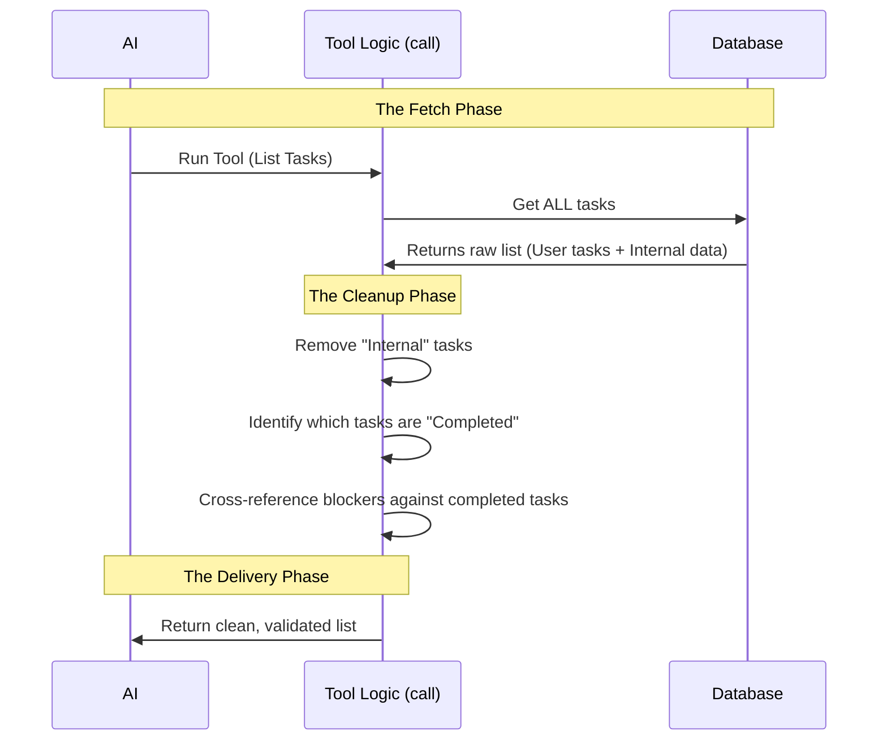

# Chapter 4: Task Execution & Logic

In the previous chapter, [Dynamic Prompt Engineering](03_dynamic_prompt_engineering.md), we taught the AI *how* and *when* to use our tool by giving it a smart instruction manual.

Now, we need to actually do the work. In this chapter, we will build the engine of our tool: the `call()` method. This is where we fetch data, clean it up, and serve it to the AI.

## The Problem: The Messy Warehouse

Imagine our task database is like a giant warehouse. It contains:
1.  **Actual Tasks:** "Buy milk", "Write code".
2.  **Internal Junk:** "System metadata", "Deleted items", "Hidden flags".
3.  **Confusing Relationships:** Task B is blocked by Task A, but Task A was finished last week.

If we just grabbed everything from the warehouse and dumped it on the AI's desk, the AI would be confused. It might say, *"Why is Task B blocked? The blocker is already done!"* or *"What is this weird system metadata file?"*

## The Solution: The "Librarian" Logic

We need to act like a helpful **Librarian**. When a user asks for a list of books (tasks):
1.  **Fetch:** We go to the shelves and get the books.
2.  **Filter:** We hide the "Staff Only" manuals (internal metadata).
3.  **Resolve:** We check the status. If a book was "on hold" but the hold has expired, we present it as available.

This logic lives inside the `call()` function of our `TaskListTool`.

## Key Concepts

To implement this "Librarian," we need to master three small logical steps.

### 1. Filtering "Staff Only" Items

Sometimes our database stores tasks that are purely for the system (internal metadata). We don't want the AI to see these or try to edit them.

**The Rule:** If a task has `metadata._internal` set to true, throw it out.

### 2. resolving "Blockers"

This is the most critical logic.
*   **Scenario:** You cannot "Paint the Wall" (Task 2) until you "Buy Paint" (Task 1).
*   **The Database says:** Task 2 is blocked by Task 1.
*   **Reality:** You finished "Buy Paint" yesterday.
*   **The Logic:** Even though the database says Task 2 has a blocker, the *logic* should tell the AI: "The blocker is finished, so Task 2 is free to start."

### 3. Mapping to Schema

Finally, we must shape the data to fit the **Output Schema** we defined in [Chapter 1: Data Schema & Validation](01_data_schema___validation.md).

## Under the Hood: The Execution Flow

Before we look at the code, let's visualize exactly what happens when the `call()` function runs.



## Implementation: Writing the `call()` Method

Let's build this function step-by-step inside `TaskListTool.ts`.

### Step 1: Fetching and Basic Filtering

First, we get the ID of the list we are working on, fetch the tasks, and immediately hide the internal ones.

```typescript
  async call() {
    const taskListId = getTaskListId()

    // Fetch tasks and remove internal metadata
    const allTasks = (await listTasks(taskListId)).filter(
      t => !t.metadata?._internal,
    )
    
    // ... logic continues
```

**Explanation:**
*   `listTasks`: This is our database helper. It grabs everything.
*   `.filter(...)`: We look at every task. If `metadata._internal` exists, we remove that task from our list.

### Step 2: Creating a "Completed" Cheat Sheet

To solve the dependency problem (Concept 2), we first need to know which tasks are already finished.

```typescript
    // ... inside call()
    
    // Create a Set of IDs for tasks that are DONE
    const resolvedTaskIds = new Set(
      allTasks
        .filter(t => t.status === 'completed')
        .map(t => t.id),
    )
```

**Explanation:**
*   We create a `Set` (a fast lookup list).
*   We fill it with the `id` of every task where the status is `'completed'`.
*   Now we can ask: `resolvedTaskIds.has('task_1')`? If yes, Task 1 is done.

### Step 3: Cleaning the Dependencies

Now we loop through our tasks to prepare the final output. This is where we check the blockers against our cheat sheet.

```typescript
    // ... inside call()

    const tasks = allTasks.map(task => ({
      id: task.id,
      subject: task.subject,
      status: task.status,
      owner: task.owner, // Pass the owner field through
      
      // ... blocker logic below
```

**Explanation:**
*   We use `.map()` to transform the raw database objects into the clean shape our Schema expects.

### Step 4: The Blocker Logic

Here is the "Librarian" logic in action. We filter the `blockedBy` list.

```typescript
      // ... inside the .map() object
      
      // Only keep blockers that are NOT finished yet
      blockedBy: task.blockedBy.filter(
        id => !resolvedTaskIds.has(id)
      ),
    }))
    
    // ... return statement next
```

**Explanation:**
*   `task.blockedBy`: A list of IDs blocking this task (e.g., `['id_1', 'id_2']`).
*   `.filter`: We check each blocker ID.
*   `!resolvedTaskIds.has(id)`: If the blocker ID is inside our "Completed Cheat Sheet", we remove it. We only keep blockers that are *still active*.

### Step 5: Returning the Data

Finally, we wrap the data in the object structure required by our Schema.

```typescript
    // ... inside call()

    return {
      data: {
        tasks, // This matches our Output Schema
      },
    }
  },
```

**Explanation:**
*   We return an object with a `data` property.
*   Inside `data`, we have `tasks`, which is the array of clean task objects we just created.

## Why This Logic Matters

Let's look at the difference between **Raw Data** and **Logically Processed Data**.

**Scenario:**
*   Task A (ID: 101): "Buy Eggs". Status: **Completed**.
*   Task B (ID: 102): "Make Omelet". Blocked By: **[101]**.

**Without Logic (Raw Data):**
> AI: "I see 'Make Omelet' is blocked by 101. I cannot make the omelet yet."
> *(The AI is stuck because it doesn't realize 101 is already done).*

**With Logic (Our Code):**
> 1. Code sees 101 is completed. Adds 101 to `resolvedTaskIds`.
> 2. Code looks at Task B. Sees blocked by 101.
> 3. Code filters 101 out because it is resolved.
> 4. AI receives: Task B, Blocked By: [].
> AI: "Task B has no blockers. I will start making the omelet."

## Conclusion

We have successfully built the execution logic for our tool.
1.  We **fetched** the raw data.
2.  We **protected** internal data.
3.  We **calculated** real-time dependencies so the AI acts intelligently.

The tool now returns a clean, logical JavaScript object. However, Large Language Models (LLMs) are essentially text processors. While they *can* read JSON objects, sometimes it is better to format the output into a specific text style to make sure the AI pays attention to the most important details.

In the final chapter, we will handle how this data is presented back to the AI.

[Next Chapter: LLM Response Formatting](05_llm_response_formatting.md)

---

Generated by [Code IQ](https://github.com/adityasoni99/Code-IQ)