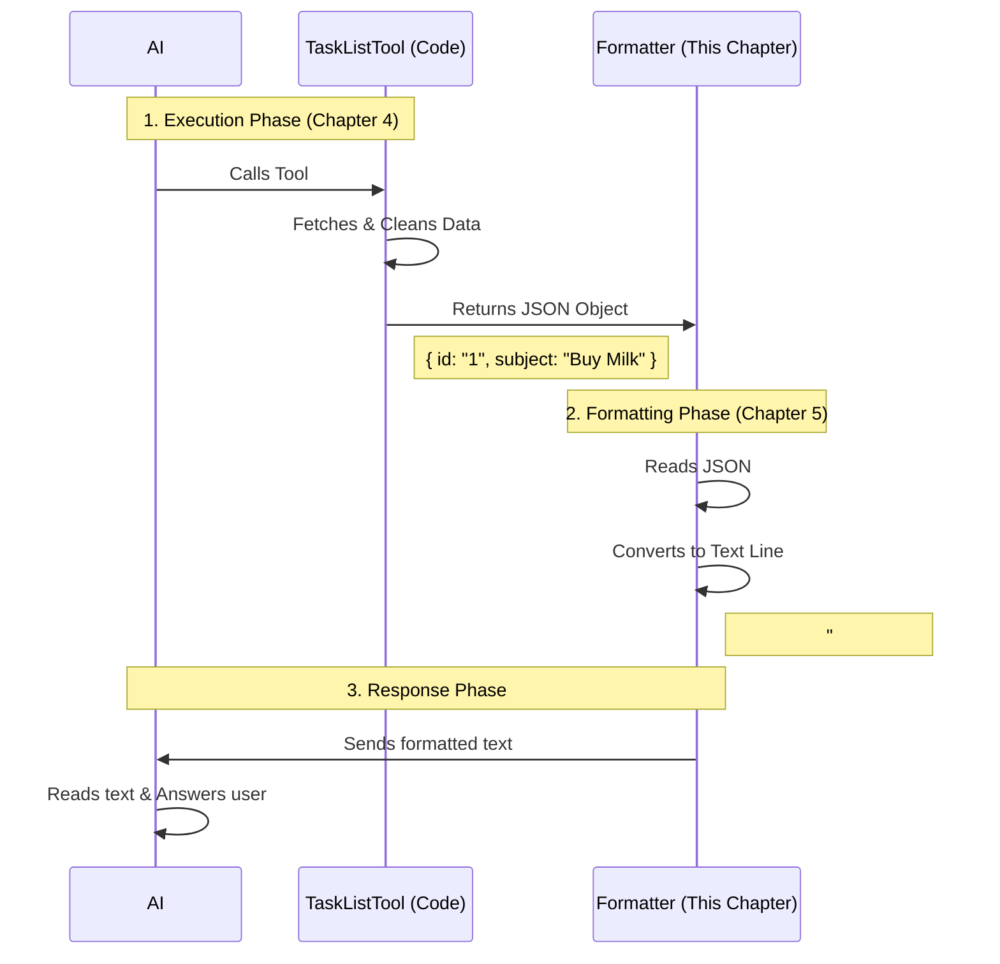

# Chapter 5: LLM Response Formatting

Welcome to the final chapter of our **TaskListTool** journey!

In the previous chapter, [Chapter 4: Task Execution & Logic](04_task_execution___logic.md), we built the engine of our tool. We successfully fetched data from the database, cleaned it up, and returned a structured list of tasks.

However, we have a small communication problem.

## The Problem: Robots Speak JSON, but Think in Text

In Chapter 4, our tool returned data that looked like this:

```json
{
  "tasks": [
    { "id": "101", "subject": "Buy Milk", "status": "todo", "blockedBy": [] },
    { "id": "102", "subject": "Walk Dog", "status": "done", "blockedBy": [] }
  ]
}
```

While this **JSON** format is perfect for computers, it is verbose. If we have 50 tasks, that JSON file becomes huge.
1.  **It's Expensive:** AI models charge by the "token" (word). Sending brackets `{}`, quotes `""`, and repeated field names (`"subject":`) wastes money and memory.
2.  **It's Hard to Read:** If you paste a 500-line JSON file into a chat, the AI has to work hard to parse it.

## The Solution: The Translator

We need a translator that takes that "Spreadsheet" (JSON) and turns it into a "Quick Memo" (Text) for the AI.

**The Goal:** We want the AI to see this instead:
```text
#101 [todo] Buy Milk
#102 [done] Walk Dog
```
This is concise, readable, and saves money. To do this, we use a function called `mapToolResultToToolResultBlockParam`.

## Concepts: How the Translator Works

We will write this logic inside `TaskListTool.ts`. It takes the output from Chapter 4 and reformats it.

### 1. Handling the "Empty" Case

If the user has no tasks, we shouldn't send an empty blank space. We should explicitly tell the AI, "There is nothing here."

```typescript
  mapToolResultToToolResultBlockParam(content, toolUseID) {
    // 'content' is the JSON output from Chapter 4
    const { tasks } = content as Output

    if (tasks.length === 0) {
      return {
        tool_use_id: toolUseID,
        type: 'tool_result',
        content: 'No tasks found',
      }
    }
    // ... formatting continues
```

**Explanation:**
*   `content`: This is the data object `{ tasks: [...] }` returned by our `call()` function.
*   We check if the list is empty. If so, we return a simple text message: `'No tasks found'`.

### 2. Formatting a Single Line

Now, let's format a single task. We want to combine the ID, Status, and Subject into one line.

```typescript
    // We loop through every task in the list
    const lines = tasks.map(task => {
      
      // Check if there is an owner
      const owner = task.owner ? ` (${task.owner})` : ''
      
      // Start building the string
      let line = `#${task.id} [${task.status}] ${task.subject}${owner}`
      
      // ... blocker logic continues below
```

**Explanation:**
*   `tasks.map(...)`: We run a function on every task to transform it.
*   `owner`: We use a ternary operator. If `task.owner` exists, we format it like `(Alice)`. If not, we make it an empty string.
*   `line`: We use template literals (backticks) to glue the pieces together.

### 3. Handling Complex Details (Blockers)

If a task is blocked, that is critical information. We need to append it to the line.

```typescript
      // ... inside the map loop
      
      const blocked =
        task.blockedBy.length > 0
          ? ` [blocked by ${task.blockedBy.map(id => `#${id}`).join(', ')}]`
          : '' // If no blockers, add nothing

      // Return the full text line
      return line + blocked
    })
```

**Explanation:**
*   We check `task.blockedBy.length`.
*   If there are blockers, we format them to look like `[blocked by #101, #102]`.
*   We add this string to the end of our line.

### 4. The Final Join

We now have an array of strings (lines). We need to join them into one big paragraph to send to the AI.

```typescript
    // ... after the map loop finishes

    return {
      tool_use_id: toolUseID,
      type: 'tool_result',
      // Join all lines with a 'newline' character (\n)
      content: lines.join('\n'),
    }
  },
```

**Explanation:**
*   `lines.join('\n')`: This takes our list of strings and puts them one after another, separated by a line break.
*   `tool_use_id`: We must pass this back so the AI knows which question we are answering.

## Under the Hood: The Full Pipeline

Let's visualize the entire journey of a user's request, combining everything we have learned in this project.



1.  **Execution:** The logic we wrote in Chapter 4 runs. It produces the precise, strict data structure.
2.  **Formatting:** The code in *this* chapter runs. It takes that strict structure and "prettifies" it.
3.  **Delivery:** The AI receives the pretty text, which is easy for it to understand and summarize for the user.

## Putting it all Together

Here is the complete implementation of the function inside `TaskListTool.ts`.

```typescript
  // ... inside TaskListTool object

  mapToolResultToToolResultBlockParam(content, toolUseID) {
    const { tasks } = content as Output

    // 1. Handle Empty State
    if (tasks.length === 0) {
      return { tool_use_id: toolUseID, type: 'tool_result', content: 'No tasks found' }
    }

    // 2. Format Lines
    const lines = tasks.map(task => {
      const owner = task.owner ? ` (${task.owner})` : ''
      const blocked = task.blockedBy.length > 0
          ? ` [blocked by ${task.blockedBy.map(id => `#${id}`).join(', ')}]`
          : ''
          
      return `#${task.id} [${task.status}] ${task.subject}${owner}${blocked}`
    })

    // 3. Return Text
    return {
      tool_use_id: toolUseID,
      type: 'tool_result',
      content: lines.join('\n'),
    }
  },
```

## Conclusion of the Tutorial

Congratulations! You have built a fully functional AI Tool from scratch.

Let's recap what we built:
1.  **[Data Schema & Validation](01_data_schema___validation.md):** We defined the strict contracts (Input/Output) to ensure data safety.
2.  **[Tool Definition & Configuration](02_tool_definition___configuration.md):** We created the "ID Badge" so the system could find our tool.
3.  **[Dynamic Prompt Engineering](03_dynamic_prompt_engineering.md):** We taught the AI how to behave differently in Solo vs. Team modes.
4.  **[Task Execution & Logic](04_task_execution___logic.md):** We wrote the engine to fetch and clean the data.
5.  **LLM Response Formatting:** We polished the output into a readable, concise format.

You now have a tool that is safe, smart, logical, and communicative. You can use these principles to build tools for anything—checking weather, querying databases, or controlling smart home devices.

**Happy Coding!**

---

Generated by [Code IQ](https://github.com/adityasoni99/Code-IQ)