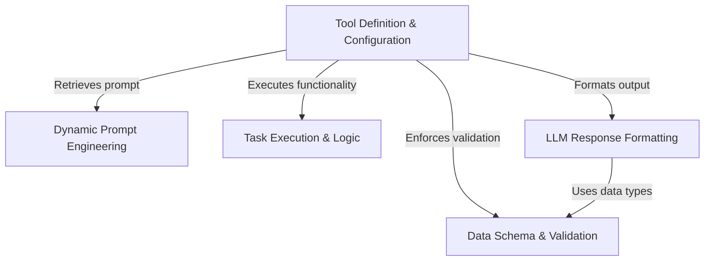

# Tutorial: TaskListTool

This project creates a **TaskList** tool that allows an AI agent to search and view the status of project tasks. It features *dynamic prompt engineering* to adjust instructions based on whether the agent is working alone or in a **swarm**, and uses strict **data schemas** to validate inputs and outputs. The tool also includes logic to filter blocked tasks and translates raw data into a readable text summary for the AI.

## Chapters

1. [Data Schema & Validation](01_data_schema___validation.md)
2. [Tool Definition & Configuration](02_tool_definition___configuration.md)
3. [Dynamic Prompt Engineering](03_dynamic_prompt_engineering.md)
4. [Task Execution & Logic](04_task_execution___logic.md)
5. [LLM Response Formatting](05_llm_response_formatting.md)

---

Generated by [Code IQ](https://github.com/adityasoni99/Code-IQ)