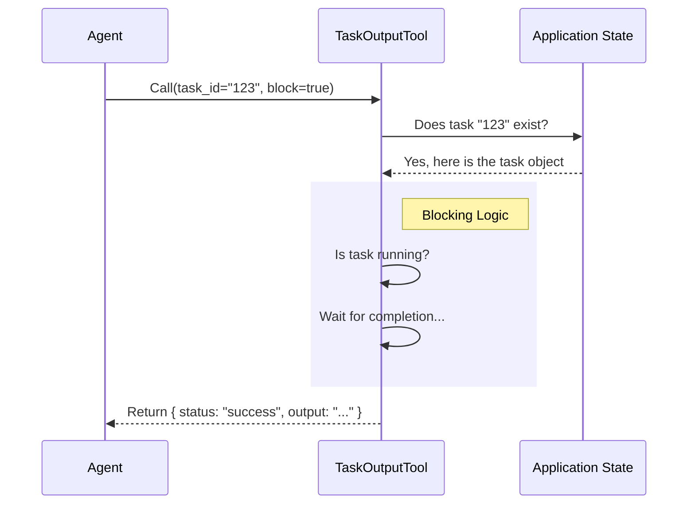

# Chapter 1: TaskOutputTool Definition

Welcome to the **TaskOutputTool** project! 

In this tutorial series, we will explore how an AI agent retrieves the results of long-running background tasks. 

Imagine you order a custom pizza. You get a receipt with an **Order ID**. You don't stand at the counter staring at the oven; you go sit down. Later, you use that Order ID to ask, "Is my pizza done?" or "What toppings were on that?"

The **TaskOutputTool** is the interface that allows the AI to do exactly that: take a **Task ID** and retrieve the "pizza" (the logs, errors, or final results).

## What is the TaskOutputTool?

When an AI agent runs a command (like a shell script or a sub-agent), it often happens in the background. The agent needs a specific tool to "check back in" on that process.

The **TaskOutputTool** acts as the API endpoint for task data. It defines:
1.  **The Request:** How the agent asks for data (Input Schema).
2.  **The Response:** What the data looks like (Output Schema).
3.  **The Behavior:** Whether to wait for the task to finish or just peek at the current logs.

### The Central Use Case

**Scenario:** An agent starts a script called `data_crunch.sh` which runs for 30 seconds. The system gives it a Task ID: `task-123`.

**Problem:** The agent needs to see the final output of `data_crunch.sh` to know if it succeeded.

**Solution:** The agent calls `TaskOutputTool` with `task_id="task-123"`.

## Key Concepts

Let's break down the definition of this tool into two simple parts: what goes in and what comes out.

### 1. The Input Schema (The Request)

To get information, the agent must provide specific details.

```typescript
// From TaskOutputTool.tsx
const inputSchema = lazySchema(() => z.strictObject({
  task_id: z.string().describe('The task ID to get output from'),
  block: z.boolean().default(true).describe('Wait for completion?'),
  timeout: z.number().default(30000).describe('Max wait time in ms')
}));
```

*   **`task_id`**: The "receipt number" for the background job.
*   **`block`**:
    *   `true` (default): "Wait until it's done, then tell me."
    *   `false`: "Tell me what is happening *right now*, even if it's not finished."
*   **`timeout`**: How long (in milliseconds) the agent is willing to wait.

### 2. The Output Schema (The Response)

The tool returns a standardized object so the agent knows exactly where to look for errors or logs.

```typescript
type TaskOutputToolOutput = {
  // Did we get the data, or did we time out waiting?
  retrieval_status: 'success' | 'timeout' | 'not_ready';
  
  // The actual details of the job
  task: TaskOutput | null;
};
```

The `task` object contains the juicy details: `output` (the text logs), `status` (e.g., "completed", "failed"), and `exitCode`.

## Using the Tool

Here is how an agent interacts with this definition in a real scenario.

**Agent Input (JSON):**
```json
{
  "task_id": "task-55a",
  "block": true,
  "timeout": 5000
}
```

**What happens:**
The tool receives this input. Because `block` is true, it pauses until `task-55a` finishes. Once finished, it returns the result.

**Tool Output (Simplified):**
```json
{
  "retrieval_status": "success",
  "task": {
    "task_id": "task-55a",
    "status": "completed",
    "output": "Data processing complete.\nRows affected: 50",
    "exitCode": 0
  }
}
```

## Internal Implementation: The Flow

How does the tool actually work under the hood? Let's look at the lifecycle of a request.



### Code Walkthrough

Let's look at the internal logic in `TaskOutputTool.tsx`.

#### Step 1: Validation
First, we ensure the Task ID provided actually points to a real task in memory.

```typescript
// Inside validateInput
const appState = getAppState();
const task = appState.tasks?.[task_id];

if (!task) {
  return {
    result: false,
    message: `No task found with ID: ${task_id}`,
    errorCode: 2
  };
}
```
*   **Explanation:** We grab the global state (`appState`) and look up the task. If it's missing, we stop immediately.

#### Step 2: The "Block" Logic
This is the core decision point. Do we return immediately, or do we wait?

```typescript
// Inside call()
if (!block) {
  // If we aren't waiting, return whatever we have right now
  const isRunning = task.status === 'running';
  return {
    data: {
      retrieval_status: isRunning ? 'not_ready' : 'success',
      task: await getTaskOutputData(task)
    }
  };
}
```
*   **Explanation:** If `block` is `false`, we don't wait. We grab the data immediately using `getTaskOutputData` (which we will cover in detail in [Unified Task Data Normalization](03_unified_task_data_normalization.md)).

#### Step 3: Waiting for Completion
If `block` is `true`, we enter the polling phase.

```typescript
// Inside call() - Blocking mode
const completedTask = await waitForTaskCompletion(
  task_id, 
  toolUseContext.getAppState, 
  timeout
);
```
*   **Explanation:** This helper function pauses execution until the task is done or the timer runs out. We will dive deep into how this polling works in [Task Completion Polling](02_task_completion_polling.md).

#### Step 4: Returning the Result
Finally, we package the data.

```typescript
if (!completedTask) {
  return { data: { retrieval_status: 'timeout', task: null } };
}

return {
  data: {
    retrieval_status: 'success',
    task: await getTaskOutputData(completedTask)
  }
};
```

## Conclusion

We have successfully defined the **TaskOutputTool**. It serves as a bridge between the agent and the background processes, accepting a "ticket" (Task ID) and returning the "order" (Output Logs).

However, you might be wondering: *How exactly does the tool wait for the task without freezing the entire application?*

We'll answer that in the next chapter.

[Next Chapter: Task Completion Polling](02_task_completion_polling.md)

---

Generated by [Code IQ](https://github.com/adityasoni99/Code-IQ)