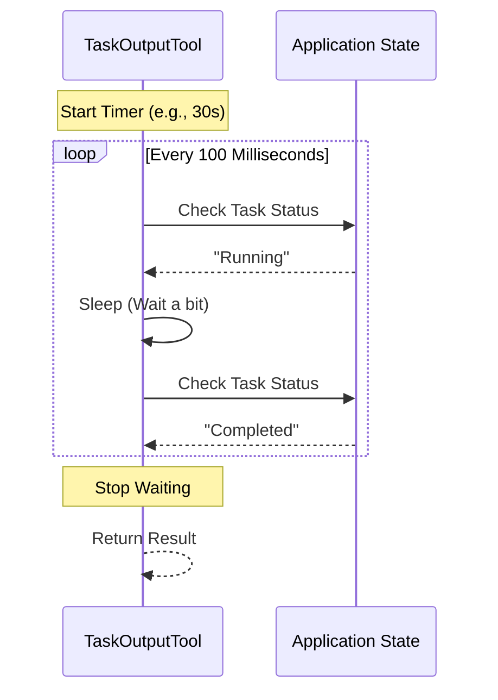

# Chapter 2: Task Completion Polling

Welcome back! In the previous chapter, [TaskOutputTool Definition](01_taskoutputtool_definition.md), we learned how to structure a request to get data about a background task.

But there was one magical parameter we glossed over: `block=true`.

In this chapter, we will learn how the **TaskOutputTool** actually "pauses" time to wait for a task to finish. We call this mechanism **Task Completion Polling**.

## The Problem: "Is It Ready Yet?"

Imagine you are at a busy coffee shop.
1.  You order a Latte (This is starting the task).
2.  The barista gives you a receipt with Order #42 (This is the **Task ID**).

If you ask for the coffee immediately after paying, it won't be ready. You have two choices:
1.  **Non-Blocking:** You walk away, do some work, and come back later to check.
2.  **Blocking:** You stand at the pickup counter, watching the barista, waiting until Order #42 is placed on the counter.

The **TaskOutputTool** defaults to the second option (**Blocking**). It effectively "stands at the counter" so the AI Agent doesn't have to keep asking repeatedly.

## Visualizing the Flow

How does a computer program "stand at the counter"? It enters a loop. It repeatedly checks the status of the task until one of two things happens:
1.  The task finishes (Success).
2.  Too much time passes (Timeout).

Here is what happens inside the tool:



## The Implementation

Let's look at the actual code that powers this logic. It is found in the helper function `waitForTaskCompletion` inside `TaskOutputTool.tsx`.

We will break it down into three simple parts: The Loop, The Check, and The Sleep.

### Part 1: The Loop and Timeout

We don't want to wait forever. If a task hangs for an hour, we want to stop waiting eventually so the Agent can regain control.

```typescript
// From TaskOutputTool.tsx

async function waitForTaskCompletion(taskId, getAppState, timeoutMs) {
  const startTime = Date.now();

  // Keep looping as long as we haven't hit the timeout
  while (Date.now() - startTime < timeoutMs) {
    // ... logic continues below ...
  }
  
  // If we exit the loop here, we timed out!
  // Return whatever state we have (even if still running)
}
```

*   **`startTime`**: We mark exactly when we started waiting.
*   **`while`**: This loop runs continuously until the difference between "now" and "start" is greater than our `timeoutMs` (default is 30,000ms or 30 seconds).

### Part 2: The Check

Inside the loop, we need to peek at the global Application State to see what the task is doing.

```typescript
    // Inside the while loop...
    const state = getAppState();
    
    // Look up the specific task by ID
    const task = state.tasks?.[taskId];

    // If the task is NOT running or pending, it must be done!
    if (task.status !== 'running' && task.status !== 'pending') {
      return task; // Return the completed task immediately
    }
```

*   **`getAppState()`**: Retrieves the current "memory" of the application.
*   **`task.status`**: We check if it is `'running'` or `'pending'`. If it is anything else (like `'completed'`, `'failed'`, or `'cancelled'`), we stop waiting and return the result.

### Part 3: The Sleep (Crucial!)

If we just looped as fast as the computer allows, we would check the status millions of times per second. This would freeze the computer (CPU 100%). We need to take a tiny nap between checks.

```typescript
    // Still inside the while loop...
    
    // Wait for 100 milliseconds before checking again
    await sleep(100);
  } // End of while loop
```

*   **`await sleep(100)`**: This pauses execution for 0.1 seconds. It frees up computer resources so the actual background task has CPU power to run!

## Connecting it to the Tool

Now we know how the helper function works. How does the `TaskOutputTool` use it?

When the Agent calls the tool, we check the `block` parameter.

```typescript
// Inside TaskOutputTool.tsx -> call()

// If the user said "Don't wait", return immediately
if (!block) {
  return { 
     data: { retrieval_status: 'not_ready', task: currentTask } 
  };
}

// If block is true (default), start polling!
const completedTask = await waitForTaskCompletion(
  task_id, 
  toolUseContext.getAppState, 
  timeout
);
```

1.  If `block` is **false**, we skip the polling logic entirely and just show the current state (Running).
2.  If `block` is **true**, we call our `waitForTaskCompletion` function. The code pauses on that line until the task finishes or times out.

## What happens after the wait?

Once `waitForTaskCompletion` returns, we have a task object. But tasks can be messy!
*   A shell script has `stdout`.
*   An AI agent has a `result` string.
*   A remote session has a `command`.

We need a way to clean this data up before giving it to the Agent.

**Conclusion:**
In this chapter, we learned that "Blocking" is simply a loop that checks status, sleeps for 100ms, and repeats until the task is done or time runs out.

In the next chapter, we will look at how we take the raw result of that task and clean it up using **Unified Task Data Normalization**.

[Next Chapter: Unified Task Data Normalization](03_unified_task_data_normalization.md)

---

Generated by [Code IQ](https://github.com/adityasoni99/Code-IQ)