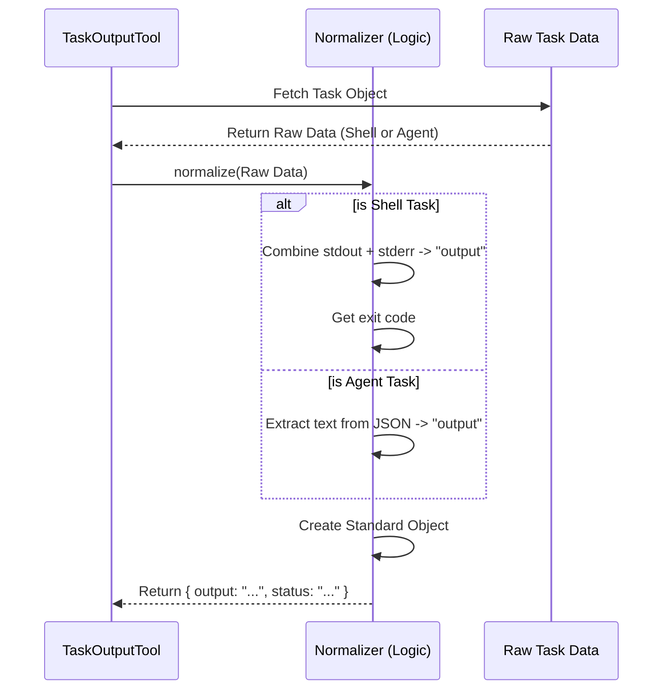

# Chapter 3: Unified Task Data Normalization

Welcome back! In the previous chapter, [Task Completion Polling](02_task_completion_polling.md), we learned how to wait for a task to finish using a loop.

Now imagine the task *is* finished. We have a "Task Object" in our hands. But here is the problem: **Not all tasks look the same.**
*   A **Shell Command** has standard output (`stdout`) and exit codes (e.g., `0` or `1`).
*   An **AI Agent** has a "prompt", a conversation transcript, and a "final result".
*   A **Remote Session** has connection logs.

If our tool returned different data structures for every type of task, the AI using the tool would be very confused. It would need complex `if/else` logic to read a simple log.

This chapter introduces **Unified Task Data Normalization**: the "Universal Translator" that turns messy, specific task data into a single, standard format.

## The Problem: The "Messy" Reality

Let's look at the central use case. The AI wants to know: *"What happened?"*

**Scenario A (Shell Script):**
The raw data might look like this:
```json
{
  "type": "local_bash",
  "shellCommand": { "stdout": "File saved.", "stderr": "" },
  "result": { "code": 0 }
}
```

**Scenario B (Sub-Agent):**
The raw data might look like this:
```json
{
  "type": "local_agent",
  "prompt": "Write a poem",
  "result": { "content": [ { "text": "Roses are red..." } ] }
}
```

If the AI tries to read `shellCommand.stdout` on the Agent task, it will crash. We need to normalize this.

## The Solution: The "Standard Form"

We created a standard structure called `TaskOutput`. Think of it like a standardized government form. No matter if you run a bakery or a tech startup, you fill out the *same form* for taxes.

Here is the **Output Schema** we are aiming for:

1.  **`output`**: The main text result (Logs for shell, Answer for agents).
2.  **`status`**: E.g., "success", "failed".
3.  **`exitCode`**: (Optional) specific to shell.
4.  **`result`**: (Optional) specific to agents.

## Implementation: The Logic Flow

How does the code transform the data? It runs through a function called `getTaskOutputData`.



## Code Walkthrough

Let's look at `TaskOutputTool.tsx` to see how this normalization is implemented in the function `getTaskOutputData`.

### Step 1: Handling Shell Output

If the task is a shell command (`local_bash`), we need to combine standard output and errors into one readable string.

```typescript
// Inside getTaskOutputData(task)

if (task.type === 'local_bash') {
  const bashTask = task as LocalShellTaskState;
  // Get the raw output object
  const taskOutputObj = bashTask.shellCommand?.taskOutput;

  if (taskOutputObj) {
     // Combine stdout and stderr
     const stdout = await taskOutputObj.getStdout();
     output = [stdout, taskOutputObj.getStderr()]
       .filter(Boolean)
       .join('\n');
  }
}
```
*   **Explanation:** We grab `stdout` and `stderr`. We join them with a newline (`\n`). Now, the variable `output` holds the complete log.

### Step 2: Creating the Base Object

Regardless of the task type, certain fields are always the same (ID, Type, Status). We create a "Base Output" first.

```typescript
// Inside getTaskOutputData(task)

const baseOutput: TaskOutput = {
  task_id: task.id,
  task_type: task.type,
  status: task.status,
  description: task.description,
  output // The string we calculated in Step 1
};
```
*   **Explanation:** This object is the foundation. Every task will return at least these fields.

### Step 3: Handling Agent Output

Agents are trickier. Their "output" is often a complex JSON object containing a conversation history. We want just the final answer.

```typescript
if (task.type === 'local_agent') {
  const agentTask = task as LocalAgentTaskState;
  
  // Helper function extracts just the text from the complex JSON
  const cleanResult = agentTask.result 
    ? extractTextContent(agentTask.result.content, '\n') 
    : undefined;

  return {
    ...baseOutput,
    result: cleanResult || output, // The clean text
    output: cleanResult || output  // Also put it in the standard 'output' field
  };
}
```
*   **Explanation:** 
    1.  We check if it is a `local_agent`.
    2.  We use `extractTextContent` to ignore internal thinking logs and grab only the final message.
    3.  We overwrite `baseOutput` to ensure the `output` field contains that clean text.

### Step 4: Handling Shell Specifics

Finally, if it was a shell task, we add the exit code (e.g., `0` for success).

```typescript
if (task.type === 'local_bash') {
  const bashTask = task as LocalShellTaskState;
  return {
    ...baseOutput,
    // Add the specific exit code (or null if missing)
    exitCode: bashTask.result?.code ?? null
  };
}
```
*   **Explanation:** We return the `baseOutput` plus the `exitCode`.

## The Result

Thanks to this logic, the `TaskOutputTool` delivers a consistent experience.

**Input (Shell):**
```bash
echo "Hello World"
```

**Input (Agent):**
```text
"Please say Hello World"
```

**Normalized Output (For BOTH):**
```json
{
  "task_id": "...",
  "status": "completed",
  "output": "Hello World"  <-- Look! They are the same format!
}
```

## Conclusion

In this chapter, we learned how **Unified Task Data Normalization** acts as a translator. It takes raw, messy data from specific tasks (Bash, Agent, Remote) and formats it into a single, predictable structure.

This ensures that the AI Agent consuming this tool doesn't need to know *how* the task was run—only *what* the result was.

Now that we have clean data, how do we present it to the user in the terminal without flooding their screen with text?

[Next Chapter: Result Visualization](04_result_visualization.md)

---

Generated by [Code IQ](https://github.com/adityasoni99/Code-IQ)