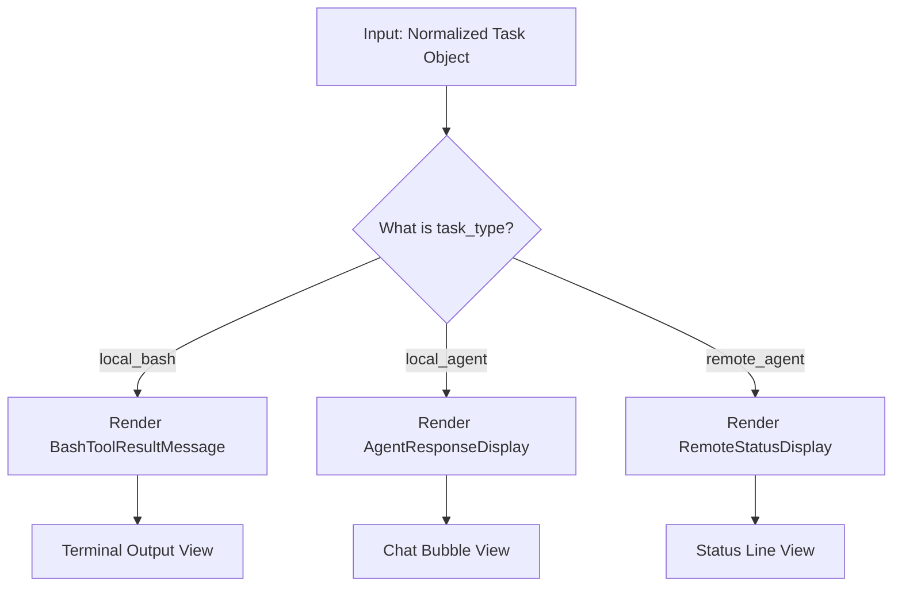

# Chapter 4: Result Visualization

Welcome to the final chapter of our **TaskOutputTool** series! 

In the previous chapter, [Unified Task Data Normalization](03_unified_task_data_normalization.md), we successfully took messy raw data from different sources (Shell, Agent, Remote) and cleaned it into a standard "Task Object".

But we still have one problem: **Presentation.**

If we just dump that standard object as JSON text into the terminal, it looks like this:

```json
{"task_id": "123", "status": "completed", "output": "Installing packages...\nDone.\n", "exitCode": 0}
```

This is hard for a human to read. We want it to look like a proper dashboard widget, with colors, status indicators, and formatted text.

In this chapter, we explore **Result Visualization**, handled by the React component `TaskOutputResultDisplay`.

## The Problem: One Data Format, Many Looks

Even though we normalized the data structure, the *way* a user wants to read it depends on the context:
1.  **Bash Command:** Users expect to see a terminal-like block with green text for success and red for errors.
2.  **AI Agent:** Users expect to see a "Prompt" and a "Response" (like a chat bubble).
3.  **Remote Session:** Users expect status indicators (Connected/Disconnected).

The `TaskOutputResultDisplay` component acts as a **Traffic Controller**. It looks at the task type and decides which UI card to draw.

## The Solution: A React Component for the CLI

You might be surprised to see React used in a Command Line Interface (CLI). This project uses a library called `ink` to render React components as text in your terminal.

The `TaskOutputResultDisplay` is the main container. It takes the normalized data and renders specific "Sub-Components" based on the task type.

### The Decision Flow



## Implementation Walkthrough

Let's look at the code in `TaskOutputTool.tsx`.

### Step 1: Parsing and Safety Checks

Before we draw anything, we ensure the content is valid. Sometimes the content comes in as a string (JSON text), so we need to parse it back into an object.

```typescript
// Inside TaskOutputResultDisplay
function TaskOutputResultDisplay({ content, verbose, theme }) {
  // 1. Ensure content is an object
  const result = typeof content === 'string' 
    ? jsonParse(content) 
    : content;

  // 2. Safety Check
  if (!result.task) {
    return <Text dimColor>No task output available</Text>;
  }
  
  const { task } = result;
  // ... Logic continues below ...
}
```

*   **`jsonParse`**: Converts the string back to a usable JavaScript object.
*   **`!result.task`**: If the task is missing, we show a dim "No output" message instead of crashing.

### Step 2: Visualizing Bash Tasks

If the task was a shell command, we want it to look like a terminal window. We delegate this to a specialized component called `BashToolResultMessage`.

```typescript
  // Inside TaskOutputResultDisplay

  if (task.task_type === 'local_bash') {
    // Prepare the data for the bash viewer
    const bashOut = {
      stdout: task.output,
      stderr: '', // Normalized output combines these already
      returnCodeInterpretation: task.error
    };

    // Render the Bash specific component
    return <BashToolResultMessage content={bashOut} verbose={verbose} />;
  }
```

*   **`BashToolResultMessage`**: This component handles coloring output (e.g., standard logs in white, errors in red).

### Step 3: Visualizing Agent Tasks

Agent tasks are different. They are conversations. We want to see what we asked (the Prompt) and what the Agent replied (the Result).

We also handle "Verbosity". If `verbose` is true, we show everything. If not, we show a summary.

```typescript
  // Inside TaskOutputResultDisplay - Agent Logic

  if (task.task_type === 'local_agent') {
    if (result.retrieval_status === 'success') {
      // If we want full details (Verbose Mode)
      if (verbose) {
         return (
           <Box flexDirection="column">
             <Text>{task.description}</Text>
             <AgentPromptDisplay prompt={task.prompt} />
             <AgentResponseDisplay content={task.result} />
           </Box>
         );
      }
      
      // If NOT verbose (Summary Mode)
      return <Text dimColor>Read output (ctrl+o to expand)</Text>;
    }
  }
```

*   **`AgentPromptDisplay`**: Shows the user's original request.
*   **`AgentResponseDisplay`**: Shows the AI's final answer.
*   **`ctrl+o`**: The tool includes a helper `useShortcutDisplay` that lets users toggle between Summary and Verbose modes instantly.

## The User Experience

By using this visualization layer, the user experience transforms dramatically.

**Without Visualization:**
User sees: `{"status": "success", "output": "Hello World"}`

**With Visualization:**
User sees:
```text
  ✓ Task Completed (Lines: 1)
  
  Prompt:
  > Please say hello
  
  Response:
  Hello World
```

## Conclusion

Congratulations! You have completed the **TaskOutputTool** tutorial series.

We have built a robust system that handles the entire lifecycle of asynchronous background tasks:

1.  **Definition:** We defined how to ask for data (Input Schema) and what to expect back (Output Schema). ([Chapter 1](01_taskoutputtool_definition.md))
2.  **Polling:** We implemented a "Blocking" mechanism to wait for running tasks to finish without freezing the app. ([Chapter 2](02_task_completion_polling.md))
3.  **Normalization:** We built a universal translator to turn messy Shell and Agent data into a standard format. ([Chapter 3](03_unified_task_data_normalization.md))
4.  **Visualization:** Finally, we created a UI layer to present this data beautifully to the user.

You now understand how an AI agent can reliably "check back in" on long-running jobs and present the results meaningfully!

---

Generated by [Code IQ](https://github.com/adityasoni99/Code-IQ)