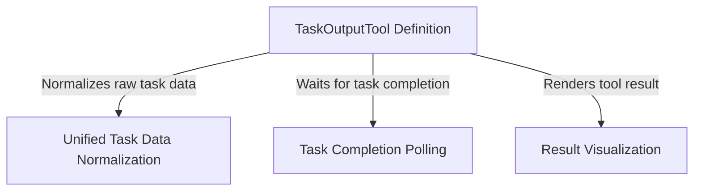

# Tutorial: TaskOutputTool

The **TaskOutputTool** enables an AI agent to retrieve logs and results from background operations, such as shell commands or sub-agents. It employs a **unified normalization layer** to standardize data across different task types and features a **polling mechanism** to optionally wait for a task to complete before reporting back.

## Chapters

1. [TaskOutputTool Definition](01_taskoutputtool_definition.md)
2. [Task Completion Polling](02_task_completion_polling.md)
3. [Unified Task Data Normalization](03_unified_task_data_normalization.md)
4. [Result Visualization](04_result_visualization.md)

---

Generated by [Code IQ](https://github.com/adityasoni99/Code-IQ)