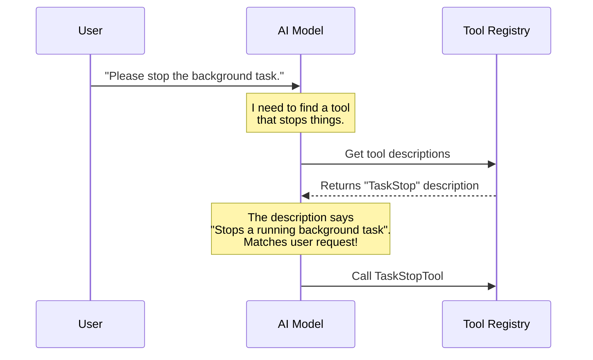

# Chapter 1: Tool Metadata & Prompting

Welcome to the **TaskStopTool** project! 

Imagine you have a super-intelligent robot assistant. This robot can do amazing things, but only if it knows exactly what tools are in its toolbox and how to use them. If you hand the robot a hammer but don't tell it what a hammer is or that it's for hitting nails, the robot might try to use it to stir soup!

In this first chapter, we are going to look at **Tool Metadata & Prompting**. This is essentially writing the "instruction manual" for the Artificial Intelligence (AI) model. It tells the AI:
1.  **What** the tool is called.
2.  **When** to use it.
3.  **Why** it exists.

## The Motivation: Why do we need this?

**Use Case:** Let's say you asked the AI to start a web server in the background. Later, you want to turn it off. You type: *"Okay, stop that server task now."*

For the AI to understand that command, it needs a tool specifically designed to kill processes. But having the code isn't enough—the AI needs to know that the tool *exists* and matches your request to "stop" something.

Without clear **Metadata** (the label) and **Prompting** (the description), the AI is blind. It won't know it has the power to stop tasks.

## Key Concepts

We will break this down into two simple parts:

1.  **The Prompt (Description):** This is a natural language paragraph that describes the tool. It's written for the AI to read, almost like a job description.
2.  **The Metadata:** These are specific tags—like the tool's name, aliases (nicknames), and search hints—that help the system classify and organize the tool.

## Implementation: Writing the Instruction Manual

Let's look at how we define these instructions in our code. We separate the text definitions into their own file to keep things clean.

### 1. Defining the Text (`prompt.ts`)

First, we create a file solely for the text strings. This acts as the source of truth for the tool's identity.

```typescript
// --- File: prompt.ts ---

export const TASK_STOP_TOOL_NAME = 'TaskStop'

export const DESCRIPTION = `
- Stops a running background task by its ID
- Takes a task_id parameter identifying the task to stop
- Returns a success or failure status
- Use this tool when you need to terminate a long-running task
`
```

**Explanation:**
*   **`TASK_STOP_TOOL_NAME`**: We give the tool a formal name. We export it so we can use it elsewhere without typing "TaskStop" over and over (which prevents typos).
*   **`DESCRIPTION`**: This is the most important part for the AI. Notice how it is written in bullet points? AIs love structured text. It clearly explains *what* it does ("Stops a running background task") and *how* ("Takes a task_id").

### 2. Attaching Metadata to the Tool (`TaskStopTool.ts`)

Now we need to import that text and attach it to the actual tool definition.

```typescript
// --- File: TaskStopTool.ts ---

import { buildTool } from '../../Tool.js'
import { DESCRIPTION, TASK_STOP_TOOL_NAME } from './prompt.js'

export const TaskStopTool = buildTool({
  name: TASK_STOP_TOOL_NAME,
  searchHint: 'kill a running background task',
  aliases: ['KillShell'], // Old name for compatibility
  
  // ... rest of the tool configuration
})
```

**Explanation:**
*   **`buildTool`**: This is a helper function that constructs our tool object.
*   **`name`**: We use the constant we defined in `prompt.ts`.
*   **`searchHint`**: This helps the system find this tool if the user types something vague like "kill task" even if the AI hasn't fully analyzed the request yet.
*   **`aliases`**: Sometimes tools change names. `KillShell` was the old name. We keep it here so old scripts still work.

## Under the Hood: How the AI Picks the Tool

Before we write the logic for the prompt functions, let's visualize how the AI actually selects this tool.

Imagine the AI is a chef. The "Tool Definition" is the menu. When a customer (User) orders something, the Chef reads the menu (Metadata/Prompt) to decide what to cook.



### 3. Exposing the Description to the AI

In the full tool definition, we explicitly map the text to functions the system can call.

```typescript
// --- File: TaskStopTool.ts (continued) ---

export const TaskStopTool = buildTool({
  // ... previous config ...
  
  async description() {
    return `Stop a running background task by ID`
  },
  
  async prompt() {
    return DESCRIPTION
  },
  
  // ... logic code ...
})
```

**Explanation:**
*   **`description()`**: This returns a short, one-line summary. Think of this as the "Subject Line" of the tool.
*   **`prompt()`**: This returns the full `DESCRIPTION` we wrote earlier. This is the "Body" of the email. The AI reads this to understand the nuances of the tool.

## Summary

In this chapter, we learned that a tool is useless if the AI doesn't know it exists or how to use it.
*   **Metadata** (Name, Aliases) creates the label.
*   **Prompting** (Description) creates the instruction manual.

By defining these clearly, we ensure that when a user says "Stop!", the AI knows exactly which tool to grab from its belt.

But wait—knowing *what* tool to use is only the first step. The AI also needs to know exactly what **data** to provide (like the specific ID of the task to stop). How do we ensure the AI doesn't send us garbage data?

Find out in the next chapter: [Data Validation Schemas](02_data_validation_schemas.md).

---

Generated by [Code IQ](https://github.com/adityasoni99/Code-IQ)