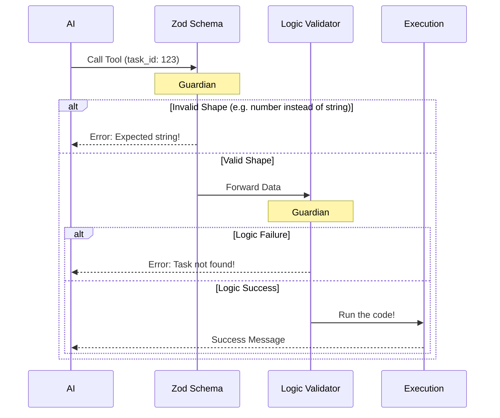

# Chapter 2: Data Validation Schemas

In the previous chapter, [Tool Metadata & Prompting](01_tool_metadata___prompting.md), we gave our AI a menu so it knows **TaskStop** exists.

But imagine you run a restaurant. Just because a customer points to a burger on the menu doesn't mean they order it correctly. They might shout "I want the food!" without saying *which* food, or ask for a "Burger with concrete buns."

This is where **Data Validation Schemas** come in. They act like a strict order form or a gatekeeper. They ensure that:
1.  **Input:** The AI provides exactly the data we need (e.g., a specific Task ID).
2.  **Output:** We return data in a structure the system understands.

## The Motivation: Preventing "Garbage In, Garbage Out"

**Use Case:** You ask the AI: *"Stop the server task."*

The AI decides to use the `TaskStop` tool. However, without a strict schema, the AI might try to send:
*   `{ "name": "server" }` (Wrong! We need an ID, not a name.)
*   `{ "task_id": 123 }` (Wrong! We expect a string "123", not a number.)
*   `{}` (Wrong! It sent nothing.)

If our code runs with bad data, it crashes. We need a way to stop these bad requests *before* they reach our sensitive code.

## Key Concepts

We use a library called **Zod** to define these rules. Think of Zod as a "Shape Sorter" toy. If the data isn't the right shape (square vs. circle), it doesn't get through.

### 1. The Input Schema (The Order Form)

This defines what arguments the AI *must* provide to call the tool.

```typescript
// --- File: TaskStopTool.ts ---
import { z } from 'zod/v4'
import { lazySchema } from '../../utils/lazySchema.js'

const inputSchema = lazySchema(() =>
  z.strictObject({
    task_id: z
      .string()
      .optional()
      .describe('The ID of the background task to stop'),
      
    // shell_id is kept for backward compatibility (old nickname)
    shell_id: z.string().optional().describe('Deprecated: use task_id instead'),
  }),
)
```

**Explanation:**
*   **`z.strictObject`**: This means "Only allow the fields I list here. No extra junk."
*   **`z.string()`**: The data must be text (e.g., "123"), not a number.
*   **`.describe(...)`**: This is crucial! The AI actually reads this text. It tells the AI *what* to put in this field.
*   **`.optional()`**: This field isn't strictly mandatory in Zod's eyes because we have custom logic later to check it (we accept either `task_id` OR `shell_id`).

### 2. The Output Schema (The Receipt)

After the tool runs, it sends data back to the system. We define this shape too, so other parts of the system (like the UI or the AI's memory) know what to expect.

```typescript
const outputSchema = lazySchema(() =>
  z.object({
    message: z.string().describe('Status message about the operation'),
    task_id: z.string().describe('The ID of the task that was stopped'),
    task_type: z.string().describe('The type of the task that was stopped'),
    command: z.string().optional(),
  }),
)
```

**Explanation:**
*   **Consistency:** Every time this tool runs, we promise to return an object with a `message`, `task_id`, and `task_type`.
*   **Reliability:** The rest of our app can write code like `result.task_id` without worrying that the field might be missing.

## Advanced Logic: `validateInput`

Sometimes, "checking the shape" isn't enough.
For example, if the AI sends `task_id: "999"`, that looks like a valid string. The **Schema** passes.
But what if task "999" doesn't exist? Or what if it's already stopped?

We need a second layer of validation to check the *reality* of the data.

```typescript
// --- File: TaskStopTool.ts ---

async validateInput({ task_id, shell_id }, { getAppState }) {
  // 1. Check if we received an ID at all
  const id = task_id ?? shell_id
  if (!id) {
    return { result: false, message: 'Missing required parameter: task_id' }
  }

  // 2. Check if the task actually exists in our App State
  const appState = getAppState()
  const task = appState.tasks?.[id]

  if (!task) {
    return { result: false, message: `No task found with ID: ${id}` }
  }

  // 3. Logic passed!
  return { result: true }
}
```

**Explanation:**
*   **`validateInput`**: This is a special function that runs *after* the Zod schema check but *before* the actual tool executes.
*   **`getAppState`**: This lets us peek at the current state of the application to see if the ID is valid.
*   **Safety:** If this returns `false`, the tool execution is cancelled, and the AI is told why ("No task found"). This prevents crashes.

## Under the Hood: The Validation Flow

Let's visualize exactly what happens when the AI tries to use the tool. It has to pass two "Guardians" before it can stop a task.



## Implementation: Attaching Schemas to the Tool

Finally, we hook these definitions into our main tool builder (which we will define fully in the next chapter).

```typescript
// --- File: TaskStopTool.ts ---

export const TaskStopTool = buildTool({
  name: TASK_STOP_TOOL_NAME,
  
  // Attach the "Shape Sorter" rules
  get inputSchema() {
    return inputSchema()
  },
  
  // Attach the "Receipt" rules
  get outputSchema() {
    return outputSchema()
  },

  // Attach the "Logic Guardian"
  validateInput, 
  
  // ... execution logic comes later ...
})
```

**Explanation:**
We use getters (`get inputSchema()`) to return the schema definition. This connects the abstract rules we wrote to the actual tool object.

## Summary

In this chapter, we learned that we cannot trust the AI to always guess the right input formats.
*   **Zod Schemas** ensure the data is the correct *type* (String, Object).
*   **`validateInput`** ensures the data makes sense in *context* (Does this ID exist?).

Together, these act as a firewall, protecting our internal code from bad data.

Now that we have the **Name** (Chapter 1) and the **Rules** (Chapter 2), we are ready to assemble the full tool structure.

[Next Chapter: Tool Definition](03_tool_definition.md)

---

Generated by [Code IQ](https://github.com/adityasoni99/Code-IQ)