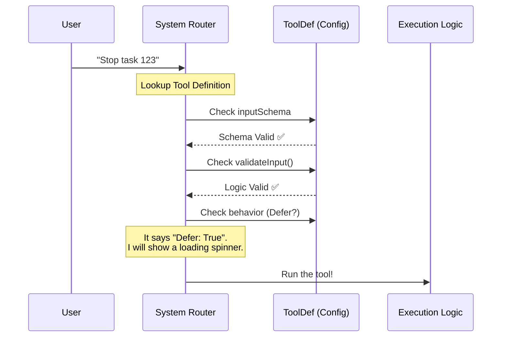

# Chapter 3: Tool Definition

Welcome back! In the previous chapters, we laid the groundwork for our **TaskStopTool**:

1.  We gave it a name and instruction manual in [Tool Metadata & Prompting](01_tool_metadata___prompting.md).
2.  We built a security guard to check inputs in [Data Validation Schemas](02_data_validation_schemas.md).

Now, we need to bring these pieces together.

## The Motivation: The "Plugin Manifest"

Imagine you are building a video game console. You have a game cartridge (the code), a label (metadata), and a slot shape (validation). But for the console to actually *play* the game, it needs a standardized way to read it.

In our system, the **Tool Definition** is that standard. It is a single configuration object that tells the main application:
1.  "Here is my name."
2.  "Here are my rules."
3.  "Here is how you run me."
4.  "Here is how I behave (am I fast? slow? safe?)."

Without this definition, our metadata and schemas are just loose parts scattered on the floor. This chapter is about assembling the robot.

## Key Concepts

We use a helper function called `buildTool`. Think of this as filling out a "Driver License" application for your tool. It bundles everything into one neat package.

### 1. The Container (`buildTool`)
This function creates the actual object that the AI system imports and registers. It enforces type safety, ensuring we don't forget important settings.

### 2. Operational Settings
Beyond just names and inputs, tools have **behaviors**:
*   **Concurrency:** Can two of these run at the same time?
*   **Deferral:** Is this tool slow? Should the AI wait for it?
*   **Safety limits:** How much data is allowed to come back?

## Implementation: Assembling the Tool

Let's build the `TaskStopTool` definition in `TaskStopTool.ts`. We will break this large object down into small, digestible chunks.

### Step 1: Identity and Aliases

First, we set up the basic identity. We import the name we defined in Chapter 1.

```typescript
// --- File: TaskStopTool.ts ---
import { buildTool } from '../../Tool.js'
import { TASK_STOP_TOOL_NAME } from './prompt.js'

export const TaskStopTool = buildTool({
  name: TASK_STOP_TOOL_NAME,
  
  // A helper for when the user searches manually
  searchHint: 'kill a running background task',
  
  // Aliases allow old scripts to work even if we rename the tool
  aliases: ['KillShell'], 
  
  // ... continued below
})
```

**Explanation:**
*   **`buildTool`**: The constructor function.
*   **`aliases`**: We used to call this tool `KillShell`. By adding it here, if an old AI script tries to call `KillShell`, the system automatically routes it to `TaskStop`.

### Step 2: Wiring Up the Schemas

In [Data Validation Schemas](02_data_validation_schemas.md), we wrote `inputSchema` and `outputSchema`. Now we plug them in.

```typescript
  // ... inside buildTool({ ...
  
  // Connect the "Order Form" (Input)
  get inputSchema() {
    return inputSchema()
  },

  // Connect the "Receipt" (Output)
  get outputSchema() {
    return outputSchema()
  },
  
  // Connect the "Logic Guardian"
  validateInput,
```

**Explanation:**
*   **Getters (`get`)**: We use getters to return the schema. This is a technical detail that helps with performance (lazy loading), so we don't calculate the schema until the AI actually asks for it.
*   **`validateInput`**: We attach the custom logic function we wrote in Chapter 2.

### Step 3: Configuring Behavior

This is unique to the **Tool Definition**. We need to tell the system how this tool behaves in the real world.

```typescript
  // ... inside buildTool({ ...

  // "shouldDefer: true" tells the UI: 
  // "This might take a moment. Show a spinner."
  shouldDefer: true,

  // Can we run this while other tools are running?
  // Yes, stopping a task is safe to do in parallel.
  isConcurrencySafe() {
    return true
  },
```

**Explanation:**
*   **`shouldDefer`**: If you are stopping a heavy server process, it might take 2 or 3 seconds. If we don't set this to `true`, the AI might think the system froze.
*   **`isConcurrencySafe`**: Some tools (like writing to a file) shouldn't happen at the same time as others. Stopping a task is usually safe, so we return `true`.

### Step 4: Connecting the Descriptions

Finally, we link the text prompts we wrote in [Tool Metadata & Prompting](01_tool_metadata___prompting.md).

```typescript
  // ... inside buildTool({ ...

  async description() {
    return `Stop a running background task by ID`
  },
  
  // The full instruction manual
  async prompt() {
    return DESCRIPTION
  },
  
  // ... continued in next chapters
})
```

## Under the Hood: The System Router

When the application starts, it loads this definition. Let's see how the System uses this object when a user types a command.



### Specialized Configuration: `toAutoClassifierInput`

There is one advanced setting you might see in the code called `toAutoClassifierInput`.

Sometimes, the AI needs to look at a history of commands to "guess" what the user wants next. To do this efficiently, it doesn't need the whole JSON object; it just needs the important bit.

```typescript
  // ... inside buildTool({ ...

  // When the AI looks at history, just show it the ID.
  // It doesn't need to see the full JSON structure.
  toAutoClassifierInput(input) {
    return input.task_id ?? input.shell_id ?? ''
  },
```

**Explanation:**
This is an optimization. Instead of storing `{ task_id: "123", shell_id: undefined }` in the AI's "short-term memory" for classification, we just store `"123"`. It saves tokens and makes the AI smarter.

## Summary

We have now successfully created the **Tool Definition**. This object acts as the bridge between:
1.  **Text:** The prompts and descriptions (Chapter 1).
2.  **Safety:** The schemas and validation (Chapter 2).
3.  **System:** The behavior settings like concurrency and deferral (Chapter 3).

However, if you look closely at our code, there is still one massive piece missing. We have defined *who* the tool is and *how* it behaves, but we haven't actually written the code that **stops the task**!

Right now, our tool is like a car with a beautiful dashboard but no engine.

In the next chapter, we will write the actual engine—the function that performs the work.

[Next Chapter: Task Execution Logic](04_task_execution_logic.md)

---

Generated by [Code IQ](https://github.com/adityasoni99/Code-IQ)