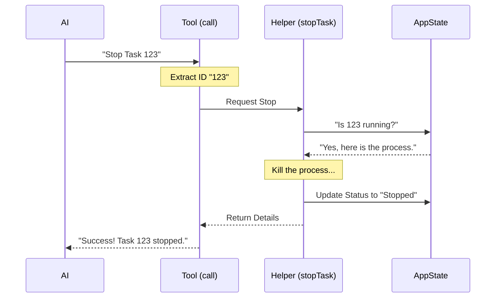

# Chapter 4: Task Execution Logic

In the previous chapter, [Tool Definition](03_tool_definition.md), we built the chassis of our robot. We defined its name, configured its safety rules, and set up the validation gates.

But if you sit in the car and press the gas pedal right now, nothing happens. Why? **Because we haven't put the engine in yet.**

This chapter is about **Task Execution Logic**. This is the code that actually *does* the work. It takes the validated order from the AI and performs the operation—in this case, reaching into the system and stopping a running task.

## The Motivation: pushing the "Big Red Button"

**Use Case:** The AI has successfully navigated the metadata, passed the validation checks, and is now ready to execute the command: *"Stop task 123."*

We need a function that:
1.  **Receives** the safe data (the Task ID).
2.  **Interacts** with the application's "Brain" (State) to find the task.
3.  **Executes** the kill command.
4.  **Returns** a receipt confirming the job is done.

Without this logic, the tool is just a label. With it, the tool becomes an action.

## Key Concepts

To understand the execution logic, we need to understand three simple concepts:

### 1. The `call` Method
Every tool has a main function usually named `call`. When the AI decides to use a tool, the system invokes this specific function. It is the entry point for all the action.

### 2. Context (The Toolbox)
The `call` function doesn't just get the input (like `task_id`). It also receives a **Context** object. This contains special permissions, like:
*   `getAppState`: The ability to *read* what is currently running.
*   `setAppState`: The ability to *update* the list of running tasks.

### 3. The Helper Function (`stopTask`)
To keep our code clean, we often write the complex "heavy lifting" code (like actually talking to the Operating System) in a separate file. The tool simply *delegates* the work to this helper.

## Implementation: The Engine Room

Let's look at how we implement the `call` method inside our `TaskStopTool`. We will break the code down into small steps.

### Step 1: Receiving the Order

The `call` function receives the **Input** (data from the AI) and the **Context** (system tools).

```typescript
// --- File: TaskStopTool.ts ---

async call(
  { task_id, shell_id },             // The Input
  { getAppState, setAppState }       // The Context
) {
  // We check which ID was provided. 
  // 'shell_id' is just an old nickname for 'task_id'.
  const id = task_id ?? shell_id
  
  if (!id) {
    throw new Error('Missing required parameter: task_id')
  }
  
  // ... continued below
```

**Explanation:**
*   **Destructuring:** We instantly unpack the variables we need (`task_id`, `shell_id`).
*   **Backup Check:** Even though our Validation Schema (Chapter 2) checked the data, it's good practice to ensure we have a valid ID before proceeding.

### Step 2: Doing the Work

Now that we have the ID, we call the heavy lifter. We import a helper function called `stopTask`.

```typescript
  // ... inside call() function

  // We pass the ID and the tools (state getters/setters) to the helper
  const result = await stopTask(id, {
    getAppState,
    setAppState,
  })
  
  // The 'result' variable now holds the details of what happened.
  // ... continued below
```

**Explanation:**
*   **`await`**: Stopping a task might take a few seconds. We tell the code to "wait" here until the task is fully dead before moving on.
*   **Delegation:** The `TaskStopTool` doesn't know *how* to kill a process (e.g., sending a `SIGTERM` signal). It just asks the `stopTask` expert to do it.

### Step 3: Writing the Receipt

Finally, we need to return data to the AI. This must match the **Output Schema** we defined in [Data Validation Schemas](02_data_validation_schemas.md).

```typescript
  // ... inside call() function

  return {
    data: {
      message: `Successfully stopped task: ${result.taskId}`,
      task_id: result.taskId,
      task_type: result.taskType,
      command: result.command,
    },
  }
} // End of call function
```

**Explanation:**
*   **`data` object:** The system expects the result wrapped in a `data` property.
*   **Structured Info:** We don't just say "Done." We confirm *what* we stopped (`task_id`) and *what it was doing* (`command`). This helps the AI keep track of its own actions.

## Under the Hood: The Sequence of Events

Let's visualize exactly what happens when the `call` function is triggered.



## Deep Dive: The Complete Connection

Now that we've seen the pieces, let's look at how this fits into the main `TaskStopTool` object we built in the previous chapter.

In **Chapter 3**, we left the `call` function as a placeholder. Now we fill it in.

```typescript
// --- File: TaskStopTool.ts ---

import { stopTask } from '../../tasks/stopTask.js' // Import the helper

export const TaskStopTool = buildTool({
  // ... (Metadata from Chapter 1) ...
  // ... (Validation from Chapter 2) ...
  // ... (Configuration from Chapter 3) ...

  // The Logic (Chapter 4)
  async call(
    { task_id, shell_id },
    { getAppState, setAppState }
  ) {
    const id = task_id ?? shell_id
    if (!id) throw new Error('Missing ID')

    // 1. Execute the logic
    const result = await stopTask(id, { getAppState, setAppState })

    // 2. Return the result matching OutputSchema
    return {
      data: {
        message: `Successfully stopped task: ${result.taskId}`,
        task_id: result.taskId,
        task_type: result.taskType,
        command: result.command,
      },
    }
  },
})
```

### Why do we separate `stopTask`?

You might wonder why we don't write the kill code directly inside the tool.

**Analogy:**
Think of the `TaskStopTool` as a **Receptionist**.
Think of `stopTask` as the **Security Guard**.

The Receptionist (Tool) takes the request from the visitor (AI), checks their ID (Validation), and then calls the Security Guard (Helper) to handle the situation.
*   If we want to change how we kill tasks later (e.g., force kill vs. gentle stop), we only change the Security Guard's instructions. The Receptionist doesn't need to know the details.

## Summary

In this chapter, we installed the engine.
*   We learned that the **`call` method** is the bridge between the AI's wish and the system's action.
*   We learned how to accept **Input** and **Context**.
*   We learned to delegate complex work to a **Helper Function** (`stopTask`).
*   We learned to return a clear **Result** object.

Our tool is now fully functional! It has a name, rules, and an engine. The AI can successfully stop a task.

However, simply returning a JSON object like `{ "message": "Success" }` is a bit boring for the human user watching the screen. How do we make this look good in the application interface?

[Next Chapter: UI Rendering](05_ui_rendering.md)

---

Generated by [Code IQ](https://github.com/adityasoni99/Code-IQ)