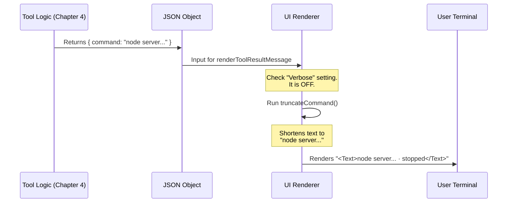

# Chapter 5: UI Rendering

Welcome to the final chapter of our **TaskStopTool** tutorial!

In the previous chapter, [Task Execution Logic](04_task_execution_logic.md), we built the engine of our tool. We wrote the code that actually communicates with the system to kill a process and returns a raw data object (JSON) confirming the success.

However, raw data looks like this:
```json
{
  "message": "Successfully stopped task: 123",
  "task_id": "123",
  "command": "/usr/bin/node /very/long/path/to/script.js --flag1 --flag2..."
}
```
While this is great for the AI to read, it’s messy for a human user.

This chapter is about **UI Rendering**. We are going to build the "Dashboard" that takes that raw data and turns it into a clean, readable status message on your screen.

## The Motivation: Information Overload

**Use Case:** Imagine you stop a background process that was started with a command that is 500 characters long (lots of file paths and configuration flags).

If our tool simply prints the whole command again to say it stopped, your screen will be flooded with text. You don't care about the flags anymore; you just want to know: **"Is it dead?"**

We need a display layer that:
1.  **Summarizes:** Hides the technical noise.
2.  **Confirms:** Clearly states the "Stopped" status.
3.  **Respects Space:** Truncates long text so the interface stays clean.

## Key Concepts

We use a library called **React** (standard for web UI) combined with **Ink** (which lets React render text inside a command-line terminal).

### 1. The Renderer Function
Just like the `call()` function was the entry point for logic, `renderToolResultMessage` is the entry point for visuals. The system hands this function the output from the tool and asks, "How should I draw this?"

### 2. Truncation
This is the art of cutting text short. If a command is 10 lines long, we might only show the first 2 lines and add "..." at the end. This keeps the user's terminal tidy.

### 3. Verbosity
Sometimes, you *do* want to see the details. Our UI needs a "Verbose Mode" switch.
*   **Normal Mode:** Clean, short summary.
*   **Verbose Mode:** Show me everything (useful for debugging).

## Implementation: Building the Display

Let's look at `UI.tsx`. We will build this in two parts: the logic to shorten text, and the component to display it.

### Step 1: Defining Limits

First, we set some rules. We don't want the text to be wider than a standard screen or taller than two lines.

```typescript
// --- File: UI.tsx ---

const MAX_COMMAND_DISPLAY_LINES = 2
const MAX_COMMAND_DISPLAY_CHARS = 160

// We import a helper to measure text width accurately
import { stringWidth } from '../../ink/stringWidth.js'
```

**Explanation:**
These constants act as our "budget" for screen real estate. We won't spend more than 160 characters or 2 lines on a status update.

### Step 2: The Truncation Helper

We need a function that takes a long string and chops it down to fit our budget.

```typescript
function truncateCommand(command: string): string {
  const lines = command.split('\n')
  let truncated = command

  // Rule 1: Limit to 2 lines
  if (lines.length > MAX_COMMAND_DISPLAY_LINES) {
    truncated = lines.slice(0, MAX_COMMAND_DISPLAY_LINES).join('\n')
  }
  
  // Rule 2: Limit to 160 characters
  if (stringWidth(truncated) > MAX_COMMAND_DISPLAY_CHARS) {
    // A helper that cuts the string without breaking words awkwardly
    truncated = truncateToWidthNoEllipsis(truncated, MAX_COMMAND_DISPLAY_CHARS)
  }

  return truncated.trim()
}
```

**Explanation:**
*   **`split('\n')`**: Breaks the text into an array of lines.
*   **`slice(0, 2)`**: Keeps only the first 2 lines.
*   **`truncateToWidth...`**: Ensures the horizontal length doesn't wrap uglily.

### Step 3: The Component

Now we write the main function that returns the visual elements. It receives the `output` from our tool (Chapter 4) and a `verbose` setting.

```typescript
import { Text } from '../../ink.js'
import { MessageResponse } from '../../components/MessageResponse.js'

export function renderToolResultMessage(output, _, { verbose }) {
  // 1. Get the command string from the tool output
  const rawCommand = output.command ?? ''
  
  // 2. Decide: Full text or Short text?
  const command = verbose ? rawCommand : truncateCommand(rawCommand)
  
  // 3. Add a visual indicator
  const suffix = command !== rawCommand ? '… · stopped' : ' · stopped'

  // 4. Render the UI
  return (
    <MessageResponse>
      <Text>{command}{suffix}</Text>
    </MessageResponse>
  )
}
```

**Explanation:**
*   **`verbose ? raw : truncated`**: This is a toggle. If the user asked for verbose output, we skip the truncation logic.
*   **`suffix`**: We append " · stopped" so the user knows the state. If we cut text out, we add an ellipsis (`…`) so they know there is missing info.
*   **`<Text>`**: This is an Ink component that prints styled text to the terminal.

## Under the Hood: The Rendering Pipeline

How does the data get from the engine to the screen?



## Putting It All Together

We have now completed the entire circle of tool creation.

1.  **[Tool Metadata & Prompting](01_tool_metadata___prompting.md)**: We told the AI "I am TaskStop. I stop things."
2.  **[Data Validation Schemas](02_data_validation_schemas.md)**: We ensured the AI gives us a valid Task ID.
3.  **[Tool Definition](03_tool_definition.md)**: We configured the tool's behavior and safety.
4.  **[Task Execution Logic](04_task_execution_logic.md)**: We wrote the code to kill the process.
5.  **[UI Rendering](05_ui_rendering.md)**: We made the result look pretty for the human.

### Final Example Output

If you stop a simple task, the user sees:
> `npm run dev · stopped`

If you stop a massive, complex task, the user sees:
> `java -jar server.jar --config=/etc/configs/production... · stopped`

Because of your work in this chapter, the user gets exactly the information they need—no more, no less.

## Conclusion

Congratulations! You have built a fully functional, safe, and user-friendly AI tool from scratch.

You learned how to:
*   Communicate with AI via **Prompts**.
*   Protect your system with **Schemas**.
*   Standardize behavior with **Definitions**.
*   Perform actions with **Execution Logic**.
*   Communicate with humans via **UI Rendering**.

You are now ready to add this tool to the robot's registry and let it help you manage your tasks!

---

Generated by [Code IQ](https://github.com/adityasoni99/Code-IQ)