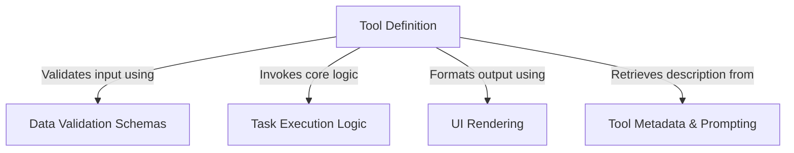

# Tutorial: TaskStopTool

The **TaskStopTool** acts as a control mechanism allowing an AI agent to safely terminate running background processes. It functions as a central hub that uses strict **Data Validation Schemas** to verify request integrity, triggers **Task Execution Logic** to stop the targeted process, and employs **UI Rendering** to display concise status updates to the user.

## Chapters

1. [Tool Metadata & Prompting](01_tool_metadata___prompting.md)
2. [Data Validation Schemas](02_data_validation_schemas.md)
3. [Tool Definition](03_tool_definition.md)
4. [Task Execution Logic](04_task_execution_logic.md)
5. [UI Rendering](05_ui_rendering.md)

---

Generated by [Code IQ](https://github.com/adityasoni99/Code-IQ)