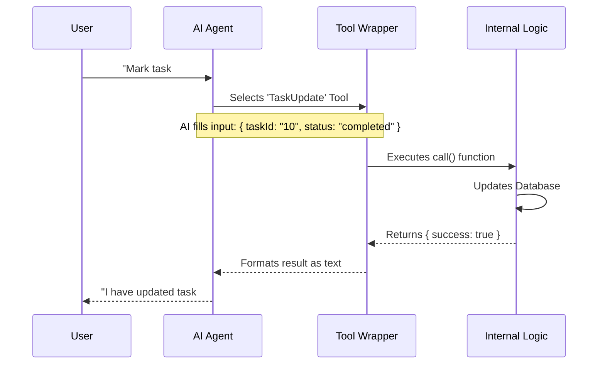

# Chapter 1: Tool Definition Wrapper

Welcome to the **TaskUpdateTool** project! In this first chapter, we are going to explore the foundation of how we add new abilities to an AI agent.

## The "Skill Cartridge" Analogy

Imagine your AI agent is a character in a video game. By default, it can talk and think, but it doesn't know how to interact with your specific database or task list.

The **Tool Definition Wrapper** is like a **"Skill Cartridge"** you insert into the game console. Once loaded, the character instantly knows:
1.  **What** the skill is called ("TaskUpdate").
2.  **When** to use it ("When the user wants to change a task").
3.  **How** to use it (What inputs are needed).

In our code, we use a function called `buildTool` to create this cartridge.

### Use Case: Updating a Task
Our goal for this tutorial is to create a tool that allows the AI to update the status of a todo item (e.g., moving a task from "todo" to "done").

## 1. The Container: `buildTool`

The `buildTool` function is the wrapper that holds everything together. It ensures our tool follows a standard format that the AI system can understand.

Here is the basic skeleton of the `TaskUpdateTool`:

```typescript
import { buildTool } from '../../Tool.js'
import { TASK_UPDATE_TOOL_NAME } from './constants.js'

export const TaskUpdateTool = buildTool({
  name: TASK_UPDATE_TOOL_NAME, // Identity: Who am I?
  
  userFacingName() {
    return 'TaskUpdate'        // How humans see me
  },
  
  // ... functionality goes here ...
})
```

**Explanation:**
This code creates the empty "cartridge." We import `buildTool` and give our tool a unique system name (`TaskUpdate`) and a human-readable name.

## 2. The Instructions: Description & Prompt

How does the AI know *when* to use this tool? We provide a description and a system prompt.

```typescript
import { DESCRIPTION, PROMPT } from './prompt.js'

// Inside buildTool({ ... })
  async description() {
    return DESCRIPTION // e.g. "Updates task details like status or owner"
  },
  
  async prompt() {
    return PROMPT     // Detailed rules on how to behave
  },
```

**Explanation:**
When the AI is deciding what to do, it reads the `description`. If the user says "Mark task #5 as done," the AI matches that request to this description and decides to load this tool.

## 3. The Interface: Inputs and Outputs

To use a tool, the AI needs to fill out a "form." We define this form using **Schemas**.

We use `inputSchema` to define what data we require from the AI (like the Task ID and the new Status).

```typescript
import { z } from 'zod/v4'

// Inside buildTool({ ... })
  get inputSchema() {
    return z.object({
      taskId: z.string().describe('The ID of the task to update'),
      status: z.string().optional().describe('New status (e.g., completed)'),
      subject: z.string().optional().describe('New title for the task'),
    })
  },
```

**Explanation:**
This defines the "buttons" on our Skill Cartridge. To activate it, the AI *must* provide a `taskId`. It *can* optionally provide a `status` or `subject`.
*Note: We handle advanced validation techniques in [Lazy Schema Validation](03_lazy_schema_validation.md).*

## 4. The Action: The `call` Function

This is the heart of the tool. When the AI fills out the form and presses "Go," the `call` function executes the actual logic.

```typescript
// Inside buildTool({ ... })
  async call({ taskId, status, subject }, context) {
    // 1. Check if task exists (Simplified logic)
    const existingTask = await getTask(taskId) 

    // 2. Perform the update
    if (status) {
       await updateTask(taskId, { status })
    }

    // 3. Return the result object
    return {
      data: { success: true, taskId, updatedFields: ['status'] }
    }
  },
```

**Explanation:**
This function receives the inputs the AI selected. It performs the database operations (like `updateTask`).
*Note: The real logic involves complex flows covered in [Task Lifecycle Workflow](02_task_lifecycle_workflow.md).*

## Under the Hood: The Execution Flow

What actually happens when the AI uses this wrapper? Let's look at the flow.



### Formatting the Result for the AI

The `call` function returns raw data (JSON). However, the AI reads text. The Wrapper includes a special helper to translate the data into a readable message for the AI.

```typescript
// Inside buildTool({ ... })
  mapToolResultToToolResultBlockParam(content) {
    const { taskId, updatedFields } = content
    
    // Create a sentence the AI can read
    return {
      type: 'tool_result',
      content: `Updated task #${taskId} fields: ${updatedFields.join(', ')}`
    }
  }
```

**Explanation:**
This function takes the raw output (e.g., `{ success: true }`) and turns it into a sentence: *"Updated task #123 fields: status"*. The AI reads this sentence to confirm the action was successful.

## Summary

In this chapter, we learned:
1.  **Tool Definition Wrapper** acts as a "Skill Cartridge" for the AI.
2.  **`buildTool`** packages identity, inputs, and logic together.
3.  **Schemas** tell the AI what inputs are required.
4.  **`call`** executes the actual code.

Now that we have the wrapper defined, we need to understand the complex logic that happens *inside* the `call` function.

[Next Chapter: Task Lifecycle Workflow](02_task_lifecycle_workflow.md)

---

Generated by [Code IQ](https://github.com/adityasoni99/Code-IQ)