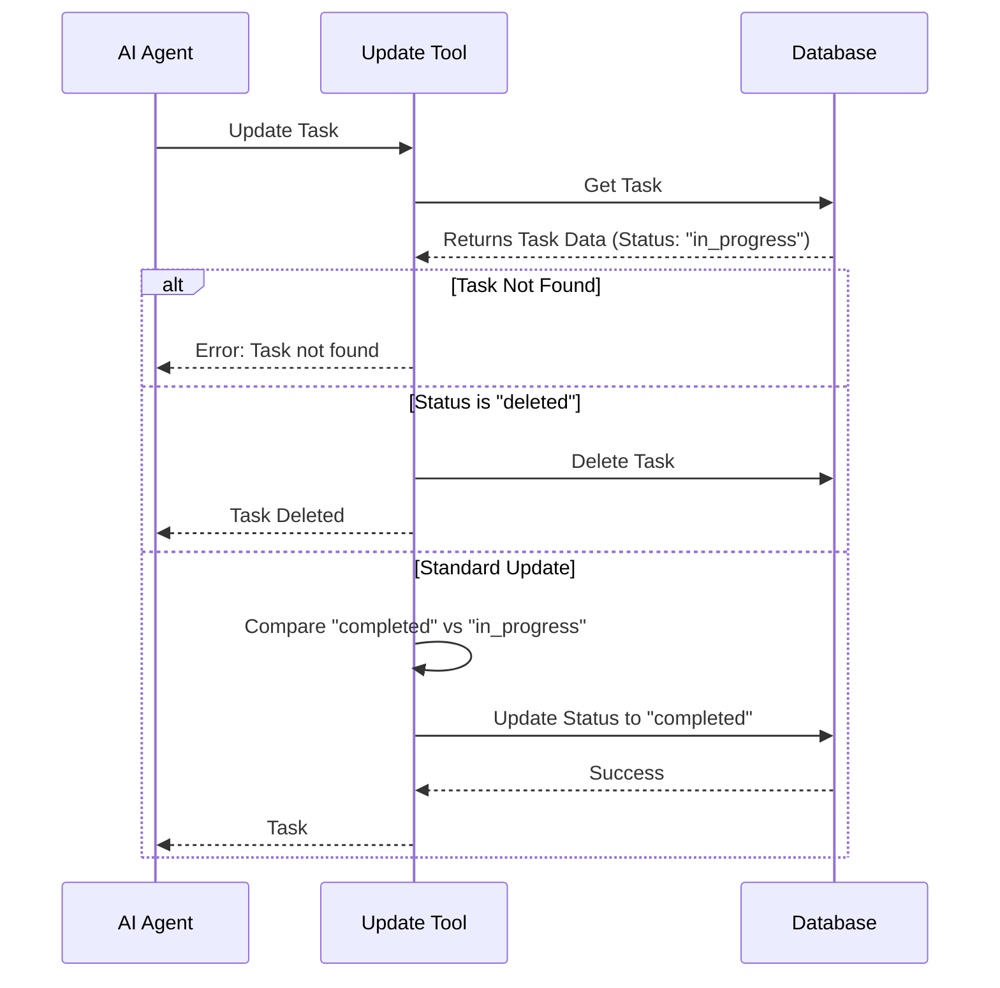

# Chapter 2: Task Lifecycle Workflow

Welcome back! In [Chapter 1: Tool Definition Wrapper](01_tool_definition_wrapper.md), we built the outer shell of our "Skill Cartridge"—the **TaskUpdateTool**. We defined *how* the AI selects the tool and *what* inputs it needs (like `taskId` and `status`).

Now, we need to program the logic inside that cartridge. We can't just let the AI do whatever it wants; we need rules. This set of rules is called the **Task Lifecycle Workflow**.

## The "Assembly Line" Analogy

Think of a task not as a digital text file, but as a physical product on a manufacturing **assembly line**.

1.  **The Queue (Pending):** Raw materials waiting to be built.
2.  **The Workstation (In Progress):** A worker is currently assembling the product.
3.  **The Shipping Crate (Completed):** The product is finished and ready to go.
4.  **The Incinerator (Deleted):** The product was defective or unwanted, so it is destroyed.

### The Golden Rule
You cannot teleport an item. You must follow the process. You can't ship an item (`completed`) that doesn't exist. You also can't work on an item that has been incinerated (`deleted`).

## 1. Validating Existence

Before we move an item on the assembly line, we must check if it's actually there. If the AI tries to update Task #99, but Task #99 doesn't exist, our tool must stop immediately.

Here is how we handle this logic inside the `call` function:

```typescript
// Inside the call() function
const existingTask = await getTask(taskListId, taskId)

// Stop if the task is missing
if (!existingTask) {
  return {
    data: {
      success: false,
      error: 'Task not found',
    },
  }
}
```

**Explanation:**
We use `getTask` to look for the item. If it returns `null` (nothing found), we return an error message. This prevents the code from crashing later.

## 2. The "Delete" Exit Ramp

In our workflow, `deleted` is unique. It isn't just a status label; it is an **action**. It removes the item from the universe entirely.

Because this is a destructive action, we check for it *before* doing normal updates.

```typescript
if (status === 'deleted') {
  // Permanently remove the task
  const deleted = await deleteTask(taskListId, taskId)

  return {
    data: {
      success: deleted,
      taskId,
      updatedFields: ['deleted'], // Tell AI it's gone
    }
  }
}
```

**Explanation:**
If the AI sends `status: 'deleted'`, we don't update the task file—we delete it using `deleteTask`. We then return immediately because there is nothing left to update.

## 3. The Progression Logic

If we aren't deleting the task, we are likely moving it along the assembly line (e.g., from `pending` to `in_progress`).

We prepare an update package. We only change fields that the AI explicitly asked to change.

```typescript
const updates = {} // Empty container for changes

// If AI provided a status, and it's different from current
if (status !== undefined && status !== existingTask.status) {
  updates.status = status
}

// If AI provided a new owner (the worker)
if (owner !== undefined && owner !== existingTask.owner) {
  updates.owner = owner
}
```

**Explanation:**
We create an `updates` object. We compare the *new* value against the *existing* value. If they are the same (e.g., changing a task to `in_progress` when it is already `in_progress`), we do nothing. This keeps our database operations efficient.

## 4. Saving the Changes

Once we have calculated all the changes (status, owner, title, etc.), we apply them to the database.

```typescript
// Only call the database if there are actual changes
if (Object.keys(updates).length > 0) {
  await updateTask(taskListId, taskId, updates)
}

return {
  data: {
    success: true,
    updatedFields: Object.keys(updates)
  }
}
```

**Explanation:**
`updateTask` is the function that actually writes to the file system. We then return a success message telling the AI exactly which fields were modified.

## Under the Hood: The Logic Flow

Let's visualize the decision-making process the `TaskUpdateTool` performs every time it runs.



## Advanced Topic: Side Effects

In a factory, when an item reaches the "Shipping Crate" (`completed`), it might trigger other events—like printing a shipping label or notifying the customer.

In our code, we have similar "Side Effects."

### Auto-Assigning Owners
If a task is moved to `in_progress` but nobody claims it, the system automatically assigns it to the AI running the tool.

```typescript
// If working, but no owner set...
if (status === 'in_progress' && !owner && !existingTask.owner) {
  // ...assign it to the current agent
  updates.owner = getAgentName()
}
```

### Notification Hooks
When a task is `completed`, we might need to notify other agents who were waiting for it. This logic is handled by "Hooks," which we will cover in detail in [Chapter 5: Agent Collaboration & Hooks](05_agent_collaboration___hooks.md).

## Summary

In this chapter, we learned:
1.  **Task Lifecycle** follows a strict path: `pending` -> `in_progress` -> `completed`.
2.  **Validation** prevents us from updating tasks that don't exist.
3.  **Deletion** is a special exit ramp that removes data entirely.
4.  **Efficiency** means we only update the database if values actually change.

However, simply passing a string like "completed" isn't enough safety. What if the AI sends a status of `"finished"` (which isn't valid)? Or sends a number instead of a string?

In the next chapter, we will learn how to strictly enforce these data types using schemas.

[Next Chapter: Lazy Schema Validation](03_lazy_schema_validation.md)

---

Generated by [Code IQ](https://github.com/adityasoni99/Code-IQ)