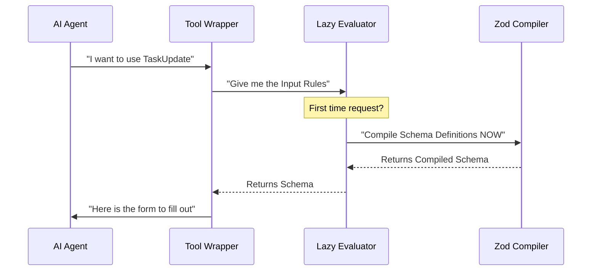

# Chapter 3: Lazy Schema Validation

Welcome back! In [Task Lifecycle Workflow](02_task_lifecycle_workflow.md), we programmed the logic of our tool. We decided how to handle updates, deletions, and status changes.

However, before our logic ever runs, we need to ensure the data coming *in* is correct. If the AI sends us a number when we expect a text string, or a status that doesn't exist, our code might crash.

To prevent this, we use **Schema Validation**. In this chapter, we will learn a special technique called **Lazy Schema Validation** to keep our tool fast and flexible.

## The Motivation: Why "Lazy"?

In programming, we often face the **"Chicken and Egg"** problem (also known as Circular Dependencies).

Imagine you are defining a **Team**:
*   A `Team` is made of `Members`.
*   But a `Member` belongs to a `Team`.

If you try to define both strictly at the exact same moment the application starts, the computer gets confused: *"I can't define Team because I don't know what a Member is yet, but I can't define Member because I don't know what a Team is!"*

### The Security Guard Analogy

Imagine a high-security building with a guard at the door.

1.  **Eager Loading (The Hard Way):**
    At 8:00 AM, the guard memorizes the face and ID number of every single person who *might* visit the building that day. This takes hours. The building cannot open until he is done.

2.  **Lazy Loading (The Smart Way):**
    The guard sits back and relaxes. He doesn't memorize anything. When a visitor actually arrives at 10:30 AM, *only then* does he open the manual to check that specific person's credentials.

**Lazy Schema Validation** is the second approach. We tell our tool: *"Don't compile the rules yet. Wait until someone actually asks to use this tool."*

## 1. The Wrapper: `lazySchema`

To implement this, we wrap our definitions in a function using a helper called `lazySchema`.

Instead of a static object, we write a function that *returns* the object.

```typescript
import { lazySchema } from '../../utils/lazySchema.js'
import { z } from 'zod/v4'

// We define the schema inside a function () => { ... }
const inputSchema = lazySchema(() => {
  
  // Rules are compiled only when this function is called
  return z.strictObject({
    taskId: z.string().describe('The ID of the task'),
    // ... other fields
  })
})
```

**Explanation:**
The `() => { ... }` arrow function acts as a pause button. The code inside the curly braces doesn't run when the file loads. It waits until the tool is needed.

## 2. Defining the Inputs

Now, let's look at the actual inputs for our `TaskUpdateTool`. We use a library called **Zod** (`z`) to define the "types" (string, number, boolean).

In the previous chapter, we learned that `deleted` is a special action, distinct from standard statuses like `in_progress`. We need to reflect that in our validation.

```typescript
const inputSchema = lazySchema(() => {
  // Combine standard statuses with the "deleted" action
  const TaskUpdateStatusSchema = TaskStatusSchema().or(z.literal('deleted'))

  return z.strictObject({
    taskId: z.string().describe('The ID of the task to update'),
    status: TaskUpdateStatusSchema.optional(),
    subject: z.string().optional(),
  })
})
```

**Explanation:**
1.  `TaskStatusSchema()`: Fetches the standard list of statuses (todo, done, etc.).
2.  `.or(z.literal('deleted'))`: Allows the AI to send the word "deleted" as a valid status, even if it's technically a destructive action.
3.  `z.strictObject`: This creates the "form." If the AI sends extra fields we didn't ask for, Zod will reject them.

## 3. Defining the Outputs

Just as we validate inputs, we must describe what we send *back* to the AI. This helps the AI understand if it succeeded or failed.

We use `lazySchema` here as well, mostly for consistency and performance.

```typescript
const outputSchema = lazySchema(() =>
  z.object({
    success: z.boolean(),
    taskId: z.string(),
    updatedFields: z.array(z.string()),
    error: z.string().optional(),
  })
)
```

**Explanation:**
This schema guarantees that our `call` function (from [Chapter 2](02_task_lifecycle_workflow.md)) always returns a structured object containing `success` (true/false) and the `updatedFields`.

## 4. Connecting Schema to Tool

Finally, we need to plug these lazy schemas into our `buildTool` definition from [Chapter 1](01_tool_definition_wrapper.md).

Because we used `lazySchema`, we need to use TypeScript "getters" (functions that look like properties) to unwrap them.

```typescript
export const TaskUpdateTool = buildTool({
  name: 'TaskUpdate',
  
  // The 'get' keyword calls our lazy function
  get inputSchema() {
    return inputSchema()
  },

  get outputSchema() {
    return outputSchema()
  },
  
  // ... rest of the tool
})
```

**Explanation:**
When the system asks `TaskUpdateTool.inputSchema`, the `get` function runs `inputSchema()`. This triggers the "Security Guard" to finally open the manual and compile the rules.

## Under the Hood: The Execution Flow

What happens internally when the AI decides to use the tool?



### Why this matters for "TaskUpdate"

Our `TaskUpdateTool` interacts with `TaskStatusSchema`.
1.  `TaskStatusSchema` might depend on configuration files loaded from a database.
2.  If we tried to load the schema instantly at startup, the database might not be connected yet.
3.  By being **Lazy**, we ensure the database is connected and ready before we ask for the valid status list.

## Implementation Detail: Type Safety

For those using TypeScript, `lazySchema` provides a helper to infer types automatically. You don't need to write interface definitions manually.

```typescript
// Automatically determines the type based on the Zod rules
type InputSchema = ReturnType<typeof inputSchema>
type OutputSchema = ReturnType<typeof outputSchema>

// We can now use this type in our code
export type Output = z.infer<OutputSchema>
```

**Explanation:**
`ReturnType` looks at our lazy function and figures out what shape the data will take. If we change the Zod definition later (e.g., adding a `priority` field), our TypeScript types update automatically!

## Summary

In this chapter, we learned:
1.  **Lazy Validation** improves startup performance and solves circular dependencies.
2.  **`lazySchema`** wraps our rules in a function, acting like a "pause button."
3.  **Zod** allows us to combine existing rules (like `TaskStatus`) with special cases (like `deleted`).
4.  **Getters** (`get inputSchema`) trigger the compilation only when needed.

Now that we have the inputs validated and the logic defined, we need to look at the relationships *between* tasks. What happens if Task A cannot be started until Task B is finished?

[Next Chapter: Task Dependency Management](04_task_dependency_management.md)

---

Generated by [Code IQ](https://github.com/adityasoni99/Code-IQ)