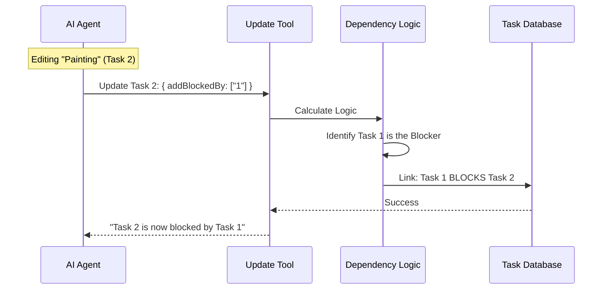

# Chapter 4: Task Dependency Management

Welcome back! In [Chapter 3: Lazy Schema Validation](03_lazy_schema_validation.md), we learned how to ensure our tool receives the correct data types (like verifying that `status` is a valid string).

Now that we can validate individual tasks, we need to look at the "Big Picture." In a real project, tasks rarely exist in isolation. They are connected.

## The "Construction Site" Analogy

Imagine you are managing a construction site for a new house. You have two tasks:
1.  **Task A:** Build the walls.
2.  **Task B:** Paint the walls.

If you send a painter (an AI agent) to do **Task B** before the bricklayer has finished **Task A**, the painter will try to paint thin air. This wastes time and resources.

**Task Dependency Management** is the system of rules that says: *"Do not let Task B start until Task A is finished."*

## 1. The Vocabulary: Blocks vs. Blocked By

In our system, we allow the AI to define these relationships in two ways. This flexibility helps the AI "think" naturally depending on which task it is currently looking at.

### Scenario: Linking Walls (ID: 1) and Painting (ID: 2)

1.  **`addBlocks` (Forward looking):**
    If the AI is editing the **Walls** (Task #1), it can say: *"I am blocking the Painting task."*
    *   Input: `taskId: "1", addBlocks: ["2"]`

2.  **`addBlockedBy` (Backward looking):**
    If the AI is editing the **Painting** (Task #2), it can say: *"I am blocked by the Walls task."*
    *   Input: `taskId: "2", addBlockedBy: ["1"]`

Both inputs result in the exact same link in the database.

## 2. Defining the Inputs

We defined these fields in our schema in the previous chapter. Let's look closely at how simple they are.

```typescript
// Inside the inputSchema definition
  addBlocks: z.array(z.string()).optional()
    .describe('Task IDs that this task blocks'),

  addBlockedBy: z.array(z.string()).optional()
    .describe('Task IDs that block this task'),
```

**Explanation:**
*   We accept an **Array** (`[]`) of strings.
*   This means one task can block *many* other tasks (e.g., "Foundation" blocks "Walls," "Roof," and "Floors").

## 3. Implementing the Logic

Inside our `call` function (which we structured in [Chapter 2: Task Lifecycle Workflow](02_task_lifecycle_workflow.md)), we handle these dependencies after we handle basic updates like status changes.

### Handling `addBlocks`

When the AI tells us Task A blocks Task B, we call a helper function `blockTask`.

```typescript
// Inside call() function
if (addBlocks && addBlocks.length > 0) {
  // 1. Filter out tasks we already blocked (avoid duplicates)
  const newBlocks = addBlocks.filter(
    id => !existingTask.blocks.includes(id)
  )

  // 2. Create the dependency link
  for (const blockId of newBlocks) {
    await blockTask(taskListId, taskId, blockId)
  }
}
```

**Explanation:**
1.  We check `existingTask.blocks` to see if the link already exists. We don't want to do double work.
2.  We loop through the new IDs and call `blockTask(blocker, victim)`.
3.  `taskListId` is passed because these tasks live in a specific list.

### Handling `addBlockedBy` (The Reverse)

This is slightly different. If Task B says "I am blocked by A," we actually need to go update Task A to say "I block B."

```typescript
// Inside call() function
if (addBlockedBy && addBlockedBy.length > 0) {
  const newBlockedBy = addBlockedBy.filter(
    id => !existingTask.blockedBy.includes(id),
  )
  
  // NOTE THE ORDER: blockTask(Blocker, Victim)
  for (const blockerId of newBlockedBy) {
    await blockTask(taskListId, blockerId, taskId)
  }
}
```

**Explanation:**
Notice the arguments for `blockTask`:
*   In `addBlocks`, we passed `(taskId, blockId)`.
*   In `addBlockedBy`, we pass `(blockerId, taskId)`.

We **normalize** the data. Regardless of how the AI phrased it ("I block him" or "He blocks me"), the database always stores it as: **A blocks B**.

## Under the Hood: The Dependency Flow

What happens when the AI creates this link?



## Why This Matters for Automation

By establishing these links, we create a "Smart Schedule."

1.  **Safety:** If an Agent tries to pick up Task 2 ("Painting"), the system can now warn them: *"Wait! Task 1 isn't done yet."*
2.  **Notification:** When Task 1 ("Walls") is finally marked `completed`, the system knows exactly who to notify next. *"Hey Painter! The walls are ready."*

This automated notification system is critical for multi-agent teams. If you have one AI writing code and another AI writing tests, the Tester needs to know the *exact moment* the Coder finishes.

## Summary

In this chapter, we learned:
1.  **Dependencies** prevent tasks from happening out of order (like building a roof before walls).
2.  **`addBlocks`** allows a task to declare what it is holding up.
3.  **`addBlockedBy`** allows a task to declare what it is waiting for.
4.  **Normalization** ensures that no matter how the relationship is described, it is stored consistently in the database.

But what happens when the "Walls" are finally built? How does the "Painter" know it's time to work? We need a way for agents to talk to each other and trigger actions automatically.

[Next Chapter: Agent Collaboration & Hooks](05_agent_collaboration___hooks.md)

---

Generated by [Code IQ](https://github.com/adityasoni99/Code-IQ)