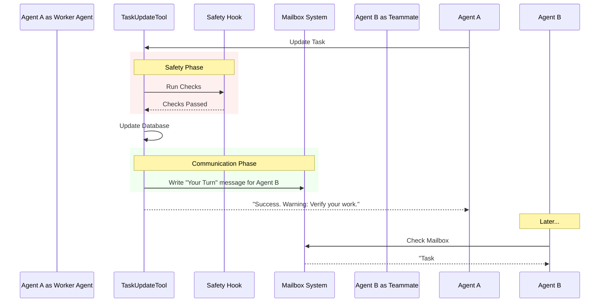

# Chapter 5: Agent Collaboration & Hooks

Welcome to the final chapter of our specific tool tutorial! 

In [Chapter 4: Task Dependency Management](04_task_dependency_management.md), we learned how to link tasks together (e.g., "Task B cannot start until Task A is finished").

However, simply linking tasks in a database isn't enough. If **Agent A** finishes the "Walls," how does **Agent B** (the Painter) know it is time to work? Do they just sit there refreshing the database every second?

This brings us to **Agent Collaboration & Hooks**.

## The "Office Manager" Analogy

Think of the `TaskUpdateTool` not just as a pencil that writes to a list, but as an **Office Manager**.

When you mark a task as "Done," the Office Manager performs several side tasks automatically:
1.  **The Announcement:** Walks over to the next person's desk and leaves a note ("Mailbox").
2.  **The Name Tag:** If you start working on a task without signing your name, the Manager slaps a name tag on you ("Auto-Assignment").
3.  **The Quality Check:** Before you leave, the Manager asks, "Are you *sure* you checked your work?" ("Verification Nudge").

## 1. Auto-Assignment

In a multi-agent system (often called a "Swarm"), we want to know who is doing what.

If an agent picks up a task (marks it `in_progress`) but forgets to fill out the `owner` field, our tool fixes it automatically.

```typescript
// Inside call() function
// If working, but no owner is set...
if (status === 'in_progress' && !owner && !existingTask.owner) {
  
  // ...automatically claim the task for the current agent
  updates.owner = getAgentName() 
}
```

**Explanation:**
This prevents "Ghost Tasks"—tasks that are being worked on but appear available to everyone else. It ensures the dashboard always reflects reality.

## 2. The Mailbox (Collaboration)

When an agent is assigned a task, they need to be notified. We use a concept called the **Mailbox**. This is how agents send text messages to each other.

When the `owner` field changes, the tool automatically sends a "letter."

```typescript
// If the owner changed...
if (updates.owner) {
  const message = {
    type: 'task_assignment',
    taskId: taskId,
    assignedBy: getAgentName()
  }

  // ...drop a letter in their mailbox
  await writeToMailbox(updates.owner, {
    text: JSON.stringify(message)
  })
}
```

**Explanation:**
The `writeToMailbox` function saves a message into the recipient's personal message queue. The next time that agent wakes up, they will see: *"You have been assigned Task #5 by Agent Smith."*

## 3. Completion Hooks (Safety Checks)

Sometimes, marking a task as "completed" requires a safety inspection. We call these **Hooks**.

A Hook is a function that runs *before* the update is finalized. If the Hook finds a problem, it stops the update entirely.

```typescript
if (status === 'completed') {
  // 1. Run external checks (e.g., "Did you actually create the file?")
  const errors = await executeTaskCompletedHooks(taskId)

  // 2. If checks fail, STOP and return error
  if (errors.length > 0) {
    return {
      data: { success: false, error: errors.join('\n') }
    }
  }
}
// 3. If no errors, proceed to update status
updates.status = 'completed'
```

**Explanation:**
Imagine an agent says, "I have finished writing the code," but they didn't actually save the file. The Hook checks the file system. If the file is missing, it returns an error: *"You cannot complete this task because the file is missing."* The task remains `in_progress`.

## 4. The Verification Nudge

Agents, like humans, can get "tunnel vision." If an agent completes 10 tasks in a row without stopping to check the quality, bugs might creep in.

We implement a **Nudge** system. If the agent finishes a large batch of work, the tool appends a warning to the output.

### Step A: Logic inside `call()`

```typescript
// Inside call()
let verificationNudgeNeeded = false

// If closing a task and the list is long...
if (status === 'completed' && allTasks.length >= 3) {
  // ...flag that we need a double-check
  verificationNudgeNeeded = true
}

return {
  data: { success: true, verificationNudgeNeeded }
}
```

### Step B: The Text Output

The AI doesn't see the boolean `true`. We must translate this into a sentence it understands using `mapToolResultToToolResultBlockParam` (from [Chapter 1](01_tool_definition_wrapper.md)).

```typescript
// Inside mapToolResultToToolResultBlockParam
if (content.verificationNudgeNeeded) {
  resultContent += "\n\nNOTE: You just closed out 3+ tasks. " + 
                   "Before finishing, spawn a Verification Agent to double-check your work."
}
```

**Explanation:**
This injects a "thought" into the AI's mind. It forces the AI to pause and reflect: *"Oh, the system is telling me to verify my work. I should spawn a tester agent now."*

## Under the Hood: The Collaboration Flow

Let's visualize how a single update triggers this chain of events.



## Putting It All Together

We have now built a robust, safe, and collaborative tool.

1.  **Definition ([Chapter 1](01_tool_definition_wrapper.md)):** We created the "cartridge" wrapper.
2.  **Workflow ([Chapter 2](02_task_lifecycle_workflow.md)):** We defined how tasks move from `pending` to `done`.
3.  **Validation ([Chapter 3](03_lazy_schema_validation.md)):** We ensured inputs like `status` are valid.
4.  **Dependencies ([Chapter 4](04_task_dependency_management.md)):** We linked tasks so order matters.
5.  **Collaboration ([Chapter 5]):** We added the "Office Manager" logic to coordinate agents.

## Conclusion

The **TaskUpdateTool** is more than just a database writer. It is the central nervous system of our agent swarm. By handling validation, dependencies, and communication *inside the tool*, we free up the AI agents to focus on their actual work—writing code, analyzing data, or solving problems—without worrying about project management overhead.

You now have a complete understanding of how to build a production-grade Agent Tool!

**End of Tutorial**

---

Generated by [Code IQ](https://github.com/adityasoni99/Code-IQ)