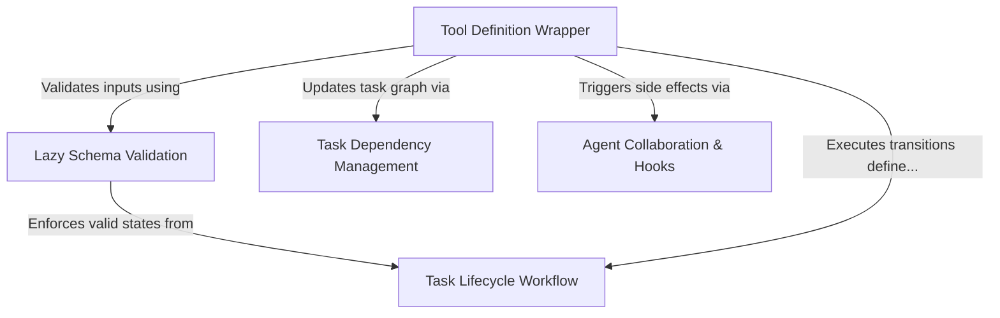

# Tutorial: TaskUpdateTool

The **TaskUpdateTool** acts as a rigorous project manager for AI agents, allowing them to modify the state of work items within a system. It ensures that every update—whether completing a task, changing an owner, or adding dependencies—adheres to a strict **Task Lifecycle Workflow** and *validates* data structure before saving changes. Beyond simple edits, it orchestrates collaboration by automatically triggering notifications and hooks to keep the entire agent team synchronized.

## Chapters

1. [Tool Definition Wrapper](01_tool_definition_wrapper.md)
2. [Task Lifecycle Workflow](02_task_lifecycle_workflow.md)
3. [Lazy Schema Validation](03_lazy_schema_validation.md)
4. [Task Dependency Management](04_task_dependency_management.md)
5. [Agent Collaboration & Hooks](05_agent_collaboration___hooks.md)

---

Generated by [Code IQ](https://github.com/adityasoni99/Code-IQ)