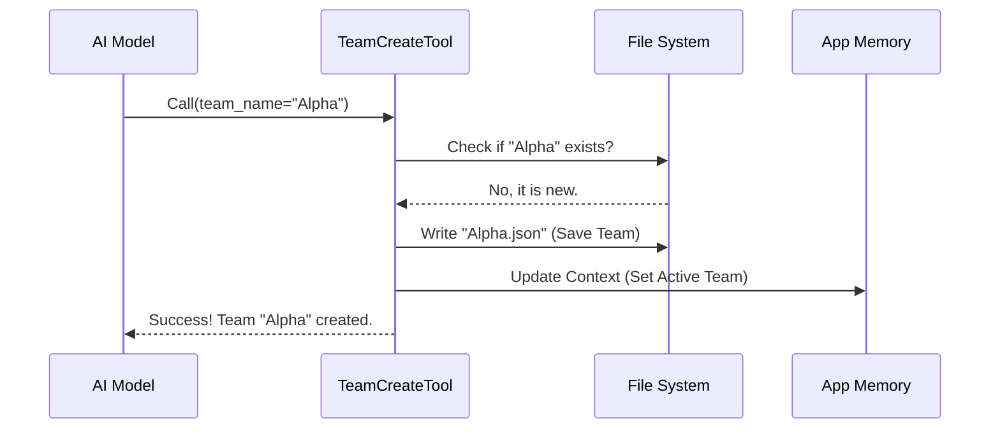

# Chapter 1: TeamCreate Tool Definition

Welcome to the **TeamCreateTool** project! If you are new here, you are in the right place. We are going to explore how an AI system can go from working alone to orchestrating a full team of specialized agents.

In this first chapter, we will look at the "Big Bang" moment of any AI swarm: **The Team Creation**.

## Why do we need this?

Imagine you are an AI tasked with building a complex web application. Doing the research, writing the backend code, designing the frontend, and testing everything all by yourself is overwhelming and prone to error.

You need help. You need a team.

The **TeamCreate Tool** is the digital equivalent of an office manager who:
1.  Registers a new department (The Team).
2.  Assigns a manager (The Lead Agent).
3.  Allocates a workspace (Files and Context).

**Use Case:**
A user tells the AI: *"I want to build a snake game in Python. Create a team to handle this."*
The AI uses the **TeamCreate Tool** to set up a "SnakeGameTeam" so it can subsequently invite a generic Coder and a Tester to join.

---

## 1. The Blueprint: Input Schema

Before the tool can do any work, it needs to know *what* to build. We define this using a **Schema**. Think of the Schema as a registration form that the AI must fill out to start the process.

Here is the simplified definition of that form:

```typescript
// File: TeamCreateTool.ts
const inputSchema = lazySchema(() =>
  z.strictObject({
    team_name: z.string().describe('Name for the new team'),
    description: z.string().optional(),
    agent_type: z.string().optional()
      .describe('Role of the team lead (e.g., "researcher")'),
  }),
)
```

**What's happening here?**
*   **`team_name`**: The specific ID for the group (e.g., "SnakeGame").
*   **`description`**: A helpful note about what the team does.
*   **`agent_type`**: This defines who the "Boss" is. We will learn more about the boss in [Lead Agent Identity](02_lead_agent_identity.md).

---

## 2. Using the Tool: Inputs and Outputs

When the AI decides to call this tool, it provides the data matching the schema above.

**Example Input:**
```json
{
  "team_name": "WebDevs",
  "description": "A team to build a React website",
  "agent_type": "tech-lead"
}
```

**High-Level Result:**
The tool doesn't just return text; it performs **actions**:
1.  It checks if "WebDevs" already exists.
2.  It creates a physical file (like a save file) for the team.
3.  It switches the AI's internal state to "Team Mode".

**Example Output Data:**
```json
{
  "team_name": "WebDevs",
  "team_file_path": "/path/to/.teams/WebDevs.json",
  "lead_agent_id": "team-lead@WebDevs"
}
```

---

## 3. How It Works (Under the Hood)

Let's visualize what happens inside the system when this tool is called.



### The Execution Logic

The logic is contained within the `call` function. Let's break down the implementation into small, digestible pieces.

#### Step A: Validation and Safety
First, the tool ensures the user provided a name and checks if the current agent is allowed to start a new team.

```typescript
// Inside TeamCreateTool.ts -> call()
const { team_name } = input
const appState = getAppState()

// An agent can only lead one team at a time
if (appState.teamContext?.teamName) {
  throw new Error(`Already leading team...`)
}
```
*If you are already the boss of a team, you can't abandon them to start a new one without deleting the old one first!*

#### Step B: Determining Identity
Once validated, we need to decide who the leader is. The tool calculates a unique ID for the "Lead Agent."

```typescript
// Creating the deterministic ID for the leader
const finalTeamName = generateUniqueTeamName(team_name)
const leadAgentId = formatAgentId(TEAM_LEAD_NAME, finalTeamName)

// Example result: "team-lead@WebDevs"
```
This specific identity logic is crucial for the swarm to function. We discuss exactly how this ID affects permissions in [Lead Agent Identity](02_lead_agent_identity.md).

#### Step C: Persistence (Saving the Team)
We create a `TeamFile` object and save it to the hard drive. This ensures that if the computer crashes, the team structure isn't lost.

```typescript
const teamFile: TeamFile = {
  name: finalTeamName,
  leadAgentId,
  members: [ /* The Lead is the first member */ ],
  createdAt: Date.now(),
}

await writeTeamFileAsync(finalTeamName, teamFile)
```
The details of how this file handles memory and history are covered in [Team State Persistence](05_team_state_persistence.md).

#### Step D: Updating Context
Finally, we update the application's immediate memory (`AppState`) so the AI knows it is no longer alone—it is now the leader of a team.

```typescript
setAppState(prev => ({
  ...prev,
  teamContext: {
    teamName: finalTeamName,
    leadAgentId,
    // The team is now live in memory!
  },
}))
```
This step initializes the workspace where tasks will be tracked. You can read more about how tasks are linked to this specific team in [Team-Task Context Binding](03_team_task_context_binding.md).

---

## Conclusion

The **TeamCreate Tool** is the foundational block of our agent swarm. It transforms a simple instruction ("Make a team") into a structured environment with a designated leader, a persistent save file, and an active memory state.

However, creating a team is just the start. Now that we have a team, we need to understand the unique role of the agent who just created it.

In the next chapter, we will explore exactly what it means to be the "Boss."

[Next Chapter: Lead Agent Identity](02_lead_agent_identity.md)

---

Generated by [Code IQ](https://github.com/adityasoni99/Code-IQ)