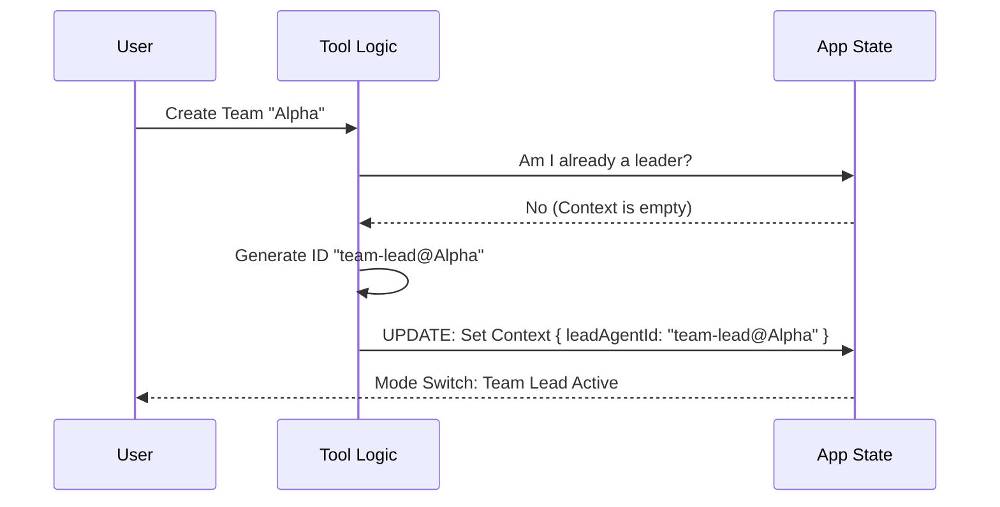

# Chapter 2: Lead Agent Identity

Welcome back! In the previous chapter, [TeamCreate Tool Definition](01_teamcreate_tool_definition.md), we learned how to initialize a new workspace for our AI agents.

But an empty office doesn't get work done. Someone needs to take charge.

In this chapter, we will explore the **Lead Agent Identity**. This is the process where your current AI session stops being a generic helper and officially puts on the "Captain's Armband," becoming the **Team Lead**.

## The Problem: Who is in Charge?

Imagine a construction site with ten workers but no foreman. Everyone creates walls wherever they want. It is chaotic.

In an AI swarm, we face similar problems:
1.  **Identity Crisis:** If every agent is just named "Claude," how do sub-agents know who to report to?
2.  **Split Focus:** Can one AI manage a "Web Development" team and a "Recipe Writing" team at the exact same time? (Spoiler: It shouldn't).

The **Lead Agent Identity** logic solves this by enforcing a single, unique role for the user's current session.

## 1. The Captain's Armband (The Concept)

When the `TeamCreate` tool is called, it performs a transformation on the current session. It assigns a **Deterministic ID**.

"Deterministic" simply means the ID follows a strict formula. If we know the team name, we instantly know the boss's name.

**The Formula:**
`Role` + `@` + `TeamName` = `LeadAgentID`

**Example:**
*   **Role:** `team-lead` (The default boss role)
*   **Team Name:** `SnakeGame`
*   **Resulting ID:** `team-lead@SnakeGame`

This ID acts as the routing address for all future reports. If a sub-agent finishes a task, they know exactly who to ping: `team-lead@SnakeGame`.

---

## 2. Enforcing Exclusivity

Before assigning this identity, the tool performs a crucial safety check. It ensures the current agent isn't *already* wearing an armband.

### The Safety Check

You cannot lead two teams simultaneously. If you try to create a new team while leading an old one, the system stops you.

```typescript
// Inside TeamCreateTool.ts
const appState = getAppState()
const existingTeam = appState.teamContext?.teamName

// Check if the agent is already the boss of another team
if (existingTeam) {
  throw new Error(
    `Already leading team "${existingTeam}". Cannot start a new one.`
  )
}
```
**Explanation:**
The code looks at the application memory (`appState`). If `teamContext` is already active, it throws an error. You must disband (or leave) your current team before starting a new venture.

---

## 3. Creating the Identity

Once the safety check passes, the tool generates the ID. This is the moment the "Captain's Armband" is created.

```typescript
// Generating the ID
import { TEAM_LEAD_NAME } from '../../utils/swarm/constants.js'
import { formatAgentId } from '../../utils/agentId.js'

// TEAM_LEAD_NAME is usually "team-lead"
const leadAgentId = formatAgentId(TEAM_LEAD_NAME, finalTeamName)

// leadAgentId is now "team-lead@YourProjectName"
```

**Explanation:**
We use a helper function `formatAgentId`. It takes the standard role name (`team-lead`) and combines it with the `finalTeamName` we determined in Chapter 1.

---

## 4. Applying the Identity (State Update)

Now that we have the ID, we must update the application state. This tells the AI: *"You are no longer a solo agent. You are the Leader of this specific team."*

Let's look at the flow of data:



### The Code Implementation

Here is how the tool writes this identity into the application's active memory.

```typescript
// Updating the global AppState
setAppState(prev => ({
  ...prev,
  teamContext: {
    teamName: finalTeamName,
    // The "Armband" is now worn
    leadAgentId, 
    teamFilePath: teamFilePath,
    // ...other initialization data
  },
}))
```

**Explanation:**
`setAppState` triggers a React-like update to the system. By filling the `teamContext` object, the entire UI and logic engine switch to "Swarm Mode." The agent now knows that any task it spawns belongs to this specific leadership context.

---

## 5. The Leader in the Team File

The identity isn't just kept in memory; it is written to the hard drive so the team structure persists.

```typescript
const teamFile: TeamFile = {
  name: finalTeamName,
  leadAgentId, // The ID we just generated
  members: [
    {
      agentId: leadAgentId, // The Leader is Member #1
      name: TEAM_LEAD_NAME,
      agentType: input.agent_type || TEAM_LEAD_NAME,
      joinedAt: Date.now(),
    },
  ],
}
```

**Explanation:**
The `members` array is the official roster. The Team Lead is **always** the first member added to the roster. This file is crucial for saving and loading logic, which we will cover in [Team State Persistence](05_team_state_persistence.md).

---

## Conclusion

We have successfully transformed our AI from a solo worker into a **Team Lead**.

**What we learned:**
1.  **Exclusivity:** An agent can only lead one team at a time.
2.  **Deterministic IDs:** We use `team-lead@TeamName` so everyone knows who the boss is.
3.  **Context Switching:** We update `AppState` to reflect this new responsibility.

Now that our agent is the designated leader, they need to assign work. But how does a generic request like "Write code" get attached to this specific team?

In the next chapter, we will look at how tasks are glued to the team.

[Next Chapter: Team-Task Context Binding](03_team_task_context_binding.md)

---

Generated by [Code IQ](https://github.com/adityasoni99/Code-IQ)