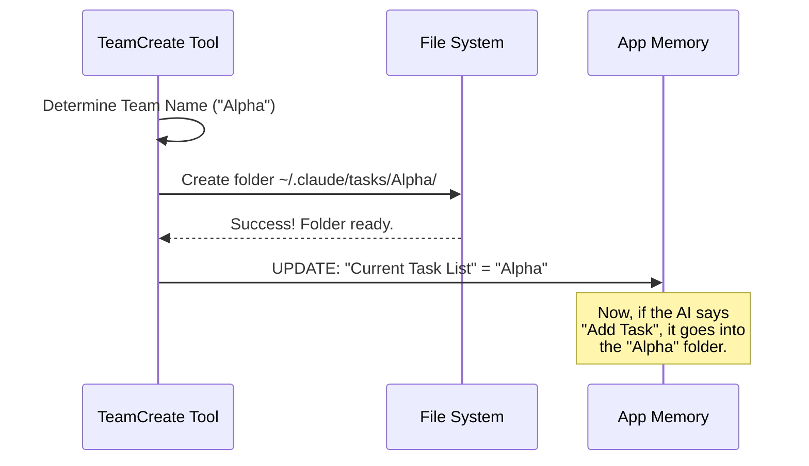

# Chapter 3: Team-Task Context Binding

Welcome back! In [Lead Agent Identity](02_lead_agent_identity.md), we gave our AI a badge and made them the "Boss." Now, we have a Leader and a Team Name.

But imagine a busy office building. If every team in the building wrote their to-do lists on the *same* whiteboard in the hallway, it would be chaos. The "Web Development" team might accidentally erase the "Accounting" team's tasks.

In this chapter, we explore **Team-Task Context Binding**. This is the logic that assigns a private "conference room" (a specific folder) to our team so their work remains isolated and organized.

---

## The Problem: The Shared Whiteboard

By default, when you ask an AI to do something, it writes tasks to a default list (often based on your current session ID).

**The Risk:**
1.  You create a team called "SnakeGame".
2.  Later, you create a team called "RecipeApp".
3.  Without context binding, the Recipe team might try to "Fix the Python bug," or the Game team might try to "Preheat the oven."

## The Solution: 1 Team = 1 Task List

**Team-Task Context Binding** enforces a strict rule: **Every Team gets its own directory.**

Think of it like this:
*   **Solo Mode:** You work at your desk.
*   **Team Mode:** The system unlocks a private room named `~/.claude/tasks/{team-name}`.
*   **The Binding:** The system forces all agents in that team to *only* look at the whiteboard in that private room.

---

## 1. How It Works (The Flow)

You don't need to manually create folders. The **TeamCreate Tool** handles this automatically the moment a team is born.

Here is the flow of events when you create a team:



---

## 2. The Implementation: Step-by-Step

Let's look at the code inside `TeamCreateTool.ts` that makes this happen. We will break it down into three simple steps.

### Step A: Sanitizing the ID

Folder names on a computer need to be clean (no spaces or weird symbols). First, we convert the human-readable team name into a "safe" ID.

```typescript
// Inside TeamCreateTool.ts

// "Snake Game Team!" becomes "SnakeGameTeam"
const taskListId = sanitizeName(finalTeamName)
```

**What just happened?**
We prepared a clean string to use as a folder name. This ensures we don't crash the file system with invalid characters.

### Step B: Preparing the Physical Directory

Now, we ensure the "Conference Room" exists. We also reset it (wipe the whiteboard clean) to ensure we aren't inheriting old tasks from a project we finished months ago.

```typescript
import { ensureTasksDir, resetTaskList } from '../../utils/tasks.js'

// 1. Wipe old tasks if this team name was used before
await resetTaskList(taskListId)

// 2. Create the physical folder on the hard drive
await ensureTasksDir(taskListId)
```

**What just happened?**
The tool checked the hard drive at `~/.claude/tasks/`. If the folder didn't exist, it created it. If it did exist, it cleared out old data so the team starts fresh.

### Step C: The "Binding" (Pointing the Leader)

This is the most critical part. We have created the room, but we haven't told the Leader to *go* there yet. If we skip this, the Leader will still write to the default list!

```typescript
import { setLeaderTeamName } from '../../utils/tasks.js'

// Tell the system: "For this session, use this specific task list"
setLeaderTeamName(taskListId)
```

**What just happened?**
`setLeaderTeamName` updates a global variable.
*   **Before this line:** When the AI asks "Where is my task list?", the system returns the generic Session ID.
*   **After this line:** The system returns `taskListId` (e.g., "SnakeGame").

Now, when the Lead Agent uses tools like `TaskCreate` or `TaskList`, the system automatically routes those requests to `~/.claude/tasks/SnakeGame/`.

---

## 3. Why is this "Binding"?

We call it **Binding** because we are gluing two concepts together in the `AppState` (Application State):

1.  **The Context:** The active team (`teamContext`).
2.  **The Storage:** The file path on the disk (`taskContext`).

The `TeamCreate` tool updates the application state to reflect this relationship:

```typescript
// Inside setAppState(...)
teamContext: {
    teamName: finalTeamName, // "SnakeGame"
    // ...
},
```

While the code above manages the *Leader*, any **Sub-Agents** (teammates) that join later will look at this `teamContext`. They will see "Oh, I belong to SnakeGame," and they will automatically know to look in the `SnakeGame` task folder.

---

## Conclusion

By using **Team-Task Context Binding**, we have created a safe, isolated environment.

1.  We created a unique folder for the team.
2.  We cleaned it up.
3.  We re-wired the Lead Agent's brain to focus *only* on that folder.

Now our Leader is in charge, has an identity, and is standing in a private room with a blank whiteboard.

But a leader in an empty room is lonely. They need to know how to bring in other agents and how to behave in this new environment.

In the next chapter, we will discuss the rules of engagement.

[Next Chapter: Swarm Workflow Guidelines](04_swarm_workflow_guidelines.md)

---

Generated by [Code IQ](https://github.com/adityasoni99/Code-IQ)