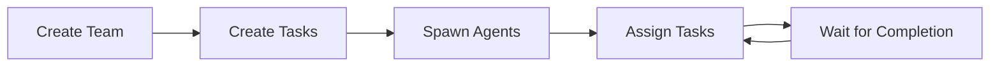
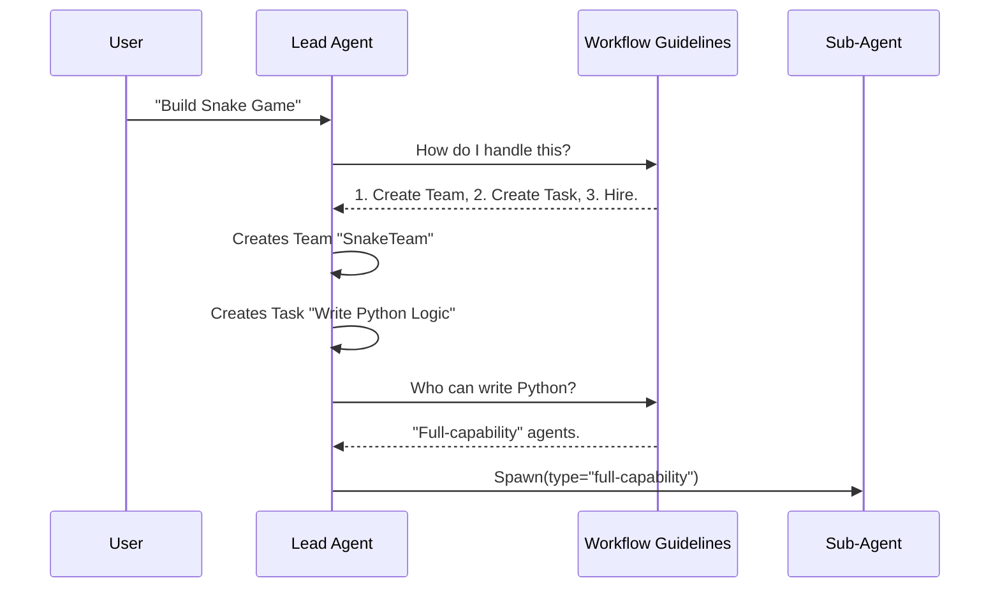

# Chapter 4: Swarm Workflow Guidelines

Welcome back! In the previous chapter, [Team-Task Context Binding](03_team_task_context_binding.md), we set up a private office (directory) for our team and made sure the Lead Agent focuses on the right task board.

So, we have a **Leader**, we have an **Office**, and we have a **Team Name**.

But imagine hiring a manager, putting them in an office, and walking away without telling them *how* to manage. They might try to do all the work themselves, or worse, just stare at the wall.

This chapter is about the **Swarm Workflow Guidelines**. This is the "Employee Handbook" or "Standard Operating Procedures" (SOP) that we feed into the AI's brain. It teaches the Lead Agent exactly how to hire, assign tasks, and communicate.

---

## The Problem: The "Lost Manager"

Without specific guidelines, an AI Lead Agent is just a generic chatbot. It doesn't inherently know:
1.  That it should split a big project into small tasks.
2.  That it needs to "hire" a Coder agent to write Python.
3.  That it shouldn't panic when a worker says "I'm idle."

## The Solution: The System Prompt

We solve this by injecting a comprehensive set of instructions—called a **System Prompt**—into the Lead Agent. This prompt acts as the **Workflow Guidelines**.

It transforms the AI's mindset from *"I am a helpful assistant"* to *"I am a Project Manager orchestrating a team."*

---

## 1. The Core Rules of Management

The guidelines cover three main pillars of team management. Let's look at them simply.

### Pillar A: Hiring Strategy (Agent Types)

The guidelines teach the Lead Agent that not all workers are the same. You wouldn't hire a demolition crew to paint a portrait.

*   **Read-only Agents:** Good for research. They can't break code because they can't write files.
*   **Full-capability Agents:** The builders. They can write code and run commands.

**The Instruction:**
> "When spawning teammates... choose the `subagent_type` based on what tools the agent needs... Never assign implementation work to Read-only agents."

### Pillar B: The Workflow Loop

The guidelines define a strict order of operations so the Lead Agent doesn't get confused.



1.  **Setup:** Make the team and list the to-dos.
2.  **Staffing:** Bring in the agents.
3.  **Delegation:** Assign the to-dos to the agents.

### Pillar C: The "Idle" State

This is the most important concept for beginners. In this system, when a sub-agent finishes a turn, it goes **Idle**.

*   **Newbie Panic:** "Oh no! The agent stopped working!"
*   **Experienced Lead:** "Good. The agent is waiting for my next command."

**The Instruction:**
> "Teammates go idle after every turn—this is completely normal... Do not treat idle as an error."

---

## 2. Implementing the Guidelines

How do we actually get these rules into the AI? We write them in a TypeScript file called `prompt.ts`.

When the `TeamCreate` tool initializes a leader, it reads this text and forces the AI to memorize it.

### Step 1: The Hiring Instructions

Here is the code that defines how to choose teammates. We keep it clear and directive.

```typescript
// Inside prompt.ts
export function getPrompt(): string {
  return `
## Choosing Agent Types for Teammates
- **Read-only agents**: Use for research/planning. 
  Cannot edit files.
- **Full-capability agents**: Use for implementation. 
  Can write files and use bash.
  `
}
```
*The AI reads this and knows: "If I need to fix a bug, I must hire a Full-capability agent."*

### Step 2: The Communication Protocol

We must explicitly tell the Lead Agent *how* to talk. If we don't, it might try to write a letter in a text file instead of sending a direct message.

```typescript
// Continuing inside prompt.ts...
`
## Automatic Message Delivery
- Messages from teammates are delivered automatically.
- You do NOT need to check your inbox manually.
- Use the 'SendMessage' tool to reply.
- Do NOT use terminal tools to "spy" on your team.
`
```
*This prevents the Lead Agent from wasting time running Linux commands just to see if a teammate said "Hello."*

---

## 3. How the AI Uses the Guidelines

Let's visualize the decision-making process of the Lead Agent when it receives a user request.

**User Request:** "Build a snake game."



### Handling the "Idle" Event

The most complex part of the guidelines is teaching patience. Here is how the code describes it to the AI.

```typescript
// The "Patience" Clause
`
## Teammate Idle State
- Idle means they are waiting for input.
- Sending a message to an idle teammate wakes them up.
- BE PATIENT with idle teammates!
`
```

**Why is this code text?**
We are programming the AI using natural language (English) because LLMs understand instructions better than binary code. This text *is* the code that controls the manager's personality.

---

## 4. Task Ownership Rules

Finally, the guidelines explain the mechanics of the "Task Board" we built in Chapter 3.

The Lead Agent needs to know how to officially give work to someone.

```typescript
// The Assignment Clause
`
## Task Ownership
- Tasks are assigned using TaskUpdate with 'owner'.
- Teammates should claim unassigned tasks.
- Prefer tasks in ID order (lowest ID first).
`
```

**Example of the Resulting Action:**
Because of this guideline, when the Lead Agent wants the "Coder" to work, it generates this exact tool call:

```json
{
  "tool": "TaskUpdate",
  "args": {
    "task_id": "1",
    "owner": "Coder",
    "status": "in_progress"
  }
}
```
*The AI only knows to fill the "owner" field because our guidelines told it to.*

---

## Conclusion

The **Swarm Workflow Guidelines** are the brain of the operation. Without them, we have tools and teams, but no behavior.

By writing a clear "Employee Handbook" into `prompt.ts`, we ensure:
1.  The Lead Agent hires the right people.
2.  It assigns tasks correctly.
3.  It stays calm when workers go idle.

Now our team is creating tasks, assigning them, and doing work. But wait—what happens if the server restarts? Or if we want to pause today and continue tomorrow?

We need a way to save the entire team's memory to the hard drive.

[Next Chapter: Team State Persistence](05_team_state_persistence.md)

---

Generated by [Code IQ](https://github.com/adityasoni99/Code-IQ)