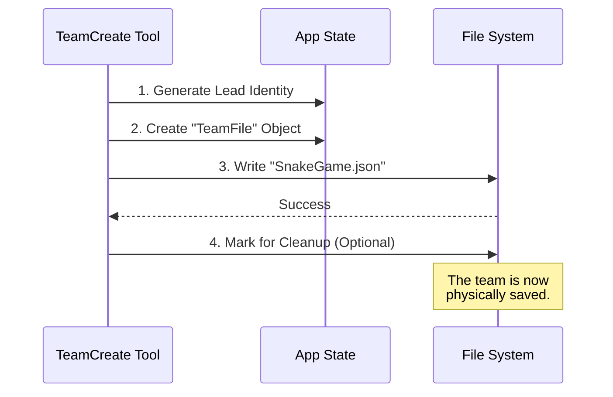

# Chapter 5: Team State Persistence

Welcome to the final chapter of our **TeamCreateTool** series!

In the previous chapter, [Swarm Workflow Guidelines](04_swarm_workflow_guidelines.md), we taught our Lead Agent how to behave, hire, and manage. We now have a smart leader in a private office.

But there is one final, critical risk: **Amnesia.**

If the computer restarts, or if another agent tries to find this team, how do they know it exists? RAM (memory) is temporary. We need something permanent.

In this chapter, we explore **Team State Persistence**. This is the mechanism that saves your team's "Incorporation Papers" to the hard drive, ensuring the team is real, discoverable, and resilient.

---

## The Problem: The "Ghost" Team

Imagine you start a company, but you never register it with the government. You have no office address and no employee list.
1.  If you leave the room, no one knows the company exists.
2.  If a new employee wants to join, they can't find you.

In our AI Swarm, if we only keep the team data in variables (`AppState`), the team vanishes the moment the script ends.

## The Solution: The Team File

We solve this by writing a **JSON file** to the computer's file system.

*   **The Concept:** "The Team Roster" or "Save Game File."
*   **The Location:** `~/.claude/teams/{TeamName}.json`
*   **The Purpose:** To prove the team exists and list who works there.

---

## 1. What is Stored? (The Roster)

When the **TeamCreate Tool** runs, it doesn't just switch modes; it compiles a snapshot of the team's vital statistics.

Here is what the "Incorporation Paper" looks like:

```json
{
  "name": "SnakeGame",
  "leadAgentId": "team-lead@SnakeGame",
  "leadSessionId": "session-12345",
  "members": [
    {
      "name": "team-lead",
      "agentType": "tech-lead",
      "joinedAt": 1715000000
    }
  ]
}
```

### Breakdown of Fields
*   **`name`**: The unique ID of the team.
*   **`leadAgentId`**: The routing address for the boss (as learned in [Lead Agent Identity](02_lead_agent_identity.md)).
*   **`leadSessionId`**: This is crucial. It tells other programs *which terminal window* the boss is living in.
*   **`members`**: An array listing everyone in the team. At creation, this list has length 1 (just the Leader).

---

## 2. How It Works (The Process)

Let's visualize the flow when the tool saves the state.



---

## 3. Implementation: Creating the Object

Inside `TeamCreateTool.ts`, we first construct the data object in memory. This gathers all the context we defined in previous chapters into one place.

```typescript
// Inside TeamCreateTool.ts
const teamFile: TeamFile = {
  name: finalTeamName,
  description: _description,
  createdAt: Date.now(),
  leadAgentId,
  leadSessionId: getSessionId(), // "Where is the boss?"
  // ... members list comes next
}
```

**Why `leadSessionId`?**
This field allows for **Discovery**. If you open a second terminal and ask, "Can I join the SnakeGame team?", that second agent reads this file, finds the `leadSessionId`, and knows exactly how to send messages to the Leader in the first terminal.

### The Members List

Next, we add the Leader as the founding member.

```typescript
// Continuing the teamFile object...
members: [
  {
    agentId: leadAgentId, // "team-lead@SnakeGame"
    name: TEAM_LEAD_NAME,
    agentType: leadAgentType,
    joinedAt: Date.now(),
    // ... paths and config
  },
],
```

The Leader is always Member #1. As new agents are hired (using the guidelines from [Swarm Workflow Guidelines](04_swarm_workflow_guidelines.md)), they will be appended to this list in the file.

---

## 4. Implementation: Writing to Disk

Finally, we commit this object to the hard drive.

```typescript
import { 
  writeTeamFileAsync, 
  registerTeamForSessionCleanup 
} from '../../utils/swarm/teamHelpers.js'

// 1. Save the JSON file
await writeTeamFileAsync(finalTeamName, teamFile)

// 2. Schedule cleanup (optional)
registerTeamForSessionCleanup(finalTeamName)
```

### Understanding the Steps:
1.  **`writeTeamFileAsync`**: This function takes the JSON object, converts it to text, and saves it to `~/.claude/teams/SnakeGame.json`.
2.  **`registerTeamForSessionCleanup`**: This is a housekeeping feature. Since we are just testing or running a session, we might not want this team to stay on the hard drive forever. This flags the file to be deleted when the user quits the application (unless they explicitly say "Keep this").

---

## 5. Why Persistence Matters for Context Binding

In [Team-Task Context Binding](03_team_task_context_binding.md), we discussed how the team has a specific folder for tasks.

This **Team File** is the link between the *Agents* and that *Task Folder*.

1.  **Agent joins team.**
2.  **Agent reads Team File.**
3.  **Agent sees Team Name.**
4.  **Agent knows to look in `~/.claude/tasks/{TeamName}`.**

Without this persistent file, a new agent joining the swarm wouldn't know where the "Task Whiteboard" is located.

---

## Conclusion: The Complete Picture

Congratulations! You have completed the **TeamCreateTool** tutorial series.

Let's recap the journey of building this tool:

1.  **[TeamCreate Tool Definition](01_teamcreate_tool_definition.md)**: We defined the inputs and the basic schema.
2.  **[Lead Agent Identity](02_lead_agent_identity.md)**: We gave the user a specific badge (`team-lead@Name`) to distinguish them from regular users.
3.  **[Team-Task Context Binding](03_team_task_context_binding.md)**: We gave the team a private room (directory) to manage their to-do lists.
4.  **[Swarm Workflow Guidelines](04_swarm_workflow_guidelines.md)**: We injected a "brain" (System Prompt) so the leader knows how to manage.
5.  **[Team State Persistence](05_team_state_persistence.md)**: We wrote the "Incorporation Papers" to disk so the team is real and discoverable.

You now understand the architecture of an AI Swarm's "Big Bang" moment. With these five pillars, a single AI command can spawn a persistent, organized, and intelligent digital workforce.

**End of Tutorial.**

---

Generated by [Code IQ](https://github.com/adityasoni99/Code-IQ)