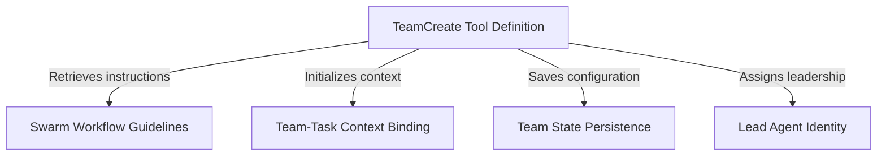

# Tutorial: TeamCreateTool

The **TeamCreate Tool** acts as the "Start Button" for launching a multi-agent *swarm*, allowing an AI to take charge as a **Team Lead**. It sets up the necessary infrastructure by creating a private **Task List** for the group and saving a "Team Roster" file so agents can find each other. Additionally, it equips the leader with a handbook of **Swarm Workflow Guidelines** to ensure smooth coordination and task delegation.

## Chapters

1. [TeamCreate Tool Definition](01_teamcreate_tool_definition.md)
2. [Lead Agent Identity](02_lead_agent_identity.md)
3. [Team-Task Context Binding](03_team_task_context_binding.md)
4. [Swarm Workflow Guidelines](04_swarm_workflow_guidelines.md)
5. [Team State Persistence](05_team_state_persistence.md)

---

Generated by [Code IQ](https://github.com/adityasoni99/Code-IQ)