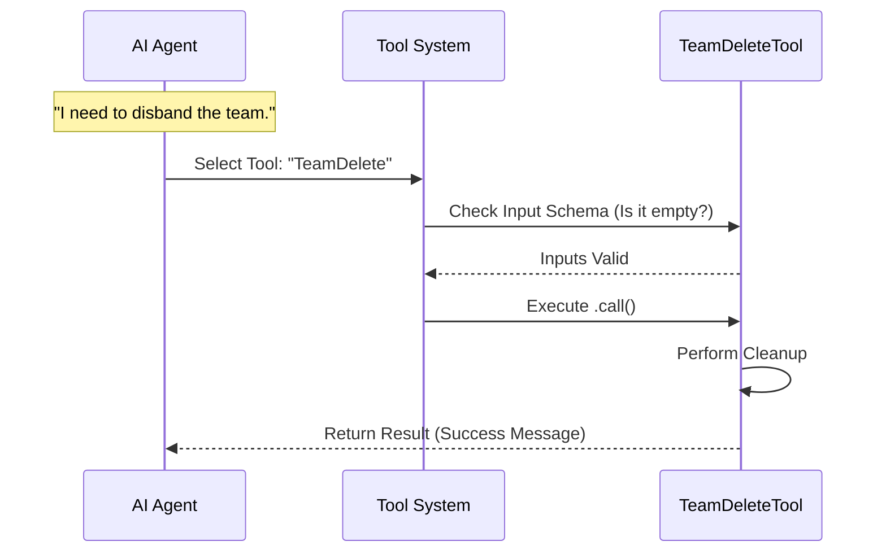

# Chapter 1: Tool Definition

Welcome to the **TeamDeleteTool** project! In this tutorial series, we are going to build a specific capability for an AI agent: the ability to "disband" a team of sub-agents and clean up their workspace.

We start at the very beginning: telling the AI that this capability exists.

## The "Skill Cartridge" Analogy

Imagine your AI agent is a classic game console. On its own, the console has raw power, but it doesn't know how to play "Super Mario" or "Zelda" until you insert a cartridge.

In our system, a **Tool Definition** is that cartridge.

*   **The Label:** It tells the console the name of the game.
*   **The Controller:** It defines what buttons (inputs) work.
*   **The Game Code:** It contains the actual logic that runs.

### The Use Case

Our goal is to create the `TeamDeleteTool`. When a swarm of AI agents finishes a complex task, we don't want to leave temporary files and "zombie" processes running. We need a specific tool that the AI can trigger to say: *"Project complete. Shut it all down."*

## Anatomy of a Tool

To create this "skill cartridge," we use a standardized structure called `buildTool`. It groups three main concepts together:

1.  **Identity:** Who am I? (Name, Description).
2.  **Schema:** What do I need to work? (Inputs).
3.  **Execution:** What do I do? (The Code).

Let's break down how we define these in `TeamDeleteTool.ts`.

### 1. Identity and Metadata

First, we give the tool a unique name and a hint so the AI knows when to use it.

```typescript
// From File: TeamDeleteTool.ts
import { buildTool } from '../../Tool.js'
import { TEAM_DELETE_TOOL_NAME } from './constants.js'

export const TeamDeleteTool = buildTool({
  name: TEAM_DELETE_TOOL_NAME, // 'TeamDelete'
  searchHint: 'disband a swarm team and clean up',
  // ...
```

**Explanation:**
*   `buildTool`: This is our factory function. It takes our raw parts and assembles them into a format the agent understands.
*   `searchHint`: This is crucial. When the AI thinks, *"I need to clean up this team,"* it searches its tool belt. This hint helps it find the right tool.

### 2. The Input Schema

Does this tool need information from the AI to run? For example, a "Weather Tool" might need a `city` name.

Our `TeamDeleteTool` is a "big red button." It doesn't need parameters; it just needs to be pressed.

```typescript
// From File: TeamDeleteTool.ts
import { z } from 'zod/v4'
import { lazySchema } from '../../utils/lazySchema.js'

// Defines an empty object because we need no inputs
const inputSchema = lazySchema(() => z.strictObject({}))
type InputSchema = ReturnType<typeof inputSchema>
```

**Explanation:**
*   `z.strictObject({})`: This is a Zod schema. It validates data. Here, it says "I expect an object, but it must be empty."
*   We will cover how we handle valid input in [Safety Validation](02_safety_validation.md).

### 3. The Execution Logic (`call`)

This is where the magic happens. When the AI invokes the tool, the `call` function runs.

```typescript
// From File: TeamDeleteTool.ts
  async call(_input, context) {
    // 1. Get the current application state
    const { setAppState, getAppState } = context
    const appState = getAppState()
    const teamName = appState.teamContext?.teamName

    // ... logic to delete files ...

    return {
        data: { success: true, message: "Cleaned up" }
    }
  },
```

**Explanation:**
*   `call`: This function receives the `_input` (which is empty in our case) and `context`.
*   `context`: This gives the tool access to the "world," like the current app state. We will explore this deeper in [Global State Management](04_global_state_management.md).

---

## Under the Hood: The Execution Flow

What actually happens when an AI decides to use this tool? Let's visualize the flow. The Agent doesn't run the code directly; it sends a request to the system.



1.  **Selection:** The AI analyzes the `searchHint` and picks `TeamDelete`.
2.  **Validation:** The system ensures the inputs match the `inputSchema`.
3.  **Execution:** The `call` function is triggered.
4.  **Result:** The tool returns a JSON object describing what happened.

---

## Deep Dive: Implementation Details

Let's look at how we wire this up in the actual code. We combine the configuration, the schema, and the function into one object.

### The Return Type
We must define what the tool returns so the AI can read the receipt.

```typescript
// From File: TeamDeleteTool.ts
export type Output = {
  success: boolean
  message: string
  team_name?: string
}
```

### The Tool Construction
Here is how we bring it all together in the final export.

```typescript
// From File: TeamDeleteTool.ts
export const TeamDeleteTool = buildTool({
  name: TEAM_DELETE_TOOL_NAME,
  
  // Link the schema we defined earlier
  get inputSchema(): InputSchema {
    return inputSchema()
  },

  // The main logic function
  async call(_input, context) {
      // Logic goes here (covered in future chapters)
      return {
          data: {
              success: true, 
              message: "Team disbanded"
          }
      }
  },
  
  // UI helpers (covered in Chapter 5)
  renderToolUseMessage,
  renderToolResultMessage,
})
```

**Explanation:**
*   **Encapsulation:** Notice how everything—schema, types, logic, and UI renderers—is packed into this single `TeamDeleteTool` object. This makes the tool portable. You can plug this object into any agent that supports the `buildTool` standard.
*   **UI Helpers:** We even attach instructions on how to *display* this tool to a human user, which we will learn about in [User Interface Integration](05_user_interface_integration.md).

## Summary

In this chapter, we learned that a **Tool Definition** is a standardized container for an AI capability.

*   It acts like a **cartridge** for the AI console.
*   It requires a **Name** and **Hint** so the AI can find it.
*   It defines a **Schema** so the AI knows how to hold the controller.
*   It wraps the **Call** function where the actual work gets done.

However, simply defining the tool isn't enough. Since this tool deletes files, we need to make sure we don't accidentally delete the wrong things or crash the system if the team is still active.

In the next chapter, we will learn how to protect our tool with checks and balances.

[Next Chapter: Safety Validation](02_safety_validation.md)

---

Generated by [Code IQ](https://github.com/adityasoni99/Code-IQ)