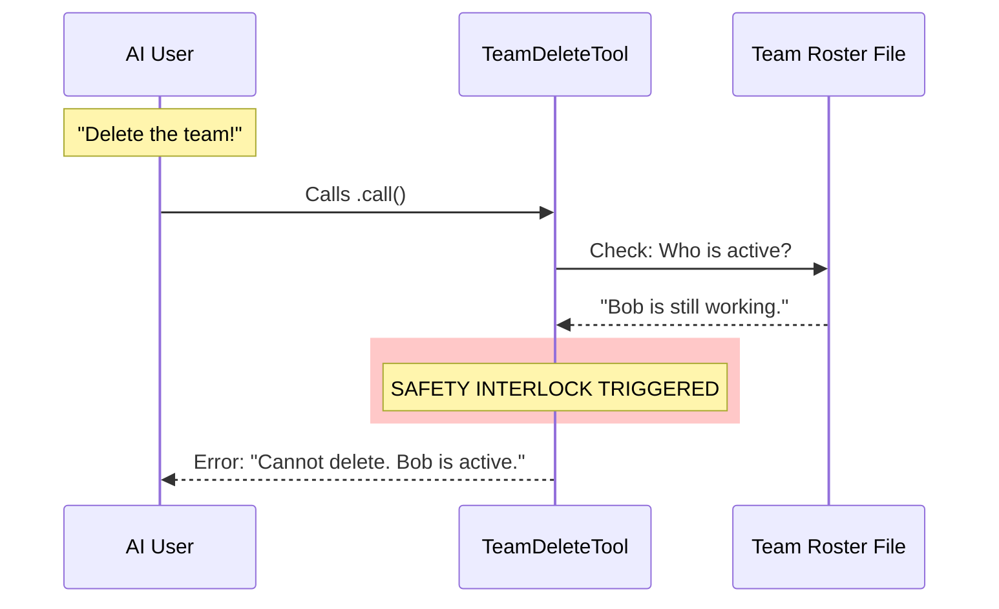

# Chapter 2: Safety Validation

In the previous chapter, [Tool Definition](01_tool_definition.md), we built the "skill cartridge" for our `TeamDeleteTool`. We gave it a name and told the AI how to hold it.

However, just because you *can* press a button doesn't mean you *should*.

## The Microwave Analogy

Imagine a microwave oven. It has a "Start" button. But if you press "Start" while the door is open, nothing happens.

Why? Because the microwave has a **safety interlock**. It checks the state of the door before allowing the magnetron to fire. This protects you and the machine.

Our `TeamDeleteTool` works the same way.
*   **The Danger:** If we delete a team's files while sub-agents (teammates) are still writing code or saving data, we could cause errors, data corruption, or leave "zombie" processes running forever.
*   **The Safety Interlock:** We check if anyone is still working. If they are, we refuse to run.

## The Logic Flow

Before we write code, let's visualize the decision-making process.



## Step-by-Step Implementation

All of this logic happens inside the `call` function we introduced in Chapter 1. Let's break down the code into small, digestible checks.

### 1. Identifying the Team

First, we need to know *which* team we are trying to delete. We don't ask the user for this; we look at the **Global State** (the current context of the application).

*(We will learn more about `context` in [Global State Management](04_global_state_management.md)).*

```typescript
// Inside the call() function
async call(_input, context) {
    const { getAppState } = context
    const appState = getAppState()
    
    // Grab the name of the current team
    const teamName = appState.teamContext?.teamName
```

**Explanation:**
We look at the application's memory (`appState`). If we are currently in a team session, `teamContext` will tell us the name.

### 2. Checking the Roster

If we have a team name, we need to see who is on the team. We read the "Team File" (a configuration file that tracks the status of all agents).

```typescript
    if (teamName) {
      // Helper to read the current team configuration from disk
      const teamFile = readTeamFile(teamName)
```

**Explanation:**
`readTeamFile` is a helper that opens a JSON file stored on the disk. It returns a list of members and their statuses.

### 3. The "Head Count" (Filtering)

This is the most critical part. We need to count how many members are active.

However, there is a catch: The **Team Lead** is the one calling this tool! If we count the Lead as "active," the tool would *never* run because the Lead is currently working (running this tool).

So, we filter the list:
1.  Ignore the Team Lead.
2.  Look for members who are NOT inactive.

```typescript
      if (teamFile) {
        // 1. Ignore the Team Lead (they are the one pressing the button)
        const nonLeadMembers = teamFile.members.filter(
          m => m.name !== TEAM_LEAD_NAME,
        )

        // 2. Filter for members who are currently active
        // (isActive === false means they are done or idle)
        const activeMembers = nonLeadMembers.filter(m => m.isActive !== false)
```

**Explanation:**
*   `TEAM_LEAD_NAME`: A constant (usually "Lead").
*   `isActive`: A flag in the team file. If it is `true` or undefined, they are working. If it is `false`, they have shut down.

### 4. The Guard Clause (The Stop Button)

Now we make the decision. If `activeMembers` is greater than 0, we **ABORT**.

```typescript
        if (activeMembers.length > 0) {
          // Create a readable list of names for the error message
          const memberNames = activeMembers.map(m => m.name).join(', ')
          
          return {
            data: {
              success: false,
              message: `Cannot cleanup team with active members: ${memberNames}.`,
              team_name: teamName,
            },
          }
        }
      } // End of teamFile check
```

**Explanation:**
*   We return `success: false`.
*   Crucially, we return a helpful `message`. This tells the AI *why* it failed: *"Cannot cleanup... Bob is active."*
*   The AI reads this message and realizes: *"Oops, I need to tell Bob to stop first."*

## What Happens if it's Safe?

If the code passes that `if` block (meaning `activeMembers` is 0), the safety interlock disengages. The microwave turns on.

The code proceeds to actually delete the files. We will cover the mechanics of deleting the files in the next chapter, [Resource Cleanup](03_resource_cleanup.md).

## Summary

In this chapter, we learned that **Safety Validation** is about protecting the system state.

1.  We identified the **current team**.
2.  We checked the **roster** (Team File).
3.  We ensured all **sub-agents** have finished their work.
4.  We provided a **Guard Clause** to stop execution and return a helpful error if it wasn't safe.

Now that we know it is safe to proceed, we are ready to perform the actual work: deleting the directories and resetting the environment.

[Next Chapter: Resource Cleanup](03_resource_cleanup.md)

---

Generated by [Code IQ](https://github.com/adityasoni99/Code-IQ)