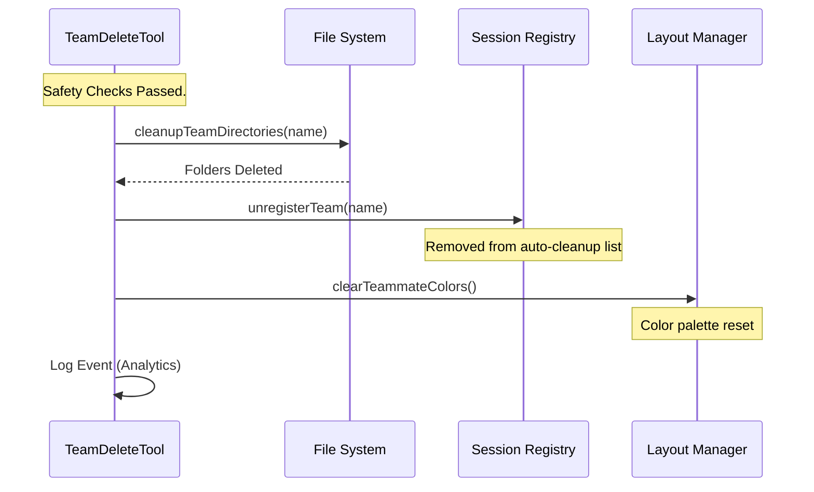

# Chapter 3: Resource Cleanup

In the previous chapter, [Safety Validation](02_safety_validation.md), we acted like a security guard. We checked the team roster to ensure everyone had finished their work before allowing the "shutdown" sequence to begin.

Now that the safety interlock has lifted, we can proceed with the main event: **Resource Cleanup**.

## The "Party Cleanup" Analogy

Think of an AI Swarm session like hosting a house party.
*   **Preparation:** You move furniture, put up decorations, and set out food. (The AI creates specific directories and configuration files).
*   **The Party:** The guests (agents) arrive, eat, and chat. (The agents create logs, code files, and temporary data).
*   **The End:** When the party is over, you can't just turn off the lights. You have to throw away the paper plates, take down the decorations, and put the furniture back.

If you don't clean up, your house becomes cluttered, and you can't host the next party effectively.

**Resource Cleanup** is the cleaning crew. It sweeps through the hard drive and deletes the temporary "decorations" created by the team so the system is fresh for the next task.

## Key Concepts: What are we cleaning?

When our AI agents work together, they create data in specific places. Our tool targets three main areas:

1.  **Physical Directories:** The actual folders on your computer where the team lived.
2.  **Session Registry:** The list that tells the system which teams are currently "alive."
3.  **Visual Layout:** The colors and UI elements assigned to specific agents.

Let's look at how we handle each of these in code.

---

## Step 1: Physical Directory Cleanup

The most important step is removing the files. The system creates two folders for every team:
*   **Team Directory:** Contains the roster and agent configurations.
*   **Task Directory:** Contains temporary files related to the specific job they were doing.

We use a helper function called `cleanupTeamDirectories`.

```typescript
// Inside TeamDeleteTool.ts

if (teamName) {
  // ... safety checks passed ...

  // 1. Physically delete the folders from the hard drive
  await cleanupTeamDirectories(teamName)
```

**What happens here?**
The tool sends a command to the file system: *"Find the folder named `~/.claude/teams/{teamName}` and delete it."* It does the same for the tasks folder. This frees up storage space.

---

## Step 2: Unregistering the Team

Even after we delete the files, the main application "Session Manager" might still have that team on a "To-Do" list to clean up later (like an automatic sprinkler system).

Since we just cleaned it manually, we need to tell the system: *"Don't worry about this team anymore; I handled it."*

```typescript
  // 2. Tell the automatic system cleanup to ignore this team
  // because we just cleaned it manually.
  unregisterTeamForSessionCleanup(teamName)
```

**Why is this necessary?**
If we don't do this, when the application eventually shuts down, it might try to delete the files again. Since the files are already gone, the system might throw an error or crash. This prevents that "double cleanup" error.

---

## Step 3: Visual and Logical Reset

Finally, we need to reset the "decorations."

When agents are added to a team, they are assigned specific colors (e.g., "Coder" might be blue, "Reviewer" might be green). We want to reset this palette so the next team gets fresh colors.

We also clear the "Leader Team Name" so the system knows there is no active leader anymore.

```typescript
  // 3. Reset the UI colors for the next team
  clearTeammateColors()

  // 4. Reset the leader tracker
  clearLeaderTeamName()
```

---

## Under the Hood: The Execution Flow

Let's visualize exactly what happens when the `cleanup` phase triggers.



1.  **Delete:** The physical evidence of the team is removed.
2.  **Unregister:** The backend bookkeeping is updated.
3.  **Reset:** The frontend visuals are cleared.

---

## Deep Dive: Implementation Details

Here is how these pieces come together inside our main code block. We group all these cleanup actions inside the `if (teamName)` block because we can only clean up a team if we know its name!

```typescript
// From File: TeamDeleteTool.ts

    // ... inside call() ...
    
      // 1. Delete files
      await cleanupTeamDirectories(teamName)
      
      // 2. Update Registry
      unregisterTeamForSessionCleanup(teamName)

      // 3. Reset Visuals
      clearTeammateColors()
      clearLeaderTeamName()

      // 4. Record that we did this (for statistics)
      logEvent('tengu_team_deleted', {
        team_name: teamName,
      })
    } // End of if(teamName)
```

**Explanation:**
*   **`await`**: Notice we use `await` on the directory cleanup. Deleting files takes time. We must wait for the files to be fully gone before we proceed.
*   **`logEvent`**: We record a "tengu_team_deleted" event. This is like a logbook entry: *"Party finished at 10:00 PM."* It helps developers track how often teams are created and destroyed.

## Summary

In this chapter, we learned how **Resource Cleanup** acts as the cleanup crew for our AI agents.

1.  We used `cleanupTeamDirectories` to remove **physical files**.
2.  We used `unregisterTeamForSessionCleanup` to prevent **system errors**.
3.  We used `clearTeammateColors` to reset the **visual interface**.

At this point, the hard drive is clean, and the file system is happy. However, the AI agent *itself* (the brain running this tool) still holds "memories" of the team in its immediate working memory.

If we stop here, the agent might hallucinate that it is still part of the team, even though the files are gone. We need to wipe the agent's memory of the team context.

[Next Chapter: Global State Management](04_global_state_management.md)

---

Generated by [Code IQ](https://github.com/adityasoni99/Code-IQ)