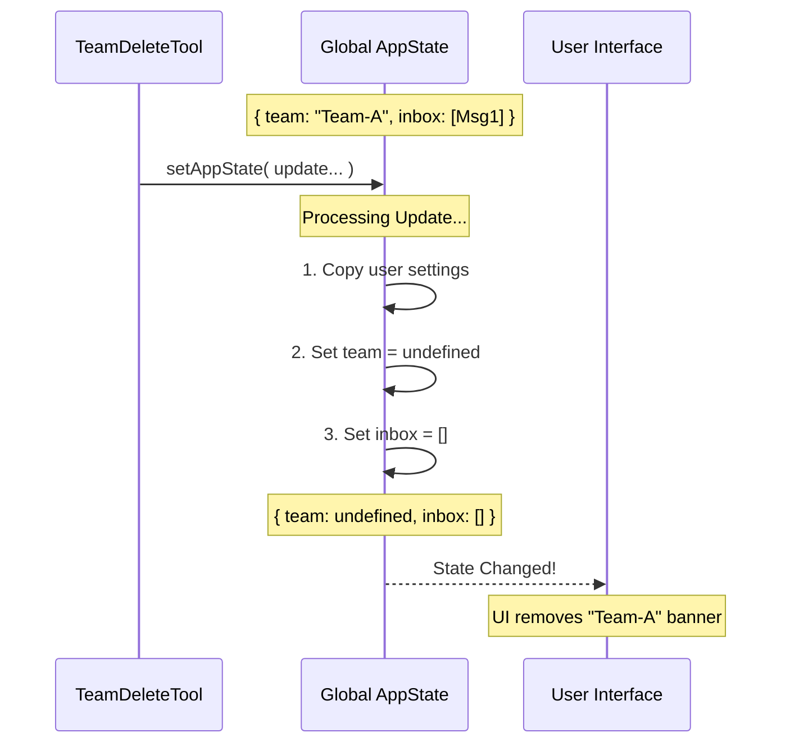

# Chapter 4: Global State Management

In the previous chapter, [Resource Cleanup](03_resource_cleanup.md), we acted as the cleaning crew. We went into the hard drive, deleted the team directories, and removed the physical files.

However, just because the files are gone doesn't mean the application *knows* the party is over.

## The Whiteboard Analogy

Imagine you just finished a brainstorming meeting.
1.  **File Cleanup:** You take the paper notes you wrote, file them in a cabinet, or shred them. (We did this in Chapter 3).
2.  **State Management:** You look at the whiteboard. It is still covered in diagrams and "To-Do" lists.

If a new group walks into the room right now, they will see the old diagrams and get confused. To truly reset the room, you must **wipe the whiteboard clean**.

In our application, the **Global State (`appState`)** is that whiteboard. It is the application's short-term memory. It currently "thinks" it is part of a team. We need to convince it otherwise.

## The Concept: `appState`

Our application runs in a loop. To keep track of what is happening *right now*, it holds a large object in memory called `appState`.

When a team is active, the state looks something like this:

```javascript
// A simplified view of the application's brain
{
  userName: "Alice",
  theme: "Dark Mode",
  teamContext: { teamName: "Coding-Team-A" }, // <--- The memory of the team
  inbox: { messages: ["Drafting code...", "Reviewing..."] }
}
```

Even if we delete the files on the disk, if `teamContext` still exists in memory, the AI agent will continue to act like the team leader.

## Step-by-Step Implementation

We perform this "mind wipe" using a function provided by the context called `setAppState`.

### 1. Accessing the Controls

At the very beginning of our tool's execution, we grabbed the controls from the `context`.

```typescript
// Inside call()
async call(_input, context) {
    // We grab 'setAppState' which allows us to write to the whiteboard
    const { setAppState } = context
    
    // ... (Safety Checks and File Cleanup happen here) ...
```

### 2. The "Mind Wipe"

Once the files are safely deleted, we update the state. We don't want to erase the *entire* application state (we want to keep the user's name and theme!), we only want to remove the team parts.

We use a technique called "spreading" to keep the old stuff, and overwrite only what we want to change.

```typescript
    // Resetting the state
    setAppState(prev => ({
      ...prev,                 // 1. Copy everything currently in state
      teamContext: undefined,  // 2. Force 'teamContext' to vanish
    }))
```

**Explanation:**
*   `prev`: The state as it exists right now.
*   `...prev`: "Copy all existing settings."
*   `teamContext: undefined`: "But set the Team Context to nothing."

### 3. Clearing the Inbox

There is one more thing on the whiteboard: The Inbox.

While the team was working, sub-agents might have sent messages that are currently sitting in a queue, waiting to be read. Since the team is dissolved, we don't want to read those old messages. We dump them.

```typescript
    setAppState(prev => ({
      ...prev,
      teamContext: undefined,
      
      // Reset the inbox to an empty list
      inbox: {
        messages: [], 
      },
    }))
```

## Under the Hood: The Execution Flow

Let's visualize how the state changes when this code runs.



## Deep Dive: The Code Block

Here is the actual block from `TeamDeleteTool.ts` that handles this logic. It is usually the very last thing the tool does before returning success.

```typescript
    // From File: TeamDeleteTool.ts

    // Clear team context and inbox from app state
    setAppState(prev => ({
      ...prev,
      // The team is gone, so the context is undefined
      teamContext: undefined,
      
      // Clear any queued messages from the old team
      inbox: {
        messages: [], 
      },
    }))
```

### Why is this the last step?
We perform **Global State Management** last because once we do this, the application effectively "forgets" the team ever existed. If we tried to do file cleanup *after* this step, we wouldn't know which team name to look for (because we just set it to `undefined`!).

1.  **Read** state (Find out who we are).
2.  **Clean** files (Delete the data).
3.  **Reset** state (Forget who we were).

## Summary

In this chapter, we learned that **Global State Management** is the psychological reset for the application.

*   We treated the `appState` like a **whiteboard**.
*   We used `setAppState` to access it.
*   We used `...prev` to ensure we didn't accidentally delete user settings.
*   We explicitly set `teamContext` to `undefined` and cleared the `inbox`.

Now, the hard drive is clean (Chapter 3), and the application's memory is clean (Chapter 4). The tool has finished its job.

The final step is to let the human user know that we succeeded. We need to display a nice message in the chat window.

[Next Chapter: User Interface Integration](05_user_interface_integration.md)

---

Generated by [Code IQ](https://github.com/adityasoni99/Code-IQ)