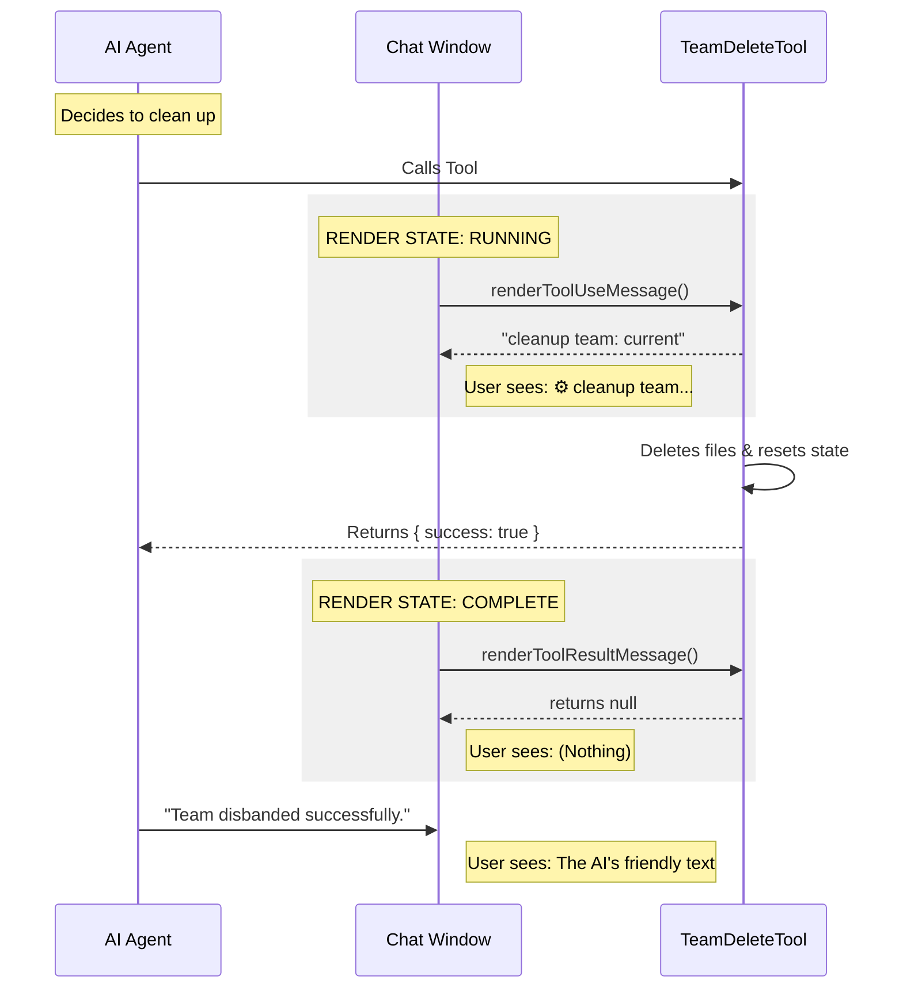

# Chapter 5: User Interface Integration

In the previous chapter, [Global State Management](04_global_state_management.md), we performed the final cleanup step: wiping the application's memory so it "forgets" the team ever existed.

We have now built the entire engine:
1.  We defined the tool.
2.  We added safety locks.
3.  We cleaned the hard drive.
4.  We reset the memory.

There is just one final question: **What does the human see?**

## The "Silent Butler" Analogy

Imagine you are at a fancy restaurant. You drop your napkin. A good waiter doesn't run over, blow a whistle, and shout, *"I AM REPLACING YOUR NAPKIN NOW! TASK COMPLETE!"*

Instead, they quietly swoop in, replace the napkin, and fade into the background. You barely notice it happened, but your table is clean.

This is the goal of **User Interface (UI) Integration**.

By default, when an AI tool runs, the system might dump a raw JSON receipt into the chat window (e.g., `{"success": true, "message": "deleted"}`). This looks "computery" and breaks the conversation flow. We want our tool to be the silent butler: effective but invisible.

## The Concepts

To control how our tool looks in the chat, we use two special helper functions. Think of these as "Display Drivers" for our tool.

1.  **Tool Use Message:** What shows up *while* the tool is running (the loading spinner).
2.  **Tool Result Message:** What shows up *after* the tool finishes.

Let's explore how we implement these in a file typically named `UI.tsx`.

---

## 1. The "Working..." Message

When the AI decides to press the button, the user sees a small indicator in the chat stream. We want this to be short and descriptive.

```typescript
// From File: UI.tsx
import React from 'react';

// This function controls the "Loading..." state
export function renderToolUseMessage(_input: Record<string, unknown>): React.ReactNode {
  // Simple, concise text
  return 'cleanup team: current';
}
```

**Explanation:**
*   **Input:** It receives the arguments the tool is using. Since our tool has no inputs (it's just a button press), we ignore them (`_input`).
*   **Output:** We return the string `'cleanup team: current'`.
*   **Result:** In the chat, the user sees a small badge saying: `⚙️ cleanup team: current`.

---

## 2. The "Done" Message (The Disappearing Act)

This is the most interesting part. When the tool finishes, it returns a result object (as we defined in [Tool Definition](01_tool_definition.md)).

Usually, the system displays this result. But for a cleanup task, we often want to **suppress** it. Why? because the AI Agent usually follows up with a conversational message like: *"I have disbanded the team for you."*

If we displayed the tool result *and* the AI's comment, it would look repetitive.

### Step A: Parsing the Output
First, we ensure we can read the data coming back from the tool.

```typescript
// From File: UI.tsx
import { jsonParse } from '../../utils/slowOperations.js';

export function renderToolResultMessage(content: Output | string) {
  // Ensure we have an object, even if it came in as a text string
  const result = typeof content === 'string' ? jsonParse(content) : content;
```

### Step B: The Condition
We check if this is the "success" message we expect.

```typescript
  // Check if this looks like our standard success receipt
  if ('success' in result && 'team_name' in result && 'message' in result) {
    // Return NULL to render NOTHING
    return null;
  }
```

### Step C: The Fallback
If something unexpected happened (like an error we didn't plan for), we might want to show it. But for now, we default to hiding everything.

```typescript
  // Default to silent
  return null;
}
```

**Key Takeaway:** By returning `null`, we tell the UI rendering engine: *"Draw nothing."* The tool execution block effectively vanishes from the chat history, leaving a clean transcript.

---

## Under the Hood: The Visual Flow

Let's look at the sequence of events when the tool runs in the chat window.



1.  **Start:** The UI asks, "What do I show while waiting?" We answer: "cleanup team..."
2.  **End:** The UI asks, "What do I show now that it's done?" We answer: `null` (Nothing).
3.  **Result:** The user sees the AI simply say "Team disbanded successfully" without seeing the mechanical clutter.

---

## Deep Dive: Wiring it Up

We wrote the logic in `UI.tsx`, but how does the main tool know about these functions? We have to link them back in our main file, `TeamDeleteTool.ts`.

We import them and attach them to the tool definition object we built in [Tool Definition](01_tool_definition.md).

```typescript
// From File: TeamDeleteTool.ts
import { renderToolResultMessage, renderToolUseMessage } from './UI.js'

export const TeamDeleteTool = buildTool({
  name: TEAM_DELETE_TOOL_NAME,
  // ... schema and call logic ...

  // Attach the "Display Drivers" here:
  renderToolUseMessage,
  renderToolResultMessage,
})
```

**Explanation:**
The `buildTool` function is designed to look for these specific properties. If you provide them, the chat system uses your custom logic. If you don't, it falls back to the default "ugly" JSON display.

## Conclusion

Congratulations! You have completed the **TeamDeleteTool** tutorial series.

We have taken a journey through the lifecycle of an AI capability:
1.  **Definition:** We gave the AI a "cartridge" so it knew the tool existed.
2.  **Safety:** We added checks to prevent deleting active teams.
3.  **Cleanup:** We performed the physical deletion of files.
4.  **State:** We wiped the application's memory.
5.  **UI:** We polished the visual experience to make it feel seamless.

You now have a fully functional, safe, and user-friendly tool that allows an AI agent to autonomously manage its own resources. This is a foundational pattern for building advanced, self-regulating AI agents.

**End of Tutorial**

---

Generated by [Code IQ](https://github.com/adityasoni99/Code-IQ)