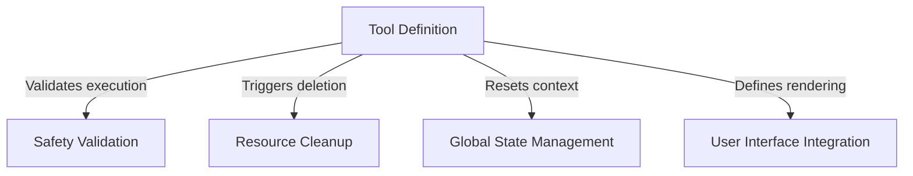

# Tutorial: TeamDeleteTool

This project implements a **TeamDelete** capability, acting as a housekeeping utility for AI agent sessions. It is responsible for *safely* dismantling teams by verifying no agents are active, removing associated file directories, and clearing the application's "mental" context to prepare for new tasks.

## Chapters

1. [Tool Definition](01_tool_definition.md)
2. [Safety Validation](02_safety_validation.md)
3. [Resource Cleanup](03_resource_cleanup.md)
4. [Global State Management](04_global_state_management.md)
5. [User Interface Integration](05_user_interface_integration.md)

---

Generated by [Code IQ](https://github.com/adityasoni99/Code-IQ)