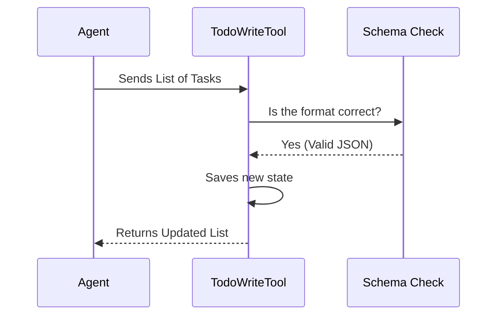

# Chapter 1: Task Structure & States

Welcome to the `TodoWriteTool` project! 

Have you ever tried to cook a complex meal without a recipe? You might forget to chop the onions, or maybe you start frying the chicken before the oil is hot. It gets chaotic quickly.

In software development, especially when an AI Agent is performing complex tasks, we need a **strict recipe**. We need to know exactly what is done, what is happening right now, and what needs to happen next.

That is the problem `TodoWriteTool` solves. It forces the AI to maintain a structured "To-Do List" so it never gets lost.

## The Core Concept: A Strict Form

Unlike a sticky note where you can scribble "Buy milk" or "Fix bug," this tool requires a specific structure. acts like a strict form that must be filled out perfectly.

Every task in the list consists of two major components:
1.  **The State:** Is it done? Is it happening now?
2.  **The Description:** What is it?

### 1. The Three States
To keep things organized, a task can only be in one of these three specific "buckets":

*   `pending`: The task is on the list, but we haven't touched it yet.
*   `in_progress`: We are working on this **right now**.
    *   *Rule:* Ideally, only **one** task should be in this state at a time. You can't chop onions and fry chicken simultaneously without risking a mistake!
*   `completed`: The task is finished successfully.

### 2. The Two Descriptions
This is the unique part of this tool. We don't just ask "What is the task?"; we ask for it in two grammatical tenses:

1.  **content (Imperative):** The command. What *needs* to be done.
    *   *Example:* "Run the database migration."
2.  **activeForm (Continuous):** The action. What is *happening*.
    *   *Example:* "Running the database migration."

This helps the system differentiate between a plan on a piece of paper and the live action occurring on the screen.

---

## Use Case Example: Adding a Feature

Let's look at a concrete example. Imagine the AI needs to "Add a Dark Mode toggle." This is too big to be one task, so we break it down.

Here is how we represent the first step of that task using the structure.

### The Input Data
When the AI uses the tool, it sends a list of tasks. Here is a single task object in JSON format:

```json
{
  "status": "in_progress",
  "content": "Create dark mode toggle component",
  "activeForm": "Creating dark mode toggle component"
}
```

**Breakdown:**
1.  **status**: Set to `in_progress` because we are starting it now.
2.  **content**: "Create..." (The command).
3.  **activeForm**: "Creating..." (The action).

### Handling Multiple Tasks
Usually, the tool accepts an *array* (a list) of these objects.

```typescript
// A list with one done task, and one active task
[
  {
    status: "completed",
    content: "Analyze UI requirements",
    activeForm: "Analyzing UI requirements"
  },
  {
    status: "in_progress", // <--- Current Focus
    content: "Create dark mode toggle",
    activeForm: "Creating dark mode toggle"
  }
]
```

By looking at this list, any system (or human) knows exactly where we are: we finished analyzing, and we are currently coding the toggle.

---

## How It Works Under the Hood

When the AI calls the `TodoWriteTool`, it doesn't just save text to a file. It validates the "grammar" of the task list to ensure the Agent is thinking clearly.

### The Flow
Here is what happens when the tool is triggered:



### Implementation Details

Let's peek at the code to see how these rules are enforced.

#### 1. Defining the Rules (Prompt)
In `prompt.ts`, we explicitly tell the AI how to behave. This acts as the instruction manual for the Agent.

```typescript
// prompt.ts (Excerpt)
export const PROMPT = `
1. **Task States**: Use these states to track progress:
   - pending: Task not yet started
   - in_progress: Currently working on
   - completed: Task finished successfully

   **IMPORTANT**: Task descriptions must have two forms:
   - content: "Run tests"
   - activeForm: "Running tests"
`
```
*Explanation:* This text is fed to the AI so it "knows" it cannot invent a state like `paused` or `waiting`. It must stick to the three allowed states.

#### 2. Enforcing the Schema (Code)
In `TodoWriteTool.ts`, we use a library called `zod` to strictly check the data types.

```typescript
// TodoWriteTool.ts
import { TodoListSchema } from '../../utils/todo/types.js'

// The tool expects an object containing a 'todos' list
const inputSchema = lazySchema(() =>
  z.strictObject({
    todos: TodoListSchema().describe('The updated todo list'),
  }),
)
```
*Explanation:* `TodoListSchema` (imported from utilities) contains the actual code logic that says "The status field MUST be one of 'pending', 'in_progress', or 'completed'". If the AI tries to send bad data, this schema rejects it.

#### 3. Updating the Application State
Once the input is validated, the tool updates the global state of the application.

```typescript
// TodoWriteTool.ts (Simplified)
async call({ todos }, context) {
  const todoKey = context.agentId ?? getSessionId()
  
  // Save the new list into the app's memory
  context.setAppState(prev => ({
    ...prev,
    todos: {
      ...prev.todos, // Keep other sessions' todos
      [todoKey]: todos, // Update ours
    },
  }))
  
  return { data: { newTodos: todos } }
}
```
*Explanation:* The tool takes the verified list (`todos`) and saves it into the `appState`. This ensures that if the Agent pauses and comes back later, the list is still there.

## Conclusion

In this chapter, we learned that a task isn't just a string of text. It is a structured object with a **State** (`pending`, `in_progress`, `completed`) and **Two Descriptions** (`content` and `activeForm`). This structure ensures the AI Agent always has a clear roadmap.

But simply having a structure isn't enough. We need to make sure this list survives between different actions the Agent takes.

[Next Chapter: State Persistence](02_state_persistence.md)

---

Generated by [Code IQ](https://github.com/adityasoni99/Code-IQ)