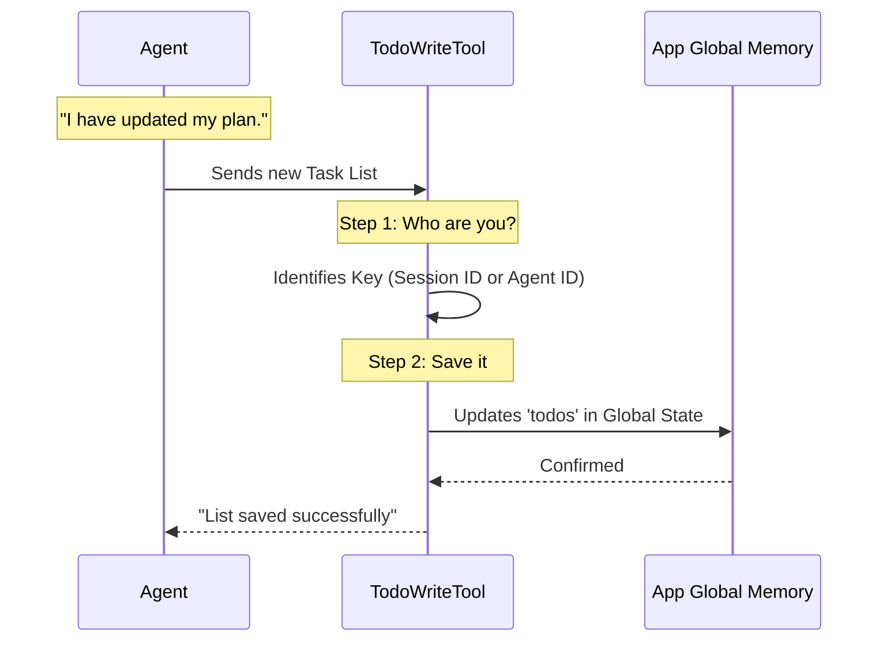

# Chapter 2: State Persistence

In the previous chapter, [Task Structure & States](01_task_structure___states.md), we learned **what** a valid task looks like. We discussed the specific grammar of "status," "content," and "activeForm."

But knowing *how* to write a task is only half the battle. If you write a perfect to-do list on a napkin and then throw it away, it’s useless. You need a way to keep that list safe while you work.

In this chapter, we will explore **State Persistence**: the mechanism `TodoWriteTool` uses to remember the list across the entire conversation.

## The Motivation: The "Meeting Room" Analogy

Imagine you are in a long strategy meeting.

1.  You write a checklist on a **whiteboard**.
2.  You leave the room to get coffee or check a file (perform an action).
3.  When you return, you expect the checklist to still be on the whiteboard so you know what to do next.

Without persistence, every time the AI Agent performs an action (like reading a file or running code), it would suffer from amnesia and forget what it was trying to achieve.

**The Solution:** The `TodoWriteTool` acts as that permanent whiteboard. It saves the list into the application's global memory (called `appState`), ensuring the plan survives throughout the session.

---

## Use Case: Switching Contexts

Let's look at a concrete scenario.

1.  **The Plan:** The Agent creates a list:
    *   [Done] Create file.
    *   [In Progress] Write code.
2.  **The Action:** The Agent uses a different tool (e.g., `FileWriteTool`) to actually write the code.
3.  **The Return:** After writing the file, the Agent needs to check its list to mark "Write code" as `completed`.

For step 3 to happen, the list defined in step 1 must be saved securely.

---

## How It Works: The Flow

Before looking at the code, let's visualize how the tool saves data when called.



### Key Concept: The "Key" (Scope)
The tool is smart. It knows *who* is talking.
*   **Main Thread:** If the main Agent is working, it saves the list under the `sessionId`.
*   **Sub-Agent:** If a helper agent is working, it saves the list under its specific `agentId`.

This prevents a helper agent from accidentally erasing the main boss's to-do list!

---

## Implementation Details

Let's look at `TodoWriteTool.ts` to see how this is implemented. We will break it down into tiny pieces.

### 1. Identifying the Scope
First, the tool needs to decide *where* to store the list. It checks the context.

```typescript
// Inside TodoWriteTool.ts -> call()

// If an agentId exists, use it. Otherwise, use the general session ID.
const todoKey = context.agentId ?? getSessionId()

// Retrieve the entire current memory of the app
const appState = context.getAppState()
```
*Explanation:* `todoKey` is the unique label for our whiteboard. `context` is provided by the system automatically when the tool runs.

### 2. Handling Completed Lists
There is a special rule: If **every** task on the list is `completed`, the tool assumes we are starting fresh next time.

```typescript
// Check if every single item is marked 'completed'
const allDone = todos.every(item => item.status === 'completed')

// If all done, reset to an empty list []. 
// Otherwise, keep the current tasks.
const newTodos = allDone ? [] : todos
```
*Explanation:* This auto-cleanup keeps the memory from getting clogged with old, finished tasks. If the project is done, the whiteboard is wiped clean.

### 3. Updating Global Memory
This is the most important part. We use `setAppState` to permanently write the data.

```typescript
context.setAppState(prev => ({
  ...prev, // Keep everything else in memory (chat history, etc) unchanged
  todos: {
    ...prev.todos, // Keep lists belonging to other agents unchanged
    [todoKey]: newTodos, // UPDATE only our specific list
  },
}))
```
*Explanation:*
1.  We take the `prev` (previous) state.
2.  We look at the `todos` section.
3.  We find our specific slot (`[todoKey]`) and overwrite it with `newTodos`.

### 4. Returning the Result
 Finally, we tell the Agent what happened.

```typescript
return {
  data: {
    oldTodos,        // What it looked like before
    newTodos: todos, // What we just saved
  },
}
```
*Explanation:* The tool returns both the old and new lists. This confirms to the Agent that the save operation was successful.

---

## Summary

In this chapter, we learned:
1.  **Why persistence matters:** Without it, the Agent forgets its plan after every action.
2.  **Scopes:** We use `agentId` or `sessionId` to ensure we don't overwrite someone else's list.
3.  **The Reset Rule:** When a list is fully completed, we wipe it clean for the next challenge.

Now that we understand the data structure (Chapter 1) and how to save it (Chapter 2), we are ready to combine everything into the formal definition of the tool.

[Next Chapter: Tool Definition](03_tool_definition.md)

---

Generated by [Code IQ](https://github.com/adityasoni99/Code-IQ)